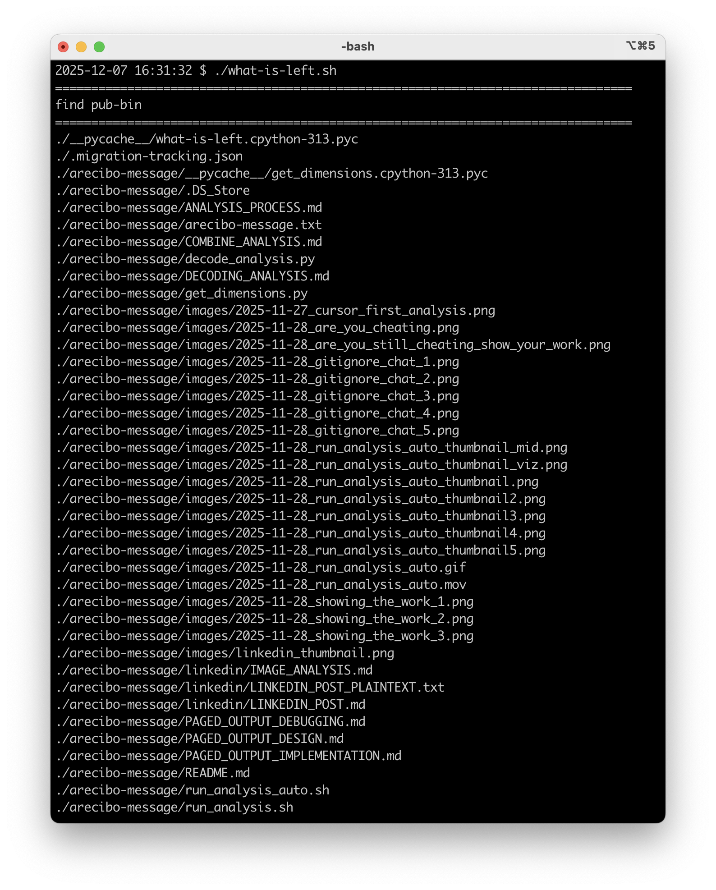
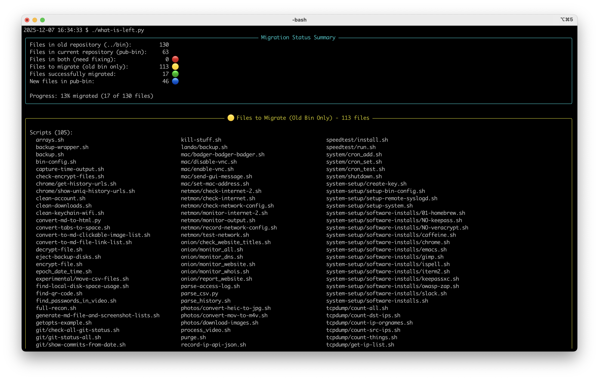
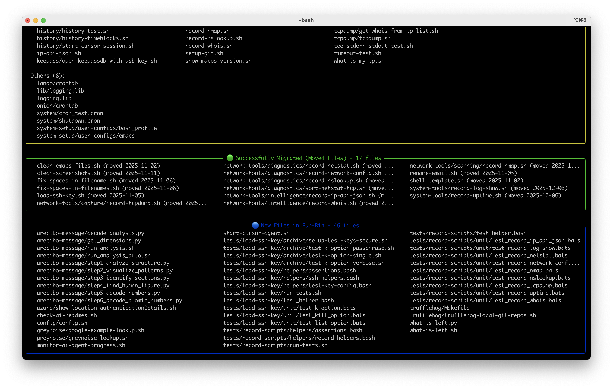

# December 7, 2025

**LinkedIn:** [Not Published Yet]()

---

From bash to Python: Migrating a migration tracker  

I've been tracking the migration of 130+ scripts from my private repo to the public one. The original bash script (`what-is-left​.sh`) was functional but raw — just a simple diff output that was hard to parse.

So I rebuilt it in Python with the `rich` library, and the difference is night and day.

**What changed:**  

▶ **Visual output**: Color-coded panels with borders instead of raw diff text  
▶ **Multi-column layout**: Automatically uses 2-3 columns on wide terminals  
▶ **Git history analysis**: Detects moved files by analyzing commit history  
▶ **Smart categorization**: Groups files by type (scripts, executables, configs)  
▶ **Progress tracking**: Shows migration progress with statistics  

**The before (bash):**  

Raw diff output showing files with `<` and `>` prefixes. No color, no organization, just text.

**The after (Python):**  

Color-coded summary with categorized sections, multi-column file lists, and clear progress indicators.

**Why Python over bash?**  

The bash version was fine for simple comparisons, but Python gave me:
- Better data structures for tracking file states
- Git history analysis (using GitPython or subprocess)
- Rich terminal formatting with the `rich` library
- Easier to extend with new features

The `rich` library was the game-changer. It provides panels, colors, tables, and multi-column layouts out of the box. The terminal width detection automatically adapts the layout — single column on narrow terminals, multi-column on wide ones.

**Recent improvements:**  

Just finished adding multi-column layout support. The script now detects terminal width and displays file lists in 2-3 columns when there's enough space. All panels expand to full width with colored borders.

**The lesson:**  

Sometimes the right tool for the job changes as requirements evolve. The bash script worked, but Python made it possible to add features that would have been painful in bash — like git history analysis and rich terminal formatting.

The migration tracker now tracks the migration of the migration tracker. Meta.

The repository: https://github.com/glblackburn/pub-bin
