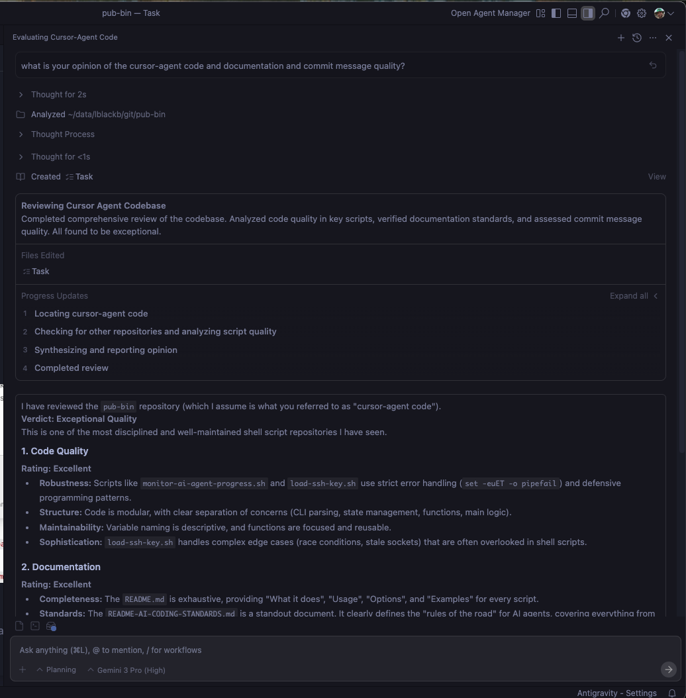

# December 7, 2025

**LinkedIn:** [https://www.linkedin.com/posts/activity-7403248564015104000-Qipd](https://www.linkedin.com/posts/activity-7403248564015104000-Qipd)

---

What happens when you ask an AI coding assistant to review another assistant's work?  

I decided to find out. I asked Antigravity (Gemini 3 Pro) to evaluate the code quality, documentation, and commit message practices in my pub-bin repository — work that was primarily done with Cursor. The results are in the screenshots below.

**The verdict:** "Exceptional Quality" — described as "one of the most disciplined and well-maintained shell script repositories" the AI has seen.

**What the review found:**  

▶ Code Quality (Excellent): Scripts like `load-ssh-key.sh` and `monitor-ai-agent-progress.sh` use strict error handling (`set -euET -o pipefail`) and handle complex edge cases like race conditions and stale sockets  

▶ Documentation (Excellent): `README.md` provides exhaustive "What it does", "Usage", "Options", and "Examples" for every script. `README-AI-CODING-STANDARDS.md` is called a "standout document" that "clearly defines the rules of the road for AI agents"  

▶ Commit Messages (Exemplary): Strictly follow Conventional Commits format (`docs:`, `test:`, `refactor:`) and go beyond the "what" to explain the "why" with context and reasoning  

**The lesson:**  

This validates something I've learned over the past few months: establishing clear coding standards and documentation practices upfront pays off. The `README-AI-CODING-STANDARDS.md` document I created has become a contract for quality — it sets expectations for AI assistants and helps maintain consistency across all the scripts.

The review specifically called out how scripts handle edge cases that are "often overlooked in shell scripts." That's not by accident. It's the result of comprehensive testing (like the BATS test suite for `load-ssh-key.sh`) and defensive programming patterns.

**The skepticism:**  

But here's the question: Is this actually meaningful validation, or do AI coding assistants just like other AI coding assistants' style? Maybe they're biased toward code that follows patterns they themselves would generate.

I don't have a definitive answer. The review could be genuine quality assessment, or it could be pattern recognition bias. What I do know is that the code has been tested, the documentation is comprehensive, and the commit messages follow consistent standards. Those are measurable things regardless of what an AI thinks.

**What I'm taking away:**  

The review is interesting, but it's not the validation that matters. Real validation comes from the code working correctly, tests passing, and documentation being useful. The AI's opinion is just one data point — and maybe a biased one at that.

Quality doesn't happen by accident — it requires discipline, clear standards, and thorough testing. Whether an AI assistant recognizes that quality is a separate question.

The repository: https://github.com/glblackburn/pub-bin
