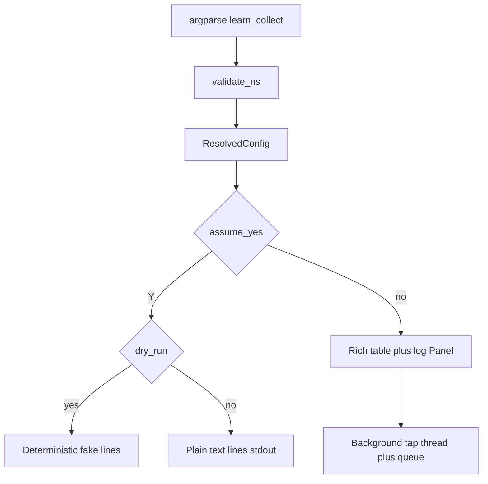

<!-- Cursor agent plan 12 (canonical copy in-repo; do not use ~/.cursor/plans/). -->
---
todos:
  - id: "doc-plan-010"
    content: "Add plan-010 product spec + docs/osx/plans/README row (TUI + text -Y + tests)"
    status: completed
  - id: "cli-config"
    content: "Argparse learn_collect mode, validate_ns, mode_fully_on_cli, ResolvedConfig, optional cap N vs infinite"
    status: completed
  - id: "rich-layout-thread"
    content: "Rich composite layout (table + log strip); rotating Text styles; integrate tap via thread+queue"
    status: completed
  - id: "text-y-dryrun"
    content: "Plain-text coordinate lines with -Y; dry-run / test-only deterministic output without tap"
    status: completed
  - id: "tests-impact"
    content: "New tests per matrix; adjust dry_run/mt09/def009/open_defects if argparse or main paths change"
    status: completed
  - id: "operator-doc"
    content: "osx/README.md + agent README index"
    status: completed
isProject: false
---
# Plan 12 — Learn-point collect (TUI log, no autoclicker)


**Terminology:** **CSI** (*Control Sequence Introducer*) — terminal control sequences usually beginning with **`ESC` `[`** (bytes `0x1B 0x5B`), including common **arrow-key** encodings. **SS3** (historically *Single Shift 3*; **arrow** sequences in this doc) — bytes introduced by **`ESC` `O`** (`0x1B 0x4F`) instead of **`ESC` `[`**. **PTY** (*pseudo-terminal*) — a paired **kernel TTY** (master/slave) so test harnesses (**pexpect**, **pytest** subprocess) can attach a fake terminal. **PTY tests** spawn **`osx/macos_mouse_click.py`** under a PTY and assert on captured transcripts (sometimes with stderr merged into the capture).

**Delivery (2026-04):** Shipped in `osx/macos_mouse_click.py` (`--learn-points`, `run_learn_collect_flow`, dry-run stdout). Product spec: [`plan-010-macos-mouse-click-learn-points-collect.md`](../plan-010-macos-mouse-click-learn-points-collect.md). Operator notes: [`osx/README.md`](../../../../osx/README.md).

## Naming constraints

- **No spaces** in new paths; **kebab-case ASCII** only (`plan-agent-12-learn-points-collect.plan.md`, `plan-010-macos-mouse-click-learn-points-collect.md`, etc.).

## Problem

[`--learn`](../../../../osx/macos_mouse_click.py) captures **one** anchor then always runs [`run_synthetic_loop`](../../../../osx/macos_mouse_click.py). Operators who want **many** UI positions for later scripting must rerun learn or scrape stderr. There is no **in-editor**, **infinite** sampler that stays inside the existing Rich chrome.

## Goal (consolidated)

1. **Primary UX — Rich TTY:** After the user confirms the pre-run flow (same **`S`** / **`Q`** / arrow semantics as today), enter a **coordinate collect** phase that runs **until the user stops** (no fixed **N** required for v1; optional **cap** after **N** samples is an open item below). Each **real left mousedown** (event tap, same Accessibility rules as learn) appends **one line** in a **log region below the settings table**, still inside the **Panel** / cyan border world—**not** raw stdout spam mixed with box drawing.
2. **Visual polish:** Log lines use Rich **`Text`** (or similar) with **rotating styles** per line (e.g. cycle **green / yellow / magenta / cyan**) so successive samples are easy to scan.
3. **No autoclicker:** Never call **`post_synthetic_click`** in this mode; no learn warmup sleep toward synthetics.
4. **Exit before any capture:** From the collect UI, the user must be able to **leave without recording a single point** (same spirit as canceling the pre-run table before **`S`**). Document exit codes: align with existing **cancel vs interrupt** behavior in [`plan-002`](../plan-002-macos-mouse-click-terminal-ux.md) / current script (**`Q`** / **`Ctrl+D`** cancel vs **`Ctrl+C`** stop).
5. **`-Y` / text-only path:** When **`assume_yes`** is set, **skip Rich** (no colors, no table). Emit coordinates as **plain text** only—one line per capture, stable format (e.g. `1 123.4 567.8` or `x=… y=…`), **UTF-8**, no ANSI escape sequences, suitable for logs and subprocess assertions.
6. **Test-only output with `-Y`:** CI and local tests must be able to assert the **text output path** without **Quartz** or **CGEventTap**. Reuse or extend **`--dry-run-after-start`** / **`MACOS_MOUSE_CLICK_DRY_RUN`** so that **`learn_collect` + `-Y` + dry-run** prints a **small deterministic sequence** of fake coordinate lines (document format) and exits **0**, mirroring how dry-run avoids **`import_quartz()`** today. Optionally emit a single dry-run JSON line first for consistency with other modes; keep **stdout text lines** clearly documented as the test hook.

## CLI shape (target)

- New targeting mode **mutually exclusive** with **`--learn`**, **`--at-cursor`**, **`-x/-y`** (extend [`validate_ns`](../../../../osx/macos_mouse_click.py)).
- **Flag name:** keep **`--learn-points`** as the mode switch; **optional integer** suffix meaning “stop after **N** samples” is allowed; **omit value ⇒ infinite** until user exits (resolve argparse with **`nargs='?'`** or dedicated **`--learn-points-max`** if `?` is too fragile in argv).
- **`-Y`:** mode must be fully on CLI; behavior = **text-only** collect (no Rich). Combine with **`--dry-run-after-start`** for **test-only** fake lines.
- **Rich path:** **no `-Y`** and TTY + Rich available ⇒ existing table for mode/settings, then transition to collect layout (or single composite view—implementation choice).

## Option combination usage examples

Syntax below is **target** operator/CI usage; exact flag spelling and cap form ship with implementation. Paths assume repo root.

**Interactive Rich (default path):** TTY stdin+stdout, Rich installed, no `-Y`. User reviews the pre-run table, presses **`S`** to enter collect, records zero or more real clicks into the colored log under the table, then **`Q`** / **`Ctrl+C`** / **`Ctrl+D`** per final exit semantics.

```bash
./osx/macos_mouse_click.py --learn-points
```

**Plain text collect (scripting, real tap):** Skip Rich; print one **plain text** line per captured point (no ANSI). Still requires Accessibility and a real event tap when not in dry-run.

```bash
./osx/macos_mouse_click.py --learn-points -Y
```

**CI / test-only (no Quartz, deterministic lines):** Same as today’s dry-run contract: **`--dry-run-after-start`** or **`MACOS_MOUSE_CLICK_DRY_RUN=1`** exits after the resolved-config line and **fake** coordinate text lines—use for **`pytest`** subprocess assertions.

```bash
./osx/macos_mouse_click.py --learn-points -Y --dry-run-after-start
MACOS_MOUSE_CLICK_DRY_RUN=1 ./osx/macos_mouse_click.py --learn-points -Y
```

**Dry-run JSON plus text hook:** If implementation keeps one **`MACOS_MOUSE_CLICK_DRY_RUN_JSON`** line on stderr first (parity with other modes), tests can grep stderr for JSON and read fake samples from stdout (or the chosen fd—finalize in code + plan-010).

```bash
./osx/macos_mouse_click.py --learn-points -Y --dry-run-after-start 2>stderr-capture.txt
# stderr: MACOS_MOUSE_CLICK_DRY_RUN_JSON line (if emitted); stdout: fake plain-text sample lines for tests
```

**Optional stop-after-N (if cap lands):** Infinite by default; optional integer limits samples then exits **0** without synthetics.

```bash
./osx/macos_mouse_click.py --learn-points 25 -Y
./osx/macos_mouse_click.py --learn-points 25
```

**Invalid combinations (must error clearly, exit 2):**

```bash
./osx/macos_mouse_click.py --learn-points --learn
./osx/macos_mouse_click.py --learn-points -x 10 -y 20
./osx/macos_mouse_click.py --learn-points --at-cursor
./osx/macos_mouse_click.py --learn-points --interactive -Y   # if -Y + interactive stays forbidden globally
```

**`-Y` without learn_collect on argv:** Unchanged today: **`-Y`** still requires a fully specified mode on the CLI; omitting **`--learn-points`** must not enter this mode by accident.

```bash
./osx/macos_mouse_click.py -Y   # error: mode not on CLI (unless -x/-y etc.)
```

## Implementation sketch

### A. Rich composite layout

- Today [`_run_rich_pre_run_editor_loop`](../../../../osx/macos_mouse_click.py) (~813+) paints a single **`Panel`** around **`_build_editor_table`**. Extend to a **`Group`** / **`Columns`** / nested layout: **top** = current table (or slimmed summary while collecting); **bottom** = **`Panel`** or **`Text`** stack for the **capture log** (scroll strategy: cap visible lines vs full scroll—open).
- **DEF-009 discipline:** keep **`_flush_stdout_safe()`** before/after frames; avoid stderr interleave during paint.
- **Alternating colors:** maintain **`line_index % len(STYLES)`** when appending each **`Text`** line.

### B. Event tap vs Rich key loop (threading)

- **`wait_for_anchor_click`** today runs **`CFRunLoopRunInMode`** on the **main** thread (~187–188), which **blocks** the Rich **read-key** loop.
- **Plan:** run **one** dedicated **background thread** (or repeated short-lived tap sessions) that owns **tap + CFRunLoop** snippets and pushes **`(x, y)`** onto a **`queue.SimpleQueue`**. The Rich loop uses **`select`** / **non-blocking** peek or a **short timeout** around key read (if feasible without breaking **`read_raw_key`**) **or** polls the queue on each redraw **before** blocking read—exact integration is an implementation detail but must be specified before coding so we do not regress **DEF-006 / DEF-008** timing.
- **Shutdown:** signal handler sets **`shutdown_requested`**; thread must exit tap cleanly; main UI exits.

### C. State machine

1. **Pre-run** — unchanged table / **`S`** / **`Q`** behavior.
2. **Collect** — after **`S`**, switch layout to “waiting for clicks…”; append on each queue item; **`Q`** / **`Ctrl+C`** ends (zero or more samples).
3. **Never** transition to **`run_synthetic_loop`** for **`learn_collect`**.

### D. Dry-run + resolved JSON

- Extend [`resolved_config_for_dry_run_json`](../../../../osx/macos_mouse_click.py) with **`learn_collect`** fields (`infinite` vs `max_points`, etc.).
- **`--dry-run-after-start` + `-Y` + learn_collect:** print fake **text** lines on **stdout** (or stderr—**pick one** and document; stdout keeps parity with “machine readable stream” if scripts tee stdout only).

## Test plan (new cases)

| Id | Scenario | Assert |
|----|----------|--------|
| T1 | `--learn-points --dry-run-after-start -Y` | No **`import_quartz`**; stdout (or chosen fd) matches **N** deterministic lines; exit **0**. |
| T2 | `--learn-points` + `--learn` | **`validate_ns`** error. |
| T3 | `--learn-points -1` (if numeric cap exists) | Error **2**, clear message. |
| T4 | `--learn-points` without `-Y`, non-TTY stdin | Same class of errors as today for modes needing TTY (if collect is Rich-only) **or** graceful fallback to text—**decide in impl**. |
| T5 | `resolved_config_for_dry_run_json` unit / subprocess | Payload includes **`mode: learn_collect`** (or agreed string) and cap/infinite flag. |
| T6 | Optional PTY | If harness can send **`Q`** before **`S`** or before first synthetic tap thread fires fake inject—**defer** unless low cost. |

## Impact on existing tests (review during impl)

| Area | File(s) | Risk |
|------|---------|------|
| Dry-run gate | [`test_dry_run.py`](../../../../osx/tests/test_dry_run.py), [`test_mt09.py`](../../../../osx/tests/test_mt09.py) | New mode must not call Quartz on dry-run; extend fixtures if argv lists grow. |
| Argparse / dup flags | [`test_open_defects.py`](../../../../osx/tests/test_open_defects.py) DEF-007 scans | Add **`--learn-points`** to duplicate scanner if it takes a value. |
| Rich layout | [`test_def009_rich_table_layout_pty.py`](../../../../osx/tests/test_def009_rich_table_layout_pty.py) | Composite layout may change transcript heuristics—**update baselines** or add collect-mode-specific tests. |
| Table nav | [`test_rich_table_nav_down_pty.py`](../../../../osx/tests/test_rich_table_nav_down_pty.py) | Unchanged if collect is **separate** screen; if table markup changes, adjust. |
| Debug TUI meta | [`test_debug_tui_logging_meta.py`](../../../../osx/tests/test_debug_tui_logging_meta.py) | New **`draw`/`after_key`** paths if collect loop emits debug events—extend or gate. |
| Hub paths | [`test_docs_osx_hub_paths.py`](../../../../osx/tests/test_docs_osx_hub_paths.py) | Only if new **plan-010** filename added—already expects **`plan-010`** doc only when file exists; **add path** when plan-010 lands. |

## Documentation

1. **[`plan-010-macos-mouse-click-learn-points-collect.md`](../plan-010-macos-mouse-click-learn-points-collect.md)** — product spec: UX, exit semantics, text vs Rich, dry-run test hook.
2. **[`osx/README.md`](../../../../osx/README.md)** — operator examples.
3. **This file** — implementation engineering notes.

## Open decisions

1. **Cap vs infinite:** infinite default; optional **`--learn-points N`** stop-after-**N** vs separate flag.
2. **Dry-run line format** and **stdout vs stderr** for text lines.
3. **Scrollback cap** in Rich log (performance on long sessions).
4. **Whether** non-Rich fallback without **`-Y`** is required when Rich missing (probably: error with install hint, same as other advanced modes).

## Dependency diagram


