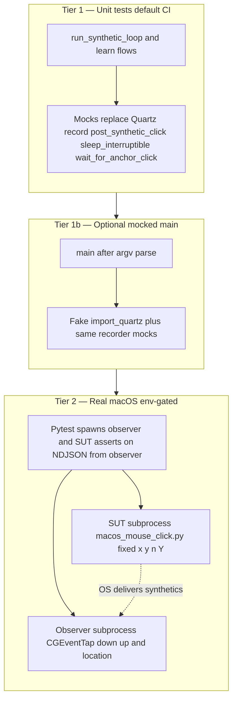

<!-- Cursor agent plan 13 (canonical copy in-repo; do not use ~/.cursor/plans/). -->
---
todos:
  - id: "helpers-fake-qz"
    content: "Add test module with fake qz + post_synthetic_click / sleep_interruptible recorders"
    status: pending
  - id: "test-synthetic-loop"
    content: "Unit tests: finite N, delay call count, shutdown exit 130, infinite until shutdown"
    status: pending
  - id: "test-learn-tail"
    content: "Monkeypatch wait_for_anchor_click + run_learn_flow: warmup once then N posts at anchor"
    status: pending
  - id: "test-learn-collect-flow"
    content: "Monkeypatch wait_for_anchor_click + run_learn_collect_flow: cap and stdout lines with assume_yes"
    status: pending
  - id: "optional-main-integration"
    content: "Optional: single main() integration test with full monkeypatch stack"
    status: pending
  - id: "doc-open-defects"
    content: "If README lists open DEFs tied to coverage, add regression row or skip"
    status: pending
  - id: "real-quartz-design"
    content: "Document + optional implement: subprocess clicker + CGEventTap observer, env-gated marker"
    status: pending
  - id: "real-quartz-harness"
    content: "Minimal osx/tests/real_click_observer.py or helper module (tap loop, NDJSON/fifo out)"
    status: pending
isProject: false
---
# Plan 13 — Tests for post-start (synthetic) clicks

## What “post start” means here

In [`osx/macos_mouse_click.py`](../../../../osx/macos_mouse_click.py), the public “start” boundary is the **`Running:`** line (and Rich **`S`** / confirmation for interactive runs). **Post-start** for click automation is everything after **`import_quartz()`** that leads to **`post_synthetic_click`** (fixed / at-cursor / learn after anchor+warmup) or **`wait_for_anchor_click`** loops (**`learn_collect`**).

Today, [`osx/tests/test_dry_run.py`](../../../../osx/tests/test_dry_run.py) and [`osx/tests/test_mt09.py`](../../../../osx/tests/test_mt09.py) prove **dry-run exits before Quartz** and **interactive cancel before tap**; they do **not** assert click count, coordinates, delay cadence, or interrupt behavior **after** a real start.

## What is needed (dependencies)

1. **Stable seams to test without Quartz** — The logic already lives in pure-Python functions:
   - [`run_synthetic_loop`](../../../../osx/macos_mouse_click.py) (~1336–1355): calls **`post_synthetic_click`**, **`sleep_interruptible`**, **`shutdown_requested`**.
   - [`run_learn_flow`](../../../../osx/macos_mouse_click.py): **`wait_for_anchor_click`** → warmup **`sleep_interruptible`** → **`run_synthetic_loop`**.
   - **`learn_collect`**: [`run_learn_collect_flow`](../../../../osx/macos_mouse_click.py) (~1382–1417): repeated **`wait_for_anchor_click`** + stdout/stderr output (no synthetics).

   **No production refactor is strictly required** if tests **`monkeypatch.setattr(mmc, "post_synthetic_click", recorder)`** (and same for **`sleep_interruptible`**, **`wait_for_anchor_click`**) on the imported module [`macos_mouse_click`](../../../../osx/macos_mouse_click.py) as [`test_dry_run.py`](../../../../osx/tests/test_dry_run.py) already does for **`import_quartz`**.

2. **Fake `qz` object** — `post_synthetic_click` only needs attributes used on `qz` (`CGPoint`, `kCGEventLeftMouseDown`, `kCGEventLeftMouseUp`, `kCGMouseButtonLeft`, `CGEventCreateMouseEvent`, `CGEventPost`, `kCGHIDEventTap`). A **`types.SimpleNamespace`** or small **`MagicMock`** with those attributes is enough for unit tests that never call into real Quartz.

3. **Signal / shutdown tests** — Reuse existing patterns: [`reset_shutdown`](../../../../osx/macos_mouse_click.py) / [`install_signal_handlers`](../../../../osx/macos_mouse_click.py) if testing interrupt paths; or call **`mmc.shutdown_state[0] = True`** between loop iterations if the test targets **`run_synthetic_loop`** directly (simpler than SIGINT in pytest).

4. **Optional later: full `main()` post-start** — Higher integration: monkeypatch **`import_quartz`** to return fake `qz`, **`wait_for_anchor_click`** for learn, **`post_synthetic_click`** recorder, then **`mmc.main([...])`**. More brittle (more branches) but validates wiring after argv parse.

5. **Not in default CI scope (document only)** — Real **`CGEventPost`** verification needs Accessibility + user session; treat as **manual / opt-in job** or separate repo recipe, not blocking **`make -C osx test`**.

## Real macOS click validation (integration design)

**Goal:** After the clicker process has started for real (no dry-run), **observe actual `CGEventPost` left-button events** and feed structured data back to pytest for assertions (count, screen locations, down/up ordering, timing).

### What accepts the clicks (observer)

On macOS the durable approach is a **`CGEventTap`** (same Quartz stack as the clicker) installed in an **observer** process or thread:

- Register for **`kCGEventLeftMouseDown`** and **`kCGEventLeftMouseUp`** (and optionally filter with **`CGEventGetIntegerValueField`** / location).
- In the tap callback, read **`CGEventGetLocation(event)`** and append **`(etype, x, y, monotonic_ts)`** to an in-memory list or write **one NDJSON line per event** to **stdout** or a **named pipe** for the parent test to consume.

**Important:** The clicker’s **`learn`** / **`learn_collect`** modes install their **own** tap while waiting for the user. A second tap in the **same** process can conflict with runloop ownership. Prefer:

- **Subprocess A:** `python3 osx/macos_mouse_click.py … -Y` (the product under test).
- **Subprocess B** (or **thread** only if proven safe): minimal observer script that only listens and logs—**no** synthetic posts from the observer.

If two taps in one process prove unstable, keep **observer = separate Python subprocess** started **before** A, stopped **after** A exits.

### Filtering so tests only see the SUT

- **PID filter:** `CGEventGetIntegerValueField(event, kCGEventSourceUnixProcessID)` (or equivalent available field) and compare to **child PID** of the clicker subprocess when the OS exposes it; not all synthetic paths set source PID predictably—**treat as best-effort** and fall back to **location + count** matching.
- **Location filter:** Clicker is invoked with **known `-x/-y`**; assert observed events within **epsilon** (e.g. **0.5 pt**) of expected global coordinates (account for Retina: document whether to compare in **logical** vs **backing** points; Quartz **`CGEventGetLocation`** matches what the clicker uses today).
- **Sequence filter:** Expect **pairs** **`MouseDown` → `MouseUp`** per synthetic click from [`post_synthetic_click`](../../../../osx/macos_mouse_click.py) (two posts per logical click).

### Harness shape (recommended)

1. **pytest** (parent) starts **observer subprocess** with argv: **`--listen-fifo /tmp/…`**, writing one JSON object per line (or use **`multiprocessing.Queue`** if observer runs as **multiprocessing.Process** with a joinable queue—simpler on one machine).
2. Parent starts **clicker subprocess**: e.g. **`osx/macos_mouse_click.py -x 100 -y 100 -n 3 -d 0 -Y`** (zero delay to shorten test).
3. Parent reads observer output until **6 events** (3× down+up) or **timeout**.
4. Assertions: count, coordinates, ordering, optional **monotonic** delta bounds between pairs.

**Learn / learn_collect real paths:** Defer to **phase 2** of real integration: requires user or robot input for anchor, or a second automation tool to inject a physical click—**out of scope** for first real-click slice unless CI gains a headless injection strategy.

### Permissions and CI

- **Accessibility** must be granted to whatever runs the observer and the clicker (on **GitHub `macos-latest`**, UI permission dialogs do not appear; **events may still post** but tap creation can fail—**probe once** in conftest or skip with clear reason).
- Gate real tests with **`@pytest.mark.real_quartz`** and **`pytest.importorskip` / env `RUN_REAL_QUARTZ_CLICKS=1`** so **`make -C osx test`** stays default-off.
- Optional **workflow job** matrix entry: same tests with env set, **continue-on-error: true** until stable.

### Safety and flakiness

- Use **small `-n`**, **non-zero delay** variant only in “timing” tests; **`d=0`** for count-only tests to reduce race with observer startup.
- Pick **coordinates** that avoid destructive UI (document a convention: e.g. **corner of terminal** or a **dedicated test window** if one is added later).
- **Background noise:** other apps generating mouse events—mitigate with **PID/location** filters and **strict sequence** checks.

### Alternatives (reference only)

- **Separate helper binary** (Swift/C) that taps and logs—more work to maintain.
- **XCTest / UI Testing**—different toolchain; possible for a future **Xcode** test target, not the current **pytest** layout.

## Proposed test matrix (pytest)

| Area | Test idea | Technique |
|------|-----------|------------|
| **Synthetic loop** | Finite **`-n`**: exactly **N** calls to **`post_synthetic_click`**, same **(x,y)** each time | Direct **`run_synthetic_loop(fake_qz, x, y, N, delay)`** + recorder list |
| **Synthetic loop** | **Delay**: for finite **N>1**, **`sleep_interruptible`** called **N−1** times with expected delay | Monkeypatch sleeper to append arg to list |
| **Synthetic loop** | **Interrupt**: after **k** posts set **`shutdown_requested()`** true; expect exit code **130** and **k** posts | Patch or mutate shutdown state mid-loop |
| **Synthetic loop** | **Infinite count** (`count==0`): loop until shutdown after **M** iterations | Same as interrupt test |
| **Learn tail** | After mocked anchor **`(ax,ay)`**, warmup sleep called once with **`cfg.delay`**, then **N** synthetics at anchor | Monkeypatch **`wait_for_anchor_click`**, **`sleep_interruptible`**, **`post_synthetic_click`**; call **`run_learn_flow`** |
| **learn_collect** | Cap **K**: **`wait_for_anchor_click`** invoked **K** times; stdout lines count / format | Monkeypatch **`wait_for_anchor_click`** to return rotating coords; **`assume_yes`** cfg |

## File / layout plan

- Add **`osx/tests/test_post_start_clicks.py`** (or split by concern: `test_synthetic_loop.py` + `test_learn_post_anchor.py`) with **`@pytest.mark.darwin`** only if any test touches platform-only code paths—**prefer no marker** if everything is mocked and runs on Linux CI too (current workflow is **macos-latest** anyway; still nicer if tests are OS-agnostic).

- Reuse fixtures from [`osx/tests/conftest.py`](../../../../osx/tests/conftest.py) (`repo_root`, `script_path`) only if subprocess tests are added; **unit tests need no subprocess**.

- Optionally add a **`post_start`** pytest marker in [`osx/pytest.ini`](../../../../osx/pytest.ini) if you later add slow subprocess tests (`-m "not post_start"`).

## Implementation order

1. **Helpers in test module**: `_fake_qz()`, `_record_posts()` returning `(mock_fn, list)`.
2. **`run_synthetic_loop` tests** (highest value / lowest risk).
3. **`run_learn_flow` tests** with mocked anchor + mocked sleep + mocked posts.
4. **`run_learn_collect_flow`** tests with mocked **`wait_for_anchor_click`** and **`-Y`** cfg.
5. **(Optional)** One **`main()`** subprocess-style test with full monkeypatch stack—or defer.

## Risks and mitigations

| Risk | Mitigation |
|------|------------|
| Tests couple to internal function names | Accept for unit tests; document as “loop contract tests”. |
| Flaky timing | Never use real **`time.sleep`** in these tests; patch **`sleep_interruptible`**. |
| Duplicate coverage with future plan-10 dry-run no-op | Keep tests at **`run_synthetic_loop`** level so they still pass if `main()` dry-run path grows. |

## Success criteria

- **`make -C osx test`** green with new module.
- Clear assertion messages: expected click count, coordinates, sleep call sequence, exit codes (**0** vs **130** vs **2**).

## Dependency diagram

## Agent plan file

**This file:** `plan-agent-13-post-start-click-tests.plan.md` — index row in [`README.md`](README.md).
