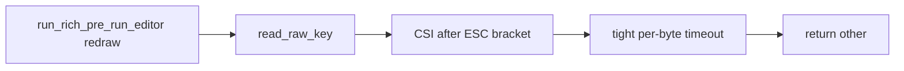

<!-- Cursor agent plan (canonical copy in-repo; do not use ~/.cursor/plans/). -->
---
todos:
  - id: "def-doc"
    content: "Add DEF-006 to plan 02 (table, subsection, frontmatter todo, MT links)"
    status: completed
  - id: "pty-test"
    content: "Add osx/tests/test_read_raw_key_csi.py PTY delayed-CSI-B test (darwin, subprocess runner)"
    status: completed
  - id: "fix-csi"
    content: "Adjust read_raw_key CSI/SS3 tail reads until PTY regression tests pass"
    status: completed
isProject: false
---
# DEF-006: Main TUI table — multiple Up/Down presses per row

## Root cause (code review)

The main settings loop is in [`osx/macos_mouse_click.py`](../../../../osx/macos_mouse_click.py) `run_rich_pre_run_editor`: each iteration redraws the Rich panel, then calls `read_raw_key()` once. Up/Down only change `selected` when `read_raw_key` returns `"up"` / `"down"`.

CSI arrow handling lives in `read_raw_key` (same file, ~266–330). **Before DEF-006**, after `ESC` + `[`, a loop read the CSI body with a **short per-byte** `select` timeout and **broke on the first empty read**. If the **final** byte (`A` / `B` for up/down) arrived **more than ~250ms** after the previous CSI byte, the loop exited early with a **partial** tail → return **`"other"`** (no row change). Leftover bytes could confuse the **next** `read_raw_key` call, matching **several** key events before one successful navigation.

Related context: plan **02** documents **DEF-002** and **DEF-003**. This defect is **intra-CSI** / **SS3** timing, not lone-`ESC` cancel.

## Resolution (implemented)

1. **CSI after `ESC [`** — One **`time.monotonic()` deadline** (~1s) for the whole tail after `[`. Each iteration calls `wait_char(min(0.5, remaining))`. On **empty** read, **continue** until the deadline (do **not** break on the first timeout). Stop when a terminator byte appears (`ABCDEFGHZab~`) or buffer cap / deadline.
2. **SS3 `ESC O …`** — Same **deadline loop** for the final direction byte (`A` / `B`).
3. **Regression tests** — [`osx/tests/test_read_raw_key_csi.py`](../../../../osx/tests/test_read_raw_key_csi.py) runs [`osx/tests/csi_pty_child_runner.py`](../../../../osx/tests/csi_pty_child_runner.py) in a **subprocess** so **`pty.fork()`** is not used inside pytest’s process.

### PTY harness: staggered writes (test-only)

The parent must **not** write `ESC` + `[` in one syscall, sleep, then write `B`: the PTY/tty layer can deliver `ESC [ B` to the child before the long gap, which **invalidates** a slow-inter-byte regression and can **EIO** the final `write` if the child has already exited.

The runner therefore sends **`ESC`**, a short pause (**`_INTER_ESC`**), **`[`** (or **`O`** for SS3), a **0.45s** gap (**`_GAP`** > legacy 250ms, under the 1s reader deadline), then **`B`**. See the module docstring in `csi_pty_child_runner.py`.

## Defect documentation

**DEF-006** is recorded in [`plan-002-macos-mouse-click-terminal-ux.md`](../plan-002-macos-mouse-click-terminal-ux.md) (summary table + MT links) and [`def-006-tui-arrow-multi-press.md`](../../defects/def-006-tui-arrow-multi-press.md) (detail narrative).

## Regression tests (current behavior)

| Test | Asserts |
|------|---------|
| `test_read_raw_key_csi_down_slow_inter_byte_gap` | After `ESC [`, gap **>250ms** before `B` → **`down`** |
| `test_read_raw_key_ss3_down_slow_final_byte` | After `ESC O`, same gap before `B` → **`down`** |

Both use **`@pytest.mark.darwin`** and subprocess timeout guards.

## Files touched (implementation)

| File | Role |
|------|------|
| [`plan-002-macos-mouse-click-terminal-ux.md`](../plan-002-macos-mouse-click-terminal-ux.md) | DEF-006 summary table + MT links |
| [`def-006-tui-arrow-multi-press.md`](../../defects/def-006-tui-arrow-multi-press.md) | DEF-006 narrative + resolution |
| [`osx/macos_mouse_click.py`](../../../../osx/macos_mouse_click.py) | `read_raw_key` CSI/SS3 deadline loops |
| [`osx/tests/test_read_raw_key_csi.py`](../../../../osx/tests/test_read_raw_key_csi.py) | Subprocess-driven PTY tests |
| [`osx/tests/csi_pty_child_runner.py`](../../../../osx/tests/csi_pty_child_runner.py) | PTY child + staggered master injection |

## Out of scope

- Full Rich-table PTY navigation tests (deferred as flaky).
- Changing cancel / `ESC` policy (**DEF-003**).
