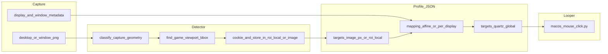
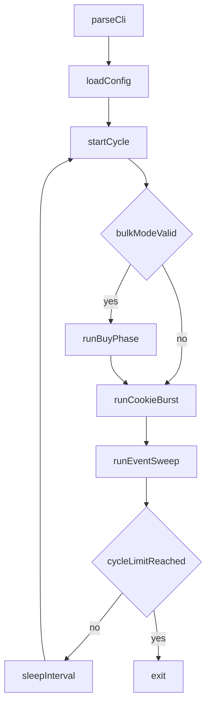

<!-- Cursor agent plan (canonical copy in-repo; do not use ~/.cursor/plans/). -->
---
todos:
  - id: "looper-research-summary"
    content: "Document current looper behavior and assumptions from the shell script."
    status: completed
  - id: "looper-research-screenshots"
    content: "Analyze cookie-clicker screenshot differences and map them to automation gaps."
    status: completed
  - id: "looper-research-backlog"
    content: "Propose prioritized feature candidates for looper improvements."
    status: completed
isProject: false
---
# Research plan: Looper features from Cookie Clicker UI evidence

## Scope

- Script under analysis: **[`osx/macos_mouse_click_loop.sh`](../../../../osx/macos_mouse_click_loop.sh)**.
- Supporting docs: **[`osx/README.md`](../../../../osx/README.md)** and **[`docs/osx/plans/agent/README.md`](README.md)**.
- Screenshot evidence: **`docs/osx/screenshots/cookie-clicker/`** (8 captures from 2026-04-25).
- This is research only: no behavior changes in this plan document.
- Terms used here are defined at first use; full glossary lives in **[`docs/osx/TERMINOLOGY.md`](../../TERMINOLOGY.md)**.

## High-level behavior of the looper today

From the current script implementation:

1. **Cycle control**
   - Runs a `while true` loop and calls `run_once` each cycle.
   - Supports bounded runs with `-c <count>`; without `-c`, runs until interrupted.
   - Sleeps 30 seconds between completed cycles.

2. **Buy ladder phase**
   - `run_buy_ladder` is a fixed sequence of 12 building rows.
   - Each row gets 5 real clicks (`-n 5 -Y`) at hard-coded coordinates.
   - Store order is static: time machine -> portal -> alchemy lab -> ... -> cursor.

3. **Cookie burst phase**
   - After ladder (or immediately with `-S`), runs a fixed cookie click burst:
     `-n 3000 -Y` on one hard-coded big-cookie coordinate.

4. **Operational assumptions**
   - Window geometry, zoom, and column positions are stable.
   - Store rows are at expected Y offsets.
   - No runtime detection of affordability, bulk buy mode, or UI state.
   - No handling for golden cookies, upgrades strip, or store scrolling.

## Screenshot evidence analyzed

Source folder currently contains:

- `Screenshot_2026-04-25_at_8.20.52_PM.png`
- `Screenshot_2026-04-25_at_8.21.09_PM.png`
- `Screenshot_2026-04-25_at_8.21.38_PM.png`
- `Screenshot_2026-04-25_at_8.23.38_PM.png`
- `Screenshot_2026-04-25_at_8.28.45_PM.png`
- `Screenshot_2026-04-25_at_8.28.54_PM.png`
- `Screenshot_2026-04-25_at_8.29.14_PM.png`
- `Screenshot_2026-04-25_at_9.20.47_PM.png`

Observed differences across the expanded screenshot set:

1. **Bulk mode flips between affordable and unaffordable store states**
   - At 8:20:52, 8:23:38, and 8:28:45, displayed prices are in roughly 60T-163T range and many rows are purchasable.
   - At 8:21:09, 8:21:38, 8:28:54, and 8:29:14, store is on `x100`; shown costs jump to quintillions/sextillions and rows are greyed.
   - Result: current blind 5x ladder can spend clicks on disabled rows when bulk mode is high.

2. **CpS changes sharply between screenshots**
   - **CpS** means *cookies per second* (the game's production rate shown under the cookie total).
   - Around 8.1B CpS in the single-buy-state shots, around 56.8B CpS in x100-state shots, and around 76.5B in the later 9:20 capture.
   - This implies dynamic game state (buffs/events/modifiers) that the loop does not model.

3. **Store list is scrollable and layout-dependent**
   - Scrollbar indicates additional tiers outside the visible region.
   - In the 9:20 capture, deeper tiers (for example antimatter condenser / prism / unknown rows) are visible; fixed Y offsets become fragile as progress, window size, or display setup changes.

4. **Economy ordering is not always intuitive by row**
   - Some higher-tier rows can appear cheaper than nearby rows in specific states.
   - A static top-to-bottom purchase order is not equivalent to best-next spend.

5. **Store header and action zones shift over time**
   - In the 9:20 capture, the right column includes a visible upgrades strip and buy-amount selector block above the building list, pushing purchasable rows further down the screen.
   - The current ladder assumes a stable top row y-position and does not compensate for header/upgrade-area height changes.

6. **Additional high-value interaction targets are visible in UI**
   - Upgrades strip area, golden cookie opportunities, and mini-game controls can materially change returns.
   - Current loop only clicks one cookie target plus fixed store rows.

## Potential feature backlog

### Tier 1: low complexity / high reliability wins

- **Config file for coordinates and counts**
  - Move ladder rows, cookie coordinate, click counts, and sleep to a data file.
- **CLI controls for burst and sleep**
  - Add flags for cookie burst count and cycle sleep seconds.
- **Explicit bulk mode contract**
  - Add a flag like `--expect-bulk x1|x10|x100` and fail fast (or warn) when operator preconditions are not met.
- **Cycle logging**
  - Emit structured per-cycle logs: cycle number, mode (`-S` or full), elapsed time, and click intents.
- **Window-profile presets**
  - Add named profiles (`desktop-max`, `windowed-small`, `ultrawide`) so coordinate sets can be switched without editing script code.

### Tier 2: medium complexity / state-aware purchasing

- **Store affordability heuristics**
  - Skip ladder rows likely disabled by current mode/state rather than always firing 5 clicks.
- **Scroll-aware ladder**
  - Add optional pre-scroll and anchor strategy for deeper tiers.
- **Ladder profiles**
  - Support selectable strategies (`balanced`, `high-tier`, `cookie-only`) via config.
- **Header-offset calibration step**
  - Before ladder clicks, run a short calibration click/move sequence to align the first visible store row.

### Tier 3: advanced automation

- **Golden cookie sweep**
  - Add optional region sweep clicks between bursts for event capture.
- **Upgrade strip pass**
  - Add configurable upgrade-region tapping before or after ladder.
- **Buff-aware pacing**
  - Adapt burst length or sleep based on observed high-value windows.

### Tier 4: longer-term research

- **Vision/accessibility-assisted state detection**
  - Detect enabled/disabled buy buttons and active bulk mode from UI state.
- **Value-based purchase optimizer**
  - Move from fixed row order to ROI-based spend strategy.
- **Automated coordinate learner**
  - Use a guided setup mode to capture and save the live cookie/store/upgrade anchor points from operator clicks.

## Detailed plan: dynamic coordinate determination

This section answers: how dynamic coordinate detection can work, what to update, and what to create.

### Goal

Replace hard-coded `-x/-y` values in `macos_mouse_click_loop.sh` with coordinates resolved at runtime from a saved calibration profile plus light safety checks.

### Approach options

1. **Manual calibration only (lowest complexity)**
   - Operator captures anchors once, saves JSON, loop derives all click points from those anchors.
   - Pro: simplest and reliable on one machine/layout.
   - Con: not resilient to window moves/resizes unless recalibrated.

2. **Computer-vision-only runtime detection (highest complexity)**
   - Detect cookie center and store rows from screenshot every cycle.
   - Pro: most automatic.
   - Con: image-template fragility, heavier dependencies, slower loop startup.

3. **Recommended: hybrid calibration + runtime guardrails**
   - Primary coordinates come from calibration profile.
   - Optional runtime checks detect major drift (window moved, bulk mode mismatch, row spacing anomaly) and fail fast with actionable message.
   - This gives predictable behavior now and leaves room for future CV enhancements.

### Recommended architecture (hybrid)

1. **Capture anchors once**
   - Guided setup captures:
     - big cookie center,
     - first visible buy-row center (`cursor` row),
     - store row spacing in pixels,
     - store panel bounds (x-left/x-right/y-top/y-bottom),
     - optional upgrade-strip and bulk-selector anchors.

2. **Persist profile**
   - Save per-machine profile JSON with metadata:
     - display resolution,
     - window mode (`fullscreen`/`windowed`),
     - game zoom/devicePixelRatio hints,
     - timestamp and profile name.

3. **Resolve per-run coordinates**
   - At loop start, load profile and compute:
     - cookie burst click point,
     - buy-ladder row click points from `start_y + n * row_spacing`,
     - optional scroll anchor / upgrade strip region.

4. **Run safety checks before click loop**
   - Validate profile exists and required keys are present.
   - Validate expected bulk mode contract (`x1`, `x10`, `x100`) by operator assertion (v1), then optional visual check (v2).
   - Abort early if profile-window mismatch exceeds threshold.

5. **Execute loop using resolved coordinates**
   - `run_buy_ladder` and cookie burst consume resolved values instead of constants.

### Scripts to update

1. **`osx/macos_mouse_click_loop.sh`** (primary)
   - Add flags:
     - `-P <profile>`: calibration profile name/path,
     - `-B <bulk_mode>`: expected bulk mode (`x1|x10|x100`),
     - `-L <layout>`: optional named preset fallback,
     - `--recalibrate` (or short flag variant): launch calibration helper then exit.
   - Replace hard-coded coordinate literals with variables populated from resolver output.
   - Add `load_profile` + `resolve_coordinates` functions and strict validation.
   - Keep `-S` and `-c` behavior unchanged.

2. **`osx/README.md`**
   - Add setup instructions:
     - run calibration,
     - choose profile,
     - run loop with profile.
   - Document new flags and troubleshooting for drift/mismatch errors.

3. **`osx/Makefile`** (optional but recommended)
   - Add convenience targets:
     - `make -C osx calibrate-cookie-clicker`,
     - `make -C osx validate-cookie-profile`.

4. **`osx/tests/...`**
   - Add/update tests for:
     - profile parsing/validation,
     - ladder coordinate derivation math,
     - argument parsing and error paths in loop wrapper.

### New scripts/files to create

1. **`osx/cookie_clicker_calibrate.py`** (new)
   - Interactive calibration wizard.
   - Uses existing click tooling and prompt flow to record anchors.
   - Writes profile JSON to `osx/config/cookie_clicker_profiles/<name>.json`.

2. **`osx/cookie_clicker_resolve_coords.py`** (new)
   - Deterministic resolver:
     - input: profile JSON + runtime options,
     - output: resolved coordinate set (JSON or env-ready key/value).
   - Contains row-map logic for buy ladder names -> y offsets.

3. **`osx/config/cookie_clicker_profiles/`** (new directory)
   - Stores user profiles (machine-local, likely ignored by git except sample).

4. **`osx/config/cookie_clicker_profile.sample.json`** (new tracked sample)
   - Documents required schema and defaults.

5. **`osx/tests/test_cookie_clicker_resolve_coords.py`** (new)
   - Unit tests for resolver math and schema validation.

6. **`osx/tests/test_cookie_clicker_calibrate_schema.py`** (new)
   - Ensures calibration output conforms to expected profile schema.

### Proposed profile schema (v1)

- `profile_name`
- `display`: `{ width, height, scale }`
- `window`: `{ mode, left, top, width, height }` (if known)
- `cookie`: `{ x, y }`
- `store`: `{ x, first_row_y, row_spacing, panel_top, panel_bottom }`
- `anchors`:
  - `bulk_selector_x1`
  - `bulk_selector_x10`
  - `bulk_selector_x100`
  - `upgrade_strip_center` (optional)
- `ladder_order`: array of building keys (`time_machine ... cursor`)

### Implementation phases

1. **Phase A: profile + resolver foundation**
   - Create schema, resolver script, tests.
   - Wire loop to consume resolver output.

2. **Phase B: calibration wizard**
   - Create interactive calibrator and profile writer.
   - Add `README` setup docs.

3. **Phase C: safety checks**
   - Add profile-window compatibility checks and bulk-mode assertions.
   - Improve loop failure messages with clear operator actions.

4. **Phase D: optional runtime drift detection**
   - Add non-blocking drift warnings (v1) then optional hard-fail mode (v2).
   - Explore CV/accessibility only after baseline is stable.

### Validation plan

- Unit tests for resolver and schema.
- Manual dry run:
  - calibrate profile,
  - run `-S -c 1` (cookie only),
  - run full ladder `-c 1`,
  - move/resize window to confirm drift error path.
- Keep `bash -n osx/macos_mouse_click_loop.sh` in CI/local checks.

## CV config generation and previewer safety gate

### Selected approach

- **Hybrid** workflow:
  1. Generate profile JSON from screenshot with OpenCV heuristics.
  2. Render annotated preview artifact showing all planned click points and click counts.
  3. Require explicit user approval before real clicks (or explicit auto-approve flag).
- Manual fallback remains available by editing profile JSON when confidence is low.

### Scripts updated and created

Updated:

- **`osx/macos_mouse_click_loop.sh`**
  - Added profile/detection/preview flags.
  - Loads cookie + ladder coordinates from profile JSON when `-P` is used.
  - Supports preview-only mode and preview confirmation gate before clicks.
- **`osx/README.md`**
  - Added CV detect -> preview -> run workflow and new CLI options.
- **`osx/requirements-test.txt`**
  - Added `opencv-python` for detector + preview tests.

Created:

- **`osx/cookie_clicker_detect_coords.py`**
  - Input: screenshot image.
  - Output: coordinate profile JSON with confidence + warnings.
- **`osx/cookie_clicker_preview_plan.py`**
  - Input: profile JSON + loop options.
  - Output: annotated preview PNG + manifest JSON with target counts.
- **`osx/config/cookie_clicker_profile.schema.json`**
  - Schema for expected profile fields.
- **`osx/config/cookie_clicker_profile.sample.json`**
  - Sample profile for documentation and tests.
- **`osx/config/cookie_clicker_profiles/.gitkeep`**
  - Keeps generated-profile directory in repo.
- **`osx/tests/test_cookie_clicker_detect_coords.py`**
  - Detector output + status coverage.
- **`osx/tests/test_cookie_clicker_preview_plan.py`**
  - Preview artifact generation + skip-ladder behavior checks.

### Profile JSON and preview artifact summary

Profile required fields:

- `profile_name`
- `source_image`
- `detected_at`
- `cookie` (`x`, `y`, `confidence`)
- `store` (`x`, `panel_top`, `panel_bottom`, `row_spacing`, `confidence`)
- `ladder_rows` (ordered list of named row coordinates + confidence)
- `preview_defaults` (cookie count, ladder count, cycle sleep)
- `warnings`

Preview manifest fields:

- `profile_hash` (SHA-256 of profile JSON)
- `options_hash` (SHA-256 of preview option payload)
- `targets[]` with `phase`, `name`, `x`, `y`, `click_count`
- output preview image path + generation timestamp

### Acceptance criteria (review checklist)

- Detector script writes profile JSON for a Cookie Clicker screenshot without clicking.
- Preview script writes:
  - annotated PNG with labeled click targets,
  - manifest JSON containing every target and click count.
- Loop script behavior:
  - `-N` exits after preview without clicking,
  - `-R` fails if manifest/profile/options hashes do not match,
  - real click run prompts for confirmation unless `-A` is supplied.
- Existing finite-cycle and `-S` behavior remains intact when using profile coordinates.

## Coordinate space integrity (screenshot pixels vs Quartz click space)

### Problem statement (what went wrong in preview review)

The preview PNG is drawn on the **same raster** as the detector input image. If detector coordinates are computed in **image pixel space** (OpenCV `imread` coordinates) but `macos_mouse_click.py` posts clicks in **Quartz global display coordinates** (logical points in the global desktop coordinate system), then:

- The preview can look internally consistent on the PNG while still being **wrong for real clicks**.
- Misalignment gets worse with **Retina / HiDPI** (backing scale factor), **browser chrome vs content area**, **window position on multi-monitor layouts**, and **captured image scaling** (downscaled screenshots, different capture tool defaults).

This is a **coordinate-space contract** bug, not just a “bad heuristic” bug.

### Invariants we need (contract)

Pick one primary representation in the profile JSON and make every consumer convert explicitly:

1. **`image_px`** — `(0,0)` top-left of the detector input image; units = pixels of that file.
2. **`quartz_global`** — macOS Quartz global desktop coordinates used by `CGEvent` (what `macos_mouse_click.py` expects today).
3. (Optional future) **`window_local`** — relative to browser window content rect; useful for repositioning.

**Rule:** preview overlays on a PNG must be labeled as **`image_px`** unless the profile also contains a verified mapping to **`quartz_global`**.

### Root causes to address (checklist)

- **DPR / backing scale:** PNG may be 2x physical pixels vs 1x “point” space used by Quartz for some setups; mapping must incorporate `backingScaleFactor` for the display/window.
- **Capture origin:** Screenshot includes menubar/dock vs cropped browser-only; mapping must record **full display vs window crop** and offsets.
- **Browser UI:** address bar, bookmarks, tab strip change the content origin; detection should target **page content** box, not the outer window frame, or include measured chrome heights.
- **Multi-monitor:** global Quartz coords depend on display arrangement; profile must record **which display** and ideally **display ID / frame** at capture time.
- **Stale captures:** moving/resizing the window after capture invalidates mapping; detection metadata must include **window frame hash** or require fresh capture.

### Plan to fix (phased, no code in this doc)

#### Phase 0 — documentation and safety labeling (fast)

- Update operator docs to state clearly:
  - detector output is **`image_px` unless marked otherwise**;
  - preview PNG verifies **image-space targets only**;
  - do not treat preview alone as proof for Quartz clicks.
- Extend preview manifest plan to include `coordinate_space` field and warnings when unmapped.

#### Phase 1 — capture metadata + explicit transform fields in profile JSON

Add structured metadata (planned schema extension):

- `image`: `{ width_px, height_px, path, capture_tool }`
- `display`: `{ primary, display_id?, display_bounds_quartz? }` (best-effort)
- `browser_window`: `{ app, title_substring, frame_quartz?, content_frame_quartz? }` (best-effort)
- `mapping`: `{ from: "image_px", to: "quartz_global", method, params }`

Where `method` is one of:

- `affine_3pt` (scale + translate; minimal)
- `homography` (perspective correction; only if needed)
- `manual_anchor` (operator-provided mapping points)

#### Phase 2 — mapping derivation strategies (choose per environment)

**Preferred (reliable):** paired calibration points

- Operator records 3–4 known points in both spaces:
  - click point in Quartz (via existing learn tooling) **and**
  - same feature location in the screenshot (or automated corner detection).
- Solve transform offline; store in profile; validate error residuals.

**Semi-automated:** window frame + content insets

- Use Accessibility / Apple APIs to read browser window rect and compute content origin.
- Combine with screenshot crop box to map pixels → Quartz.

**Fallback:** require capture settings

- Standardize capture to **full screen** or **window** with known tool flags.
- Reject captures that don’t include required metadata.

#### Phase 3 — dual previews (recommended UX)

Generate two artifacts when mapping exists:

1. **`preview_image_space.png`** — current behavior; validates detector on the raster.
2. **`preview_quartz_overlay.png`** (or a second pass) — render targets after mapping, overlaid on a **fresh capture** taken at preview time **or** a blank canvas with numeric Quartz coordinates listed.

If mapping is missing, gate real clicks behind **manual confirmation** and show a big warning in manifest.

#### Phase 4 — loop integration hardening

- `macos_mouse_click_loop.sh` should refuse `-P` profiles that are `image_px` without a `quartz_global` mapping (unless operator passes an explicit `--i-know-its-image-space` style escape hatch).
- `cookie_clicker_preview_plan.py` should stamp `coordinate_space` + mapping hash into manifest for `-R` checks.

### Acceptance criteria (coordinate-space)

- For a known test capture on a single machine, mapped targets land within **N pixels/points** of ground truth on:
  - cookie center,
  - first store row,
  - last visible store row.
- Preview manifest clearly states coordinate space; no ambiguous “x/y” without units.
- Warnings trigger when mapping confidence/residuals exceed threshold.

### Non-goals (for this track)

- Perfect CV without calibration on arbitrary machines.
- Supporting every browser zoom/DPI combo without metadata.

## Full-desktop screenshots and Quartz-aligned profiles

This section ties together **strategy** and **design** so `cookie_clicker_profile.json` (and any sidecar metadata the looper loads) can carry **real desktop coordinates** safe for `macos_mouse_click.py`, not only OpenCV pixel coordinates inside an arbitrary crop.

### Observations on `docs/osx/screenshots/cookie-clicker` captures

The folder mixes **three capture geometries** useful for different test cases:

| Pattern (examples) | Typical size | Inferred mode | Implication for detection / mapping |
| --- | --- | --- | --- |
| `Screenshot_2026-04-25_at_8.2*.png`, `8.28.45`, `9.20.47` | ~1064×820–1074×823 (tall variant ~1064×1770) | **Browser window or tight crop** (game fills most of frame) | Heuristic detector matches current script: columns and cookie are **almost entire image**. Coordinates are **window-local or crop-local**; must add **window frame in Quartz** (and browser chrome offsets) to reach global click space. |
| `Screenshot_2026-04-25_at_8.28.54`, `8.29.14` | 2352×2094 | **Large canvas** (likely Retina full desktop or very large window) | Game occupies a **sub-rectangle**; detector must **localize** the Cookie Clicker viewport inside the raster before row/cookie math. Same pixel-vs-Quartz gap unless mapping metadata exists. |
| `Screenshot_2026-04-26_at_7.59.11_AM.png` (and `7.59.49`) | **2880×1800** | **Full virtual desktop** (multi-monitor “entire desktop” capture on macOS) | Origin `(0,0)` in the PNG is the **top-left of the combined virtual framebuffer** as macOS ordered displays for that capture, **not** the game window. Cookie/store pixels are **global image coordinates** once the game region is found; mapping to Quartz is a **bounded affine** if capture scale matches Quartz **points** space (see below). |
| Same timestamp `__2_` / `__3_` siblings | **1920×1080** and **1080×1920** | **Per-display tiles** from multi-display capture | Each file is one physical display bitmap. Game may appear in **only one** tile. Quartz mapping is **`CGDisplayBounds(displayID)` origin + scaled offset** into that tile (display ID order must match capture order or be disambiguated by metadata). |

**Takeaway:** the April 26 set is the right **regression corpus** for “find Cookie Clicker in clutter” and for “multi-monitor / mixed orientation.” The older narrow crops remain the right corpus for **pure UI geometry** (row spacing, panel bounds) once a **viewport rectangle** is known.

### Coordinate flow (target architecture)

**Contract:** the looper should prefer **`targets_quartz_global`** (or an explicit `mapping` block the loop script resolves to Quartz before each run). **`targets_image_px`** remains for preview-on-PNG and for debugging CV.

### Strategy 1 — Full stitched desktop (e.g. 2880×1800) + capture-time metadata (recommended spine)

**Idea:** treat the PNG as a **bitmap of the virtual desktop** in **pixel** units. At capture time (same second as the screenshot), record from CoreGraphics:

- Ordered list of **active displays**: `display_id`, `CGDisplayBounds` in **Quartz global points**, `pixelWidth` / `pixelHeight`, and **`displayBounds` vs backing store** relationship (Retina: points vs pixels).

**Mapping:** for each display, build **pixel-rect of that display in the stitched image** (macOS documents how the framebuffer is laid out; order can be queried). Then:

- Any detected point `(x_img, y_img)` in the stitched image → identify which display rectangle contains it →  
  `x_quartz = display_bounds.origin.x + (x_img - disp_origin_in_image_px) / scale_x`  
  (and similarly for `y`), where `scale_x` is **pixels per Quartz point** for that display (often 2 on Retina, 1 on 1x).

**Profile contents:**

- `capture_kind: full_desktop_stitched`
- `image`: width/height, file path, timestamp
- `displays[]`: `{ id, bounds_quartz_points, pixel_frame_in_image, pixels_per_point }`
- `game_viewport`: `{ x, y, w, h }` in **full-image pixels** (detector output)
- `cookie` / `store` / `ladder_rows`: either **in image pixels** with a single `mapping` to Quartz, or **precomputed Quartz** fields

**Detector role:** extend classification so it **does not assume** the game fills the frame; run **window / game localization** (color regions, edge density, template from neutral background, or coarse text “cookies” / known UI colors) to get `game_viewport`, then run existing column heuristics **inside that ROI**.

### Strategy 2 — Per-display tiles (`__2_`, `__3_`) + display table

**Idea:** each PNG maps to **one** `CGDisplayBounds`. Metadata lists which file name or hash corresponds to `display_id` N.

**Detector:** either (a) pick the tile that contains the game via the same localization pass, or (b) run detector on all tiles and keep the highest-confidence hit.

**Mapping:** simpler than stitched: one origin and one scale per file.

**Risk:** filename suffix order (`__2_`) **must not** be assumed stable across macOS versions; metadata should record **display UUID / serial / arrangement signature** or raw `CGDisplayBounds` side-by-side with image dimensions.

### Strategy 3 — Small window crop + live window bounds from the OS (pragmatic default)

**Idea:** keep using **window-only** screenshots for CV quality, but **never** ship Quartz clicks from pixels alone.

**Companion input** (not necessarily inside the same JSON file, but loadable by the looper):

- Output of a tiny **Quartz / Accessibility** helper: frontmost browser window **frame in global Quartz points**, plus optional **content area** if obtainable.
- Detector outputs cookie/store positions **relative to game viewport** or **relative to window content top-left**.

**Mapping:** one translation (+ scale if Retina mismatch between screenshot and points):  
`P_quartz = window_content_origin_quartz + (P_img - content_origin_img) * (points_per_pixel)`.

This path avoids solving **multi-monitor stitching** inside the detector and matches how operators already reason about “the game window.”

### Other ways the detect script (or pipeline) can produce a correct `cookie_clicker_profile.json`

These are **composable** with the strategies above; pick 1–2 for v1.

1. **Two-phase profile generation**
   - **Phase CV:** image-only → `game_viewport`, `ladder_rows` in ROI-local or image px + confidence.
   - **Phase bridge:** separate command (Swift, `python` + `pyobjc`, or existing learn tooling) writes `window_bounds_quartz` / `displays[]` into the same profile or a `*.capture-meta.json` the looper merges. Detector refuses to emit `quartz_global` without bridge data unless `--allow-image-space-only`.

2. **Classifier flag on input**
   - Auto-detect: `window_crop` | `full_desktop` | `single_display_tile` using aspect ratio, known desktop resolutions, presence of menu bar strip, duplicate wallpaper edges, etc.
   - Branch heuristics (ROI required for full desktop).

3. **Anchored affine from menu bar + dock + window chrome**
   - Measure **menu bar height** and **dock reserve** in pixels from the top/bottom edges of a full-desktop capture; combined with `NSScreen` / CG display safe insets from metadata, improves **content** placement when the game is edge-snapped.

4. **Known fixed points inside the game**
   - Detect **big cookie center** and **bulk-buy x1/x10/x100** as high-contrast anchors; use operator-provided **two Quartz clicks** (learn tool) on those same features to solve a 2-DOF or 4-DOF affine quickly (fewer manual points than full ladder).

5. **Synthetic calibration overlay (future)**
   - Optional “debug mode” page or userscript draws fiducials at known layout positions; detector finds fiducials → strong homography (guarded behind opt-in).

6. **Reprojection validation**
   - After mapping, run **preview** that draws **back into a fresh full-desktop capture** (Strategy 1) and require operator sign-off before `-R` allows clicks.

### Plan doc deltas vs implementation order

1. Add **capture metadata schema** and a **small CG metadata dumper** script (implementation plan, not this file’s code).
2. Extend detector with **geometry classification + ROI localization**, using the **April 26** PNGs as fixtures.
3. Define **`quartz_global` fields** (or `mapping`) in profile schema; update looper to prefer Quartz when present.
4. Document operator workflow: “capture full desktop → run metadata dumper → run detector with `--capture-meta` → preview → run.”

## Suggested rollout order

1. Externalize config and add CLI tuning knobs.
2. Add logging, explicit bulk-mode safety checks, and window-profile presets.
3. Add ladder profiles with optional scroll handling plus header-offset calibration.
4. Prototype golden-cookie/upgrade passes behind opt-in flags.
5. Explore state detection and coordinate-learning only after baseline ergonomics are stable.

## Control-flow concept for a future state-aware looper

## Risks and constraints

- All coordinate automation is machine-local and fragile across monitor/layout changes.
- **Screenshot pixel coordinates are not Quartz click coordinates** unless an explicit, validated mapping is recorded; see **Coordinate space integrity** above.
- Screenshot set is now tracked and growing; filename normalization (`NN-kebab-case`) would improve chronological readability in docs tables.
- OCR/vision features raise complexity quickly and should be optional, not a blocker for simple operator loops.

## Verification

- Documentation-only output in this plan.
- Optional script sanity check remains:
  - `bash -n osx/macos_mouse_click_loop.sh`

## Owner

This file. Follow-up implementation plans can split individual backlog tiers into separate `plan-agent-*` docs for smaller review cycles.
