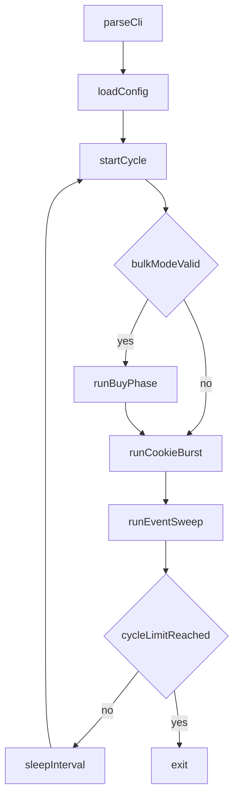

<!-- Cursor agent plan (canonical copy in-repo; do not use ~/.cursor/plans/). -->
---
todos:
  - id: "looper-research-summary"
    content: "Document current looper behavior and assumptions from the shell script."
    status: completed
  - id: "looper-research-screenshots"
    content: "Analyze cookie-clicker screenshot differences and map them to automation gaps."
    status: completed
  - id: "looper-research-backlog"
    content: "Propose prioritized feature candidates for looper improvements."
    status: completed
isProject: false
---
# Research plan: Looper features from Cookie Clicker UI evidence

## Scope

- Script under analysis: **[`osx/macos_mouse_click_loop.sh`](../../../../osx/macos_mouse_click_loop.sh)**.
- Supporting docs: **[`osx/README.md`](../../../../osx/README.md)** and **[`docs/osx/plans/agent/README.md`](README.md)**.
- Screenshot evidence: **`docs/osx/screenshots/cookie-clicker/`** (8 captures from 2026-04-25).
- This is research only: no behavior changes in this plan document.
- Terms used here are defined at first use; full glossary lives in **[`docs/osx/TERMINOLOGY.md`](../../TERMINOLOGY.md)**.

## High-level behavior of the looper today

From the current script implementation:

1. **Cycle control**
   - Runs a `while true` loop and calls `run_once` each cycle.
   - Supports bounded runs with `-c <count>`; without `-c`, runs until interrupted.
   - Sleeps 30 seconds between completed cycles.

2. **Buy ladder phase**
   - `run_buy_ladder` is a fixed sequence of 12 building rows.
   - Each row gets 5 real clicks (`-n 5 -Y`) at hard-coded coordinates.
   - Store order is static: time machine -> portal -> alchemy lab -> ... -> cursor.

3. **Cookie burst phase**
   - After ladder (or immediately with `-S`), runs a fixed cookie click burst:
     `-n 3000 -Y` on one hard-coded big-cookie coordinate.

4. **Operational assumptions**
   - Window geometry, zoom, and column positions are stable.
   - Store rows are at expected Y offsets.
   - No runtime detection of affordability, bulk buy mode, or UI state.
   - No handling for golden cookies, upgrades strip, or store scrolling.

## Screenshot evidence analyzed

Source folder currently contains:

- `Screenshot_2026-04-25_at_8.20.52_PM.png`
- `Screenshot_2026-04-25_at_8.21.09_PM.png`
- `Screenshot_2026-04-25_at_8.21.38_PM.png`
- `Screenshot_2026-04-25_at_8.23.38_PM.png`
- `Screenshot_2026-04-25_at_8.28.45_PM.png`
- `Screenshot_2026-04-25_at_8.28.54_PM.png`
- `Screenshot_2026-04-25_at_8.29.14_PM.png`
- `Screenshot_2026-04-25_at_9.20.47_PM.png`

Observed differences across the expanded screenshot set:

1. **Bulk mode flips between affordable and unaffordable store states**
   - At 8:20:52, 8:23:38, and 8:28:45, displayed prices are in roughly 60T-163T range and many rows are purchasable.
   - At 8:21:09, 8:21:38, 8:28:54, and 8:29:14, store is on `x100`; shown costs jump to quintillions/sextillions and rows are greyed.
   - Result: current blind 5x ladder can spend clicks on disabled rows when bulk mode is high.

2. **CpS changes sharply between screenshots**
   - **CpS** means *cookies per second* (the game's production rate shown under the cookie total).
   - Around 8.1B CpS in the single-buy-state shots, around 56.8B CpS in x100-state shots, and around 76.5B in the later 9:20 capture.
   - This implies dynamic game state (buffs/events/modifiers) that the loop does not model.

3. **Store list is scrollable and layout-dependent**
   - Scrollbar indicates additional tiers outside the visible region.
   - In the 9:20 capture, deeper tiers (for example antimatter condenser / prism / unknown rows) are visible; fixed Y offsets become fragile as progress, window size, or display setup changes.

4. **Economy ordering is not always intuitive by row**
   - Some higher-tier rows can appear cheaper than nearby rows in specific states.
   - A static top-to-bottom purchase order is not equivalent to best-next spend.

5. **Store header and action zones shift over time**
   - In the 9:20 capture, the right column includes a visible upgrades strip and buy-amount selector block above the building list, pushing purchasable rows further down the screen.
   - The current ladder assumes a stable top row y-position and does not compensate for header/upgrade-area height changes.

6. **Additional high-value interaction targets are visible in UI**
   - Upgrades strip area, golden cookie opportunities, and mini-game controls can materially change returns.
   - Current loop only clicks one cookie target plus fixed store rows.

## Potential feature backlog

### Tier 1: low complexity / high reliability wins

- **Config file for coordinates and counts**
  - Move ladder rows, cookie coordinate, click counts, and sleep to a data file.
- **CLI controls for burst and sleep**
  - Add flags for cookie burst count and cycle sleep seconds.
- **Explicit bulk mode contract**
  - Add a flag like `--expect-bulk x1|x10|x100` and fail fast (or warn) when operator preconditions are not met.
- **Cycle logging**
  - Emit structured per-cycle logs: cycle number, mode (`-S` or full), elapsed time, and click intents.
- **Window-profile presets**
  - Add named profiles (`desktop-max`, `windowed-small`, `ultrawide`) so coordinate sets can be switched without editing script code.

### Tier 2: medium complexity / state-aware purchasing

- **Store affordability heuristics**
  - Skip ladder rows likely disabled by current mode/state rather than always firing 5 clicks.
- **Scroll-aware ladder**
  - Add optional pre-scroll and anchor strategy for deeper tiers.
- **Ladder profiles**
  - Support selectable strategies (`balanced`, `high-tier`, `cookie-only`) via config.
- **Header-offset calibration step**
  - Before ladder clicks, run a short calibration click/move sequence to align the first visible store row.

### Tier 3: advanced automation

- **Golden cookie sweep**
  - Add optional region sweep clicks between bursts for event capture.
- **Upgrade strip pass**
  - Add configurable upgrade-region tapping before or after ladder.
- **Buff-aware pacing**
  - Adapt burst length or sleep based on observed high-value windows.

### Tier 4: longer-term research

- **Vision/accessibility-assisted state detection**
  - Detect enabled/disabled buy buttons and active bulk mode from UI state.
- **Value-based purchase optimizer**
  - Move from fixed row order to ROI-based spend strategy.
- **Automated coordinate learner**
  - Use a guided setup mode to capture and save the live cookie/store/upgrade anchor points from operator clicks.

## Suggested rollout order

1. Externalize config and add CLI tuning knobs.
2. Add logging, explicit bulk-mode safety checks, and window-profile presets.
3. Add ladder profiles with optional scroll handling plus header-offset calibration.
4. Prototype golden-cookie/upgrade passes behind opt-in flags.
5. Explore state detection and coordinate-learning only after baseline ergonomics are stable.

## Control-flow concept for a future state-aware looper

## Risks and constraints

- All coordinate automation is machine-local and fragile across monitor/layout changes.
- Screenshot set is now tracked and growing; filename normalization (`NN-kebab-case`) would improve chronological readability in docs tables.
- OCR/vision features raise complexity quickly and should be optional, not a blocker for simple operator loops.

## Verification

- Documentation-only output in this plan.
- Optional script sanity check remains:
  - `bash -n osx/macos_mouse_click_loop.sh`

## Owner

This file. Follow-up implementation plans can split individual backlog tiers into separate `plan-agent-*` docs for smaller review cycles.
