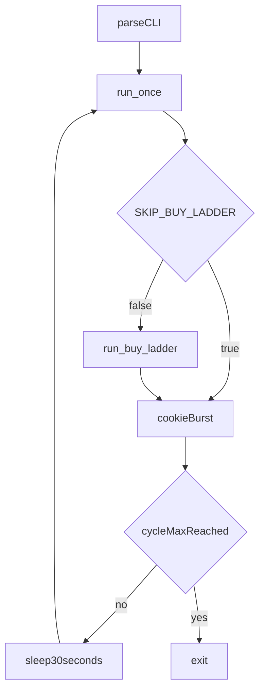

<!-- Cursor agent plan (canonical copy in-repo; do not use ~/.cursor/plans/). -->
---
todos:
  - id: "loop-retro-cli"
    content: "Retrospective: document -c, -S, run_buy_ladder, shell-template section layout."
    status: completed
  - id: "loop-retro-readme"
    content: "Pointer to osx/README.md operator-loop examples and verification."
    status: completed
isProject: false
---
# Retrospective: `macos_mouse_click_loop.sh` (template CLI, skip buy ladder)

**Terminology:** **CSI** (*Control Sequence Introducer*) — terminal control sequences usually beginning with **`ESC` `[`** (bytes `0x1B 0x5B`), including common **arrow-key** encodings. **SS3** (historically *Single Shift 3*; **arrow** sequences in this doc) — bytes introduced by **`ESC` `O`** (`0x1B 0x4F`) instead of **`ESC` `[`**. **PTY** (*pseudo-terminal*) — a paired **kernel TTY** (master/slave) so test harnesses (**pexpect**, **`pytest`** subprocess) can attach a fake terminal. **PTY tests** spawn **`osx/macos_mouse_click.py`** under a PTY and assert on captured transcripts (sometimes with stderr merged into the capture).

## Scope

- **[`osx/macos_mouse_click_loop.sh`](../../../../osx/macos_mouse_click_loop.sh)** — bash operator loop only.
- **[`osx/README.md`](../../../../osx/README.md)** — operator-loop section (examples, one-line blurb); no edits required by this retrospective.
- No changes to **`osx/macos_mouse_click.py`** or PTY tests in this plan.

## Context (git)

Work landed in two steps on `main`:

1. **`6514731`** — `feat(osx): operator loop usage, -c cycle count, README`: **`usage`** + **`getopts`**, **`-c <count>`** for finite cycles, README examples.
2. **`effa253`** — `feat(osx): loop -S cookie-only, run_buy_ladder, template section markers`: **`-S`** / **`SKIP_BUY_LADDER`**, **`run_buy_ladder`** extraction, section banners aligned with repo root **[`shell-template.sh`](../../../../shell-template.sh)**.

## Implemented behavior

- **`-c <count>`** — Run exactly that many **`run_once`** cycles, then exit. Omit **`-c`** to loop until **Ctrl+C**, with **30** seconds **`sleep`** between cycles.
- **`-S`** — Skip **`run_buy_ladder`**; each cycle runs only the long cookie burst (**`-n 3000`** on **`macos_mouse_click.py`** with **`-Y`**, i.e. real automation, not dry-run).
- **`run_once`** — Sets debug-related env vars, optionally calls **`run_buy_ladder`**, then runs the cookie burst.
- **Structure** — **`# CLI Parameters`** → **`# show command usage`** (`usage`) → **`# get command line options`** (`while getopts`, then **`shift $((OPTIND -1))`**, then post-parse checks: clicker path exists, **`-c`** is a positive integer) → **`# functions`** (`run_buy_ladder`, `run_once`) → **`# main script logic`** (cycle counter, **`while true`**, break when cap reached).

## Alignment with `shell-template.sh`

Same high-level order as **[`shell-template.sh`](../../../../shell-template.sh)** (roughly lines 77–122): **`getopts`** loop, **`shift $((OPTIND -1))`**, then **`################################################################################` / `# functions`** block containing **`function`** definitions, then **`# main script logic`** for the outer control flow. The loop script keeps validation immediately after **`shift`** (still under the options section), which matches the template’s pattern of finishing CLI parsing before entering callable units.

## Control flow (per cycle)

## Verification

- **`bash -n osx/macos_mouse_click_loop.sh`** — syntax check after any future edits to the script.
- Automated **`pytest`** for the bash loop is out of scope for this retrospective (optional follow-up).

## Non-goals

- Changing coordinates, **`sleep`** interval, or debug env toggles in the loop script.
- Adding CI or unit tests for the bash orchestration in this doc-only pass.

## Owner

This file; product umbrella for the Python clicker remains the other **`plan-agent-*`** entries under **`docs/osx/plans/agent/`**.
