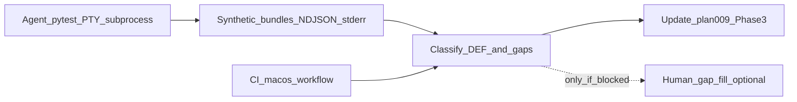

---
todos:
  - id: agent-checklist-proxy
    content: "Agent: run osx pytest (full + focused PTY/meta), build synthetic evidence bundles from NDJSON/stderr; map each plan-009 checklist row to covered/partial/gap"
    status: pending
  - id: ci-local-pytest
    content: "Record GitHub Actions macos-mouse-click.yml + local `make -C osx test` (optional test-quick) on same rev"
    status: pending
  - id: analyze-evidence
    content: "Classify agent bundles + CI vs DEF-002/003/006/008 and plan-009 log contract; list human-only gaps (if any)"
    status: pending
  - id: draft-plan09-phase3
    content: "Edit plan-009: agent checklist proxy record, automation coverage matrix, Phase 3+ backlog from evidence (human bundle optional)"
    status: pending
isProject: false
---
# Resume plan-009: agent checklist proxy, CI, Phase 3+

**Terminology:** **CSI** (*Control Sequence Introducer*) — terminal control sequences usually beginning with **`ESC` `[`** (bytes `0x1B 0x5B`), including common **arrow-key** encodings. **SS3** (historically *Single Shift 3*; **arrow** sequences in this doc) — bytes introduced by **`ESC` `O`** (`0x1B 0x4F`) instead of **`ESC` `[`**. **PTY** (*pseudo-terminal*) — a paired **kernel TTY** (master/slave) so test harnesses (**pexpect**, **pytest** subprocess) can attach a fake terminal. **PTY tests** spawn **`osx/macos_mouse_click.py`** under a PTY and assert on captured transcripts (sometimes with stderr merged into the capture).

## Goal shift (per user)

The **AI agent should perform as many operator-checklist tasks as possible**, **analyze** the outputs, and **draft Phase 3+** from that evidence. The **human should not need to do any** checklist steps **unless** automation cannot produce an equivalent signal (document those gaps explicitly).

## Context (repo)

- **[`plan-009` (narrative)](../plan-009-macos-mouse-click-tui-arrow-navigation-narrative.md)** — Phase 1 shipped (`a8c3e93`); Phase 2 AI/pytest record in doc; operator checklist rows **may be satisfied by agent-proxy evidence** when tests/subprocesses cover the same scenarios.
- **Evidence bundle recipe** — plan-009 § *Evidence bundle*; agent assembles **synthetic bundles** (NDJSON + stderr + machine-generated “transcript” from log lines) from pytest or controlled subprocess runs.
- **CI** — [`.github/workflows/macos-mouse-click.yml`](../../../../.github/workflows/macos-mouse-click.yml): `make -C osx test` on `macos-latest`.

## Checklist row → agent strategy (maximize automation)

| Plan-009 operator row | Agent-primary approach | Human only if |
|----------------------|-------------------------|---------------|
| Environment snapshot | Shell from agent session: `git rev-parse HEAD`, `python3 -V`, `echo "$TERM"`, `pip show rich` (after `make -C osx test-setup` if using venv) | Unreachable host (e.g. user-only SSH/tmux) |
| Enable `MACOS_MOUSE_CLICK_DEBUG_TUI` + log path | All pytest/subprocess fixtures already set env + `tmp_path` log files | N/A |
| Capture stderr | PTY/subprocess tests capture stderr; collect excerpts for bundle | N/A |
| Run learn + interactive to table | Existing PTY tests (`test_rich_table_nav_down_pty.py`, related); extend if a checklist segment has no test | No PTY / hang — then file Phase 3+ “add harness coverage” |
| Down once / Up once | CSI/SS3 injection via existing child runners; assert NDJSON `after_key` + row motion vs plan-009 contract | Field-only “feel” after all logs green (rare) |
| Edit then arrow | Run or add PTY/subprocess test covering field edit return-to-table + arrow (grep `osx/tests` for edit / Mode / interactive patterns) | Same as above |
| Wheel / Esc (DEF-003) | Inject wheel/Esc-like byte sequences in PTY tests (search tests for esc / wheel / DEF-003) | Physical mouse / driver-specific chunking not reproduced |
| Operator transcript | **Synthesize** from NDJSON: ordered events with `ts_wall` / `ts_mono_ns` (Phase 1 fields) | Optional human wall-clock narrative |
| Screenshot / recording | Skip in agent pipeline unless CI adds capture | **UI vs log** disagreement after automation exhausted |
| Handoff | Agent writes results into plan-009 (new subsection) + Phase 3+ backlog; cite test names and log anchors | User wants legal/ops sign-off only |

## Execution flow

1. **Agent checklist proxy** — Run `make -C osx test-setup` if needed; **`make -C osx test`**. Add focused reruns (e.g. `test_debug_tui_logging_meta.py`, `test_rich_table_nav_down_pty.py`, `test_read_raw_key_csi.py`, any Esc/wheel/edit tests found via search). For each checklist **theme**, paste or summarize **representative log excerpts** (jq-friendly NDJSON lines + stderr prefixes) and a **timeline** built from log fields. Record **per-row status**: covered / partial / gap + reason.

2. **CI** — Record latest **macOS mouse click tests** workflow for the target commit/branch: hard failures vs expected xfails.

3. **Analysis** — Apply plan-009 § *How an AI agent validates the use case from the bundle* and the disambiguation table to **synthetic bundles + CI**. List **human-only gaps** (empty list = success: human does nothing).

4. **Draft Phase 3+** — Update plan-009: **Agent checklist proxy record** (mirror the checklist table with agent results), **automation coverage matrix**, and **Phase 3 and beyond** with ordered tasks (new tests, PTY harness, product fixes, optional stdin hex). Optional cross-link [`plan-agent-new-test-up-down-navigation.plan.md`](plan-agent-new-test-up-down-navigation.plan.md) Phase 3.

## Success criteria

- Every checklist **row** has an explicit status: **agent-done**, **agent-partial**, or **human-required** with rationale.
- **CI + local** `make -C osx test` outcomes recorded for the same revision as the agent run.
- **Phase 3 and beyond** is no longer generic TBD: tasks trace to **test names**, **log patterns**, or **CI failures**.
- **Human** is not invoked unless a gap row remains **human-required** after the agent pass.

## Note on canonical plan location

This file is the **repo** copy under `docs/osx/plans/agent/`. If a duplicate exists under `~/.cursor/plans/`, prefer this path for long-term tracking.
