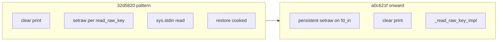

<!-- Cursor agent plan (canonical copy in-repo; do not use ~/.cursor/plans/). -->
---
id: plan-agent-rich-pre-run-tui-layout-regression
type: plan
related:
  - ../hand-off-2026-04-21-rich-pre-run-tui-layout.md
  - ../plan-006-macos-mouse-click-rich-tui-terminal-resize.md
todos:
  - id: "repro-ab"
    content: "Reproduce 32d5820 vs HEAD (same Terminal profile); capture transcripts + terminal size/env; note resize + spacer symptoms"
    status: cancelled
  - id: "isolate-cause"
    content: "Run ordered experiments (cooked-around-draw, Console stdout binding, dimension-stale vs fusion); pick minimal fix path without breaking DEF-006 /dev/tty"
    status: completed
  - id: "pty-resize-test"
    content: "Add pexpect PTY test: setwinsize after first draw; assert def009/def010 heuristics on merged transcript"
    status: completed
  - id: "implement-verify"
    content: "Implement fix; make -C osx test + manual QA; add/trim docs/osx/defects def-010 if needed"
    status: completed
isProject: false
---
# Rich pre-run TUI layout and resize (DEF-009 / DEF-010 follow-up)

## Context (from hand-off + code)

- **Reporter “good” revision:** `32d5820bf068047eb6271894a697b63d05073283` — no empty spacer lines, resize felt correct in Terminal.app.
- **First “bad” revision (reporter):** `a0c621f9464249cf16b839e5f307df20feba7b7e` — stdin/TTY path + **persistent** `tty.setraw` for the whole editor session; `_read_raw_key_impl` in the loop instead of `read_raw_key()` toggling raw per key.
- **Current `main`:** further work (`3bd517d`, `ea264d6`) addressed DEF-009 interleave (`_flush_stdout_safe`), DEF-010 spacer rows (`no_wrap` + `overflow="ellipsis"` on all columns in `_build_editor_table`), and PTY honesty (`LINES`/`COLUMNS` in [`osx/tests/pty_harness.py`](../../../../osx/tests/pty_harness.py)). **Automated tests pass; manual layout still wrong for the reporter.**

Key implementation anchors today:

- Editor entry: [`run_rich_pre_run_editor`](../../../../osx/macos_mouse_click.py) — opens `_kbd_tty_fd_get()`, snapshots attrs to `_rich_editor_tty_cooked_attrs`, **`tty.setraw(fd_in)` for entire session**, calls [`_run_rich_pre_run_editor_loop`](../../../../osx/macos_mouse_click.py).
- Draw path: `console.clear()` → `_flush_stdout_safe()` → `console.print(Panel(...))` → `_flush_stdout_safe()` → `_debug_tui_emit` → `_read_raw_key_impl(fd_in)`.
- Heuristics / tests: [`osx/tests/def009_layout_heuristics.py`](../../../../osx/tests/def009_layout_heuristics.py), [`osx/tests/test_def009_rich_table_layout_pty.py`](../../../../osx/tests/test_def009_rich_table_layout_pty.py) (live PTY uses `ignore_fused_panel_heavy_line=True` to avoid false positives on narrow `HEAVY_HEAD`).

**Important nuance:** [plan-006](../plan-006-macos-mouse-click-rich-tui-terminal-resize.md) documents **DEF-005** “stale width” without SIGWINCH. The hand-off still says resize looked **fine** at `32d5820`, so the regression may be **interaction** (persistent raw + Rich + env) rather than “only add SIGWINCH.” Treat SIGWINCH/reflow as a **possible** fix or follow-up, not the only hypothesis.

## Phase 1 — Reproduce and characterize (no code changes until failure is local)

1. **Match reporter conditions:** same Terminal profile, font, line spacing; `./osx/macos_mouse_click.py --learn --interactive` (or minimal flags from [hand-off](../hand-off-2026-04-21-rich-pre-run-tui-layout.md)); toggle `MACOS_MOUSE_CLICK_DEBUG_TUI`.
2. **Git A/B:** on same machine, check out **`32d5820`** vs **`HEAD`**, same command — confirm spacer rows + resize delta still match the hand-off (screenshot or saved transcript from `script` / tee).
3. **Capture artifacts:** one **full stdout+stderr** transcript per revision (pty or `script` session), note **actual** `stty size` / `tput cols` / `tput lines` and `echo $COLUMNS $LINES` when the editor is on screen.
4. **Optional quick probe:** log (debug-only) `os.get_terminal_size()` for **stdin / stdout / stderr** fds and Rich `console.size` once per draw on a branch — compare `32d5820` vs `HEAD` during idle and after **window resize** to see if width/height diverges when TTY stays raw.

**Exit criterion:** A concrete observation (e.g. “Rich width stuck at N after resize while ioctl says M” or “spacer lines only when raw persists across clear”) that picks the hypothesis branch below.

## Phase 2 — Isolate root cause (ordered experiments)

Use a **scratch branch**; keep changes small and reversible.

1. **Hypothesis A — Persistent raw affects layout measurement:** Try **temporary restore to cooked** around only the **render** portion (`console.clear` through second `_flush_stdout_safe`), then `tty.setraw` before `_read_raw_key_impl`, reusing the existing `_rich_editor_tty_cooked_attrs` snapshot. Compare transcripts and resize behavior to `32d5820`. Watch for **input loss** / race if bytes arrive during cooked window — may need very tight scope or `select` discipline.
2. **Hypothesis B — stdin vs controlling TTY fd mismatch for Rich:** Verify whether `Console()` should be bound explicitly to **`sys.stdout`** (and optionally `legacy_windows` / `force_terminal`) so width queries are decoupled from the keyboard fd opened via `/dev/tty`. Cross-check Rich behavior for `is_terminal` / size when stdin is not the same fd as the write side.
3. **Hypothesis C — Resize without redraw:** If Phase 1 shows **correct ioctl size after resize** but **stale render**, implement the smallest **redraw on dimension change** (compare `(w,h)` to last loop values, or SIGWINCH flag + safe redraw between keys) aligned with plan-006 — only if measurements prove stale layout.
4. **Hypothesis D — Remaining DEF-009 / fusion:** If corruption is still “heavy head + panel” at specific widths, re-evaluate **thresholded** inner `box` style (hand-off tradeoff) vs tightening heuristics — only after A–C ruled out.

**Exit criterion:** One primary cause agreed with evidence (transcript + size logs), and a fix strategy that does **not** regress DEF-006 arrow handling or `/dev/tty` buffering fix from `a0c621f`.

## Phase 3 — Tests first (fail before fix)

Goal: close the gap where **CI passes** but **real TTY fails**.

1. **PTY resize regression (new):** Extend [`osx/tests/pty_harness.py`](../../../../osx/tests/pty_harness.py) usage or add a dedicated test (e.g. next to [`osx/tests/test_def009_rich_table_layout_pty.py`](../../../../osx/tests/test_def009_rich_table_layout_pty.py)):
   - Spawn editor with `pexpect.spawn(..., dimensions=(h0, w0))`.
   - Wait for stable “review / edit” / “Setting” region (reuse helpers from [`osx/tests/test_rich_table_nav_down_pty.py`](../../../../osx/tests/test_rich_table_nav_down_pty.py): `_transcript_after_editor_banner`, `_drain_until_setting_from`).
   - Call **`child.setwinsize(h1, w1)`** (pexpect API), **drain** briefly, send a harmless key (e.g. `q` after assertions or a no-op path if you add a redraw-only wait).
   - Assert `def010_vertical_spacer_reason(transcript) is None` and `layout_corruption_reason(...)` is `None` (choose `ignore_fused_panel_heavy_line` consistently with the narrow-width case you simulate).
2. **Optional:** Small unit test that **only** exercises “render while raw vs cooked” if you extract a tiny helper for “measure + print one frame” (keeps production code testable without full editor loop).
3. **Document expected failure:** Run the new test on **`main`** before the fix; confirm it fails (or flakes in a way you can harden timeouts). If it passes on `main` but manual still fails, the test geometry does not match the reporter — adjust dimensions / `TERM` / debug flag until it fails or add logging to the test output on CI darwin.

**Exit criterion:** A test that **fails on the broken behavior** and passes on **`32d5820`** (or passes after the chosen fix on `HEAD`).

## Phase 4 — Implement fix and harden

1. Apply the **minimal** change implied by Phase 2 (likely around [`run_rich_pre_run_editor`](../../../../osx/macos_mouse_click.py) / [`_run_rich_pre_run_editor_loop`](../../../../osx/macos_mouse_click.py), possibly `Console` construction).
2. Run **`make -C osx test`** and the **new** resize test; run existing **table_nav** / DEF-009 tests on darwin.
3. **Manual re-check:** same profile as Phase 1; resize + debug on/off.
4. **Docs:** If DEF-010 is now a first-class defect narrative, add `../../defects/def-010-*.md` or trim stale references in module strings (hand-off item 4). Update DEF-009 / plan-002 defect summary only if behavior or mitigation changed materially.

## Phase 5 — Follow-ups (only if needed)

- If resize needs continuous reflow while **blocking** on input, sketch integration with **SIGWINCH** / periodic timeout in `select` per plan-006 (larger change; separate commit).
- If fusion at very short height returns: thresholded `box.ROUNDED` (hand-off) + update heuristics/tests.

## Repo hygiene (AI standards)

- When you are ready to commit: follow the **two-step** commit workflow from [`.cursorrules`](../../../../.cursorrules) / [`README-AI-CODING-STANDARDS.md`](../../../../README-AI-CODING-STANDARDS.md).

## Implementation note (2026-04-21, revised)

**Shipped in ``osx/macos_mouse_click.py``:**

1. **Hypothesis A (layout):** Restore **cooked** line discipline with ``termios.tcsetattr(..., TCSANOW)`` before each ``clear``/``print``, then **raw** only for ``_read_raw_key_impl`` (no ``tty.setraw`` wrapping the whole editor). Matches the ``32d5820`` hand-off baseline.
2. **Hypothesis C (resize):** ``_sync_rich_console_size(console)`` after cooked restore so Rich’s ``Console`` width/height track ``ioctl``/PTY size, not only ``COLUMNS``/``LINES`` at construction.
3. **Raw without flush:** ``_tty_setraw_now`` uses ``cfmakeraw`` + ``tcsetattr(..., TCSANOW)`` instead of ``tty.setraw`` (default ``TCSAFLUSH``), which could discard PTY bytes the next loop needs.

**Tests:** ``test_def009_editor_layout_after_pty_resize_pexpect`` (``osx/tests/test_def009_rich_table_layout_pty.py``). ``test_after_key_down_then_draw_pexpect`` (``osx/tests/test_debug_tui_logging_meta.py``) asserts a **draw** logged **after** the first **after_key** with ``last_key`` ``down`` that follows the first **draw** (index-based, avoids ``list.index`` on dict equality edge cases).
