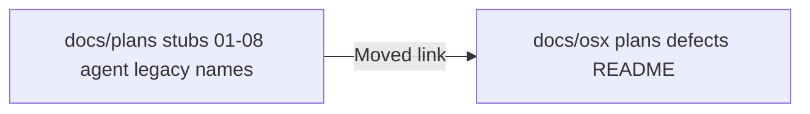

<!-- 7b30f896-9430-4faf-ae44-92b593896e92 -->
---
todos:
  - id: "hub-def-range"
    content: "Fix docs/osx/README.md hub table: DEF-001–DEF-009"
    status: pending
  - id: "reorg-plan-status"
    content: "Add Executed status section to OSX-DOCS-REORGANIZATION-PLAN.md"
    status: pending
  - id: "optional-index-dates"
    content: "Optional: Opened/Completed columns on docs/osx/plans/README + defects README"
    status: pending
  - id: "plan002-dedupe"
    content: "Optional: audit plan-002 for inlined DEF bodies still duplicating def-### files"
    status: pending
isProject: false
---
# Clicker documentation reorganization — current status

## Authority and intent

The spec is **[`docs/osx/OSX-DOCS-REORGANIZATION-PLAN.md`](docs/osx/OSX-DOCS-REORGANIZATION-PLAN.md)** (single hub under **`docs/osx/`**, numbered **`plan-###-*`**, agent plans under **`docs/osx/plans/agent/`**, defects under **`docs/osx/defects/`**, update all pointers, keep non-clicker work under **`docs/plans/agent/`**).

## What is done (matches success criteria in practice)

| Area | State |
|------|--------|
| **Hub** | [`docs/osx/README.md`](docs/osx/README.md) links **plans**, **defects**, [`osx/README.md`](osx/README.md), coverage gap doc, and the reorg plan. |
| **Product plans** | **`docs/osx/plans/plan-001` … `plan-010`** (+ handoffs) per [`docs/osx/plans/README.md`](docs/osx/plans/README.md). |
| **Agent plans** | Clicker session work under [`docs/osx/plans/agent/`](docs/osx/plans/agent/README.md) with **`plan-agent-*`** names (`.cursorrules` aligns). |
| **Defects** | **`docs/osx/defects/def-001` … `def-009`** with table in [`docs/osx/defects/README.md`](docs/osx/defects/README.md). |
| **Legacy `docs/plans/`** | Numbered **`01`–`08`**, **`HANDOFF-…`**, and old **`docs/plans/agent/*.plan.md`** names for the clicker are **stub redirects** (e.g. three-line “Moved” files), not duplicate bodies — your **`find`** output is expected noise, not unfinished copies. |
| **Top-level index** | [`docs/plans/README.md`](docs/plans/README.md) points at **`docs/osx/plans`** and lists canonical **`plan-###`** links; [`docs/plans/agent/README.md`](docs/plans/agent/README.md) only indexes **non–mouse-clicker** plans (e.g. react2shell) + pointer to **`docs/osx/plans/agent/`**. |
| **Code / tests** | [`osx/macos_mouse_click.py`](osx/macos_mouse_click.py) header cites **`docs/osx/README.md`**; [`osx/tests/test_docs_osx_hub_paths.py`](osx/tests/test_docs_osx_hub_paths.py) guards key hub paths. |

## What still feels “unfinished” (gaps vs the written reorg spec)

1. **Reorg plan text is stale** — **`OSX-DOCS-REORGANIZATION-PLAN.md`** still reads like a pre-execution review (“Next step: sign-off, execute migration”). It should be **retitled or appended** with an **“Executed (date)”** section so readers do not assume work is pending.
2. **Hub table drift** — In [`docs/osx/README.md`](docs/osx/README.md), the plans/defects summary row still says **DEF-001–DEF-008**; the live defect index includes **DEF-009** ([`defects/README.md`](docs/osx/defects/README.md)). One-line fix for consistency.
3. **Index tables vs original columns** — The reorg plan suggested **Opened / Completed** columns on plan and defect tables. [`docs/osx/plans/README.md`](docs/osx/plans/README.md) has **Plan id | Title | Status | Document** only (no dates). Defects table has **Opened** but not **Completed** as in the spec template. Optional follow-up: add dates (from git or manual) or explicitly document “dates deferred.”
4. **Phase 4 narrative in plan-002** — Spec called for **thinning** long DEF bodies in **`plan-002-…`** after extraction to **`def-###`**. Worth a **spot-check** of [`plan-002-macos-mouse-click-terminal-ux.md`](docs/osx/plans/plan-002-macos-mouse-click-terminal-ux.md): if large duplicated narratives remain, that migration sub-step is only partially done.
5. **Optional file location** — Spec open decision: keep **`OSX-DOCS-REORGANIZATION-PLAN.md`** at **`docs/osx/`** vs move under **`docs/osx/plans/`** after execution — still at repo root of **`docs/osx/`** (reasonable).

## Non-issues (clarifications)

- **`docs/plans/agent/`** still listing **`arrow-key-double-press-analysis.plan.md`** etc. is the **stub redirect set**, not a second canonical copy.
- **`plan-010`** and newer agent plans only exist under **`docs/osx/`** — there is no parallel **`docs/plans/02-…`** style file for plan-010 (correct).

## Suggested next actions (when you leave plan mode)

1. Patch **`docs/osx/README.md`** defect range to **DEF-001–DEF-009**.
2. Add an **“Execution status”** subsection at the top or bottom of **`OSX-DOCS-REORGANIZATION-PLAN.md`** marking phases done and listing residual optional items (index dates, plan-002 thin narrative).
3. Optionally extend **`docs/osx/plans/README.md`** / **`defects/README.md`** with date columns or a single sentence: “Dates: see git history or agent README.”
4. Skim **`plan-002`** for duplicate DEF prose vs **`def-###`** files; dedupe if large blocks remain.

No code behavior changes required for doc hygiene unless you want **`macos_mouse_click_loop.sh`** committed separately from earlier local edits.
