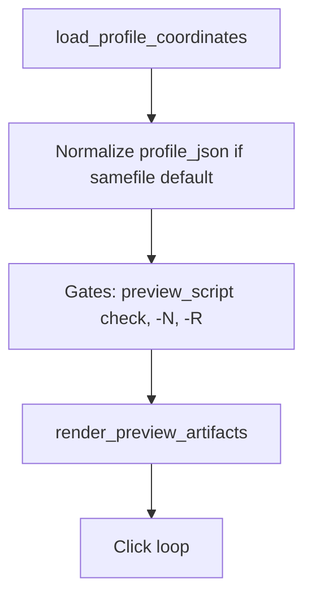

<!-- 6cde9550-b52d-4c5d-b4f9-316a1b6be015 -->
---
todos:
  - id: "close-def012-docs"
    content: "Update def-012.md (Fixed, Resolution, Git deb0389, todos completed), plan-002 DEF-012 row + manual blurb, defects/README status"
    status: pending
  - id: "manual-verify-def012"
    content: "Operator run defect §6 regression checks; append dated Manual verification to def-012"
    status: pending
  - id: "agent-readme-row"
    content: "Add plan-agent-def-012-follow-up-closeout.plan.md under docs/osx/plans/agent/ + README table row"
    status: pending
  - id: "optional-preview-ux"
    content: "Optional later: cookie_clicker_preview_plan.py builtin/empty source_image message (defect §3)"
    status: pending
  - id: "optional-dry-paths"
    content: "Optional later: shared coords-only / drawable helper; source_image base-dir semantics; samefile stderr on failure"
    status: pending
isProject: false
---
# DEF-012 follow-up: defect close-out and optional hardening

## What the git diff is already telling you

The landed change in [`osx/macos_mouse_click_loop.sh`](osx/macos_mouse_click_loop.sh) (commit **`deb0389`**) encodes two ideas in **inline comments** and structure:

1. **Coords-only profiles** — `COORDS_ONLY_PROFILE` is derived in the embedded Python inside **`load_profile_coordinates`** from `source_image` (missing / empty / **`builtin`** / non-file after `abspath` + `isfile`). Preview, confirm, and strict **`-N`** / **`-R`** behavior gate on that flag and on whether **`-P`** is still set.
2. **Explicit `-P` same as built-in default** — After load, **`os.path.samefile(profile_json, default_profile_json)`** clears **`profile_json`** so downstream paths match **omitting `-P`** (per DEF-012 design intent in [`docs/osx/defects/def-012-loop-profile-forces-preview-on-builtin.md`](docs/osx/defects/def-012-loop-profile-forces-preview-on-builtin.md)).

No further “mystery” is hidden in the diff: there are no `TODO` markers in the shell file; the “notes” are those comments plus the help-text expansion for **`-P`**.

## Repo inconsistency to fix first (docs only)

Implementation is on **`main`**, but **defect / plan hub still describe the bug as open**:

- [`docs/osx/defects/def-012-loop-profile-forces-preview-on-builtin.md`](docs/osx/defects/def-012-loop-profile-forces-preview-on-builtin.md) — **Status** still **Open**; YAML **`todos`** still **`pending`** though [`osx/tests/test_def012_loop_preview_coords_only.py`](osx/tests/test_def012_loop_preview_coords_only.py) and the shell fix exist.
- [`docs/osx/plans/plan-002-macos-mouse-click-terminal-ux.md`](docs/osx/plans/plan-002-macos-mouse-click-terminal-ux.md) — **Defect summary** row for **DEF-012** still **Open** with no **Fix commit**; **Manual verification** blurb should gain a one-line DEF-012 closure note once someone runs the regression checks from the defect file.

Per the defect workflow described in plan-002 and [`docs/osx/defects/README.md`](docs/osx/defects/README.md): update the **detail file** first, then mirror the **summary table** and **Manual verification** text.

## How the “optional” follow-ups could be done later (design only)

These align with items still listed in the defect body and with broader **osx** plans; none are required to declare DEF-012 done once docs match **`deb0389`**.

| Track | Idea | Relation to existing docs |
|-------|------|-----------------------------|
| **A. Preview helper UX** | In [`osx/cookie_clicker_preview_plan.py`](osx/cookie_clicker_preview_plan.py), detect **`builtin`** / empty **`source_image`** before **`cv2.imread`** and exit with a short explanation (defect §3). Helps operators who invoke the preview script **directly**, bypassing the loop. | Same sentinel rules as the shell; avoid duplicating conflicting semantics. |
| **B. Single source of truth** | Today “coords-only” is computed only in the loop’s embedded Python. Optionally extract a tiny shared helper (e.g. `osx/profile_source_drawable.py` or a function imported by both) so the loop and **`cookie_clicker_preview_plan.py`** cannot drift. | Optional; increases file surface; only worth it if more callers appear. |
| **C. `source_image` path resolution** | Loop uses **`os.path.abspath(si_st)`** from **cwd**, matching today’s preview script. If profiles ever ship **paths relative to the profile JSON directory**, both would need the same resolution rule (product decision). | Not in current defect scope unless you adopt that JSON convention. |
| **D. `samefile` robustness** | Clearing **`profile_json`** swallows Python errors with **`2>/dev/null`**; rare failure modes (broken symlink, permission) silently skip normalization. Could log to stderr once or fall back to string compare of resolved paths. | Small hardening; optional. |
| **E. Loop Phase 2 (rate control)** | [`docs/osx/plans/agent/plan-agent-cookie-clicker-rate-control.plan.md`](docs/osx/plans/agent/plan-agent-cookie-clicker-rate-control.plan.md) still has **pending** items to wire **`-d`** / delays from profile into the loop and optional chunking — orthogonal to DEF-012 but touches the same file. | Keep separate PR/plan from DEF-012 close-out to avoid scope creep. |

## Canonical plan file location (repo convention)

After you approve this plan, save the canonical copy under **[`docs/osx/plans/agent/`](docs/osx/plans/agent/)** as **`plan-agent-def-012-follow-up-closeout.plan.md`** (kebab-case, **`plan-agent-`** prefix) and add a one-line row to **[`docs/osx/plans/agent/README.md`](docs/osx/plans/agent/README.md)** so it is discoverable next to rate-control / plan-002 cross-links.

## Suggested implementation order (when you execute, not now)

1. **Docs-only pass** — Close DEF-012 in [`def-012-…md`](docs/osx/defects/def-012-loop-profile-forces-preview-on-builtin.md), [`plan-002`](docs/osx/plans/plan-002-macos-mouse-click-terminal-ux.md), [`defects/README`](docs/osx/defects/README.md); flip YAML **`todos`** to **`completed`** or remove obsolete items.
2. **Manual verification** — Run the two bullets in defect §6 (defaults **`-P`** / **`-A`** / **`-c`**, and a drawable profile preview path); record dated line in the defect file.
3. **Optional code** — Only if you want B/C/D: small PRs per track above, separate from the doc close-out commit.
