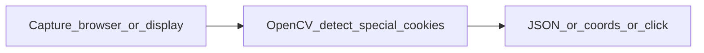

<!-- 54f2f0fb-537a-420e-9c98-ed4c74f07aae -->
---
todos:
  - id: "add-plan-015"
    content: "Create docs/osx/plans/plan-015-cookie-clicker-golden-cookie-sweeper.md (goals, capture matrix, detection, CLI, tests, loop integration options, open questions)"
    status: pending
  - id: "index-plan-015"
    content: "Update docs/osx/plans/README.md shortcut table (15) and plan index row for plan-015"
    status: pending
  - id: "optional-readme"
    content: "If scope is CLI-only v1: add stub section or full usage to osx/README.md when implementation follows"
    status: pending
isProject: false
---
# Plan: Golden / magic cookie sweeper (design + **plan-015** doc)

## What is needed to design and implement it

### Product / operator decisions (you or a short spec)

- **Target definition:** “Magic cookies” usually means **golden cookies** (and optionally **wrath** variants, seasonal sprites, **reindeer**, etc.). Lock which **visual classes** v1 must detect vs defer.
- **Outcome:** Output-only (**print coordinates / JSON / overlay PNG**) vs **click** via existing [`osx/macos_mouse_click.py`](osx/macos_mouse_click.py) (`-x/-y -Y`), vs **integration** with [`osx/macos_mouse_click_loop.sh`](osx/macos_mouse_click_loop.sh) (new phase between ladder and big-cookie burst).
- **Latency vs accuracy:** Max acceptable delay from spawn to click; polling interval; whether to **pause** long synthetic bursts while sweeping.
- **Layout constraints:** Same assumptions as today’s loop ([`plan-002` operator loop](docs/osx/plans/plan-002-macos-mouse-click-terminal-ux.md) — fixed window geometry) vs dependency on **plan-013** work (window-relative coords).

### macOS / permissions

- **Screen capture source:** Full display vs **frontmost browser window** only (needs a strategy: `screencapture -l<windowid>`, Quartz `CGWindowListCreateImage`, or Accessibility frame + crop). Each has tradeoffs (multi-monitor, Retina scaling, window chrome).
- **Privacy:** **Screen Recording** (and possibly **Accessibility**) consent; document what fails when denied.

### CV / detection approach

- **Reference assets:** Small template PNGs per cookie type, **HSV / color blob** rules, or trained detector—plus a **golden / non-golden** negative set from [`docs/osx/screenshots/cookie-clicker/`](docs/osx/screenshots/cookie-clicker/) to tune false positives.
- **Big cookie confusion:** The main cookie is large and animated; the plan should require explicit **geometric or color** separation from golden-cookie candidates (already called out as risk in [plan-002 § backlog](docs/osx/plans/plan-002-macos-mouse-click-terminal-ux.md) tier 3).

### Engineering in this repo

- **Reuse:** OpenCV is already the stack for [`osx/cookie_clicker_detect_coords.py`](osx/cookie_clicker_detect_coords.py) (file in → profile JSON); preview path in [`osx/cookie_clicker_preview_plan.py`](osx/cookie_clicker_preview_plan.py). There is **no** live window screenshot API in that pipeline today—new module or script will add capture + loop.
- **Tests:** Static PNG fixtures under `docs/osx/screenshots/cookie-clicker/` (or committed crops) for **pytest** on “find N candidates at expected (x,y) within tolerance”; optional skip when `cv2` missing (match existing patterns in [`osx/tests/`](osx/tests/)).
- **Docs:** [`osx/README.md`](osx/README.md) for CLI and deps; link from [plan-013](docs/osx/plans/plan-013-cookie-clicker-profile-layout-and-calibration.md) / plan-002 backlog when **plan-015** is the normative home.

---

## Deliverable after you leave Plan mode (implementation)

Per [`.cursorrules`](.cursorrules) and [plans README](docs/osx/plans/README.md): canonical spec lives in the repo, not only in Cursor’s plan UI.

1. **Add** [`docs/osx/plans/plan-015-cookie-clicker-golden-cookie-sweeper.md`](docs/osx/plans/plan-015-cookie-clicker-golden-cookie-sweeper.md) with: status **Design / roadmap**, terminology, goals/non-goals, capture options matrix, detection algorithm sketch, CLI shape, test strategy, integration options with loop, open questions.
2. **Update** [`docs/osx/plans/README.md`](docs/osx/plans/README.md): shortcut table **15** + index row for **plan-015**.

No code until the **plan-015** doc exists and v1 scope is agreed (unless you explicitly ask for a spike script in the same change).
