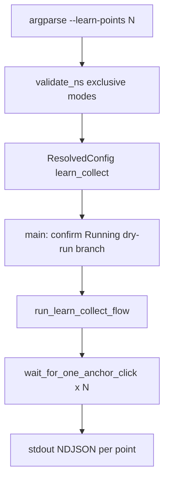

<!-- 7b30f896-9430-4faf-ae44-92b593896e92 — canonical copy: docs/osx/plans/agent/plan-agent-12-learn-points-collect.plan.md -->
---
todos:
  - id: "doc-plan-010"
    content: "Add docs/osx/plans/plan-010-macos-mouse-click-learn-points-collect.md + row in docs/osx/plans/README.md"
    status: pending
  - id: "cli-config"
    content: "Add --learn-points N, validate_ns/mode_fully_on_cli/namespace_to_cfg + ResolvedConfig fields"
    status: pending
  - id: "tap-flow"
    content: "Refactor wait_for_anchor_click; implement run_learn_collect_flow + main branch; confirmation/Running text"
    status: pending
  - id: "dry-run-tests"
    content: "Extend dry-run JSON + osx/tests (validation + dry-run subprocess); run make -C osx test"
    status: pending
  - id: "operator-doc"
    content: "Document in osx/README.md; canonical plan is docs/osx/plans/agent/plan-agent-12-learn-points-collect.plan.md"
    status: pending
isProject: false
---
# Plan 12 — Multi-point learn (coordinates only, no autoclicker)

## Naming constraints

- **No spaces** in any new file or directory path; use **kebab-case ASCII** only (matches repo rules: e.g. `plan-010-macos-mouse-click-learn-points-collect.md`, `plan-agent-12-learn-points-collect.plan.md`).
- Any copy of this plan under **`docs/osx/plans/agent/`** must follow the same rule (no shell-metacharacters or spaces in paths).

## Problem

Today **`--learn`** records **one** physical anchor via [`wait_for_anchor_click`](osx/macos_mouse_click.py) (lines ~139–199), prints a warmup message, then always enters [`run_synthetic_loop`](osx/macos_mouse_click.py) (~1210–1229). Operators who want **several** UI positions for a shell script must run learn repeatedly or read coordinates from stderr by hand.

## Goal

One command that:

1. Waits for **N** separate real **left mousedown** events (same Accessibility + event-tap requirements as learn).
2. After each capture, prints **one line of JSON per point** on **stdout** (NDJSON), suitable for `while read` / `jq`.
3. Exits **without** posting synthetic clicks and **without** the learn warmup sleep (or with an optional small inter-click delay—see open decision below).

## Proposed UX (CLI)

- New flag: **`--learn-points N`** where **N** is an integer **≥ 1**, **mutually exclusive** with **`--learn`**, **`--at-cursor`**, and **`-x`/`-y`** (extend [`validate_ns`](osx/macos_mouse_click.py) ~1044–1055 the same way as existing single-mode rules).
- **`-Y` / `--yes`**: allowed when mode is fully specified on the CLI (extend [`mode_fully_on_cli`](osx/macos_mouse_click.py) ~1058–1062).
- **Stderr**: human prompts only, e.g. `Waiting for left click 2/5…` (mirrors current “first left click” messaging on stderr).
- **Stdout**: **only** NDJSON lines, no Rich, no `Running:` prefix on stdout—keeps stdout pipe-clean for scripts.

**Example:**

```bash
./osx/macos_mouse_click.py --learn-points 3 -Y
# stdout (three lines):
# {"i":1,"x":123.4,"y":567.8}
# {"i":2,"x":...}
# {"i":3,"x":...}
```

**JSON shape (stable keys):** `i` (1-based index), `x` / `y` as floats (global Quartz coordinates, consistent with fixed mode / learn anchor today).

## Implementation sketch (`osx/macos_mouse_click.py`)

1. **Argparse** — add `--learn-points` with `type=int` in [`build_arg_parser`](osx/macos_mouse_click.py) (~894+); document in epilog; ensure [`argv_duplicate_cli_option_error`](osx/macos_mouse_click.py) treats duplicate `--learn-points` like other exclusive options if you add scanning for it (optional but consistent with DEF-007 style).

2. **Config model** — introduce an internal mode string (e.g. **`learn_collect`**) on [`ResolvedConfig`](osx/macos_mouse_click.py) (~215–228) plus a dedicated integer field (e.g. **`collect_point_count`**) so **`count` / `delay` are not overloaded** for “number of learn clicks” (avoids confusion with synthetic `-n`).

3. **Tap loop** — refactor the current “wait for one anchor” logic into a reusable primitive (e.g. **`wait_for_one_anchor_click(qz) -> Union[tuple, False, None]`**), then implement **`run_learn_collect_flow(qz, cfg) -> int`** that loops **`collect_point_count`** times: prompt → wait → **`print(json.dumps(...), file=sys.stdout, flush=True)`**. Reuse the same “disable tap after each mousedown” pattern by **re-creating the tap per click** (simplest) or re-enabling after drain—whichever is smallest diff; behavior must match learn: **real click passes through** to the OS.

4. **Main / confirmation** — branch in [`main`](osx/macos_mouse_click.py) after Quartz import: if `cfg.mode == "learn_collect"`, call **`run_learn_collect_flow`** instead of **`run_learn_flow`**. Adjust [`print_confirmation_sheet`](osx/macos_mouse_click.py), **`_running_message`**, and the Rich/plain **“Running:”** line (~1346–1357) so they describe **point collection**, not synthetic `count=` / `delay=` (either hide irrelevant fields for this mode or relabel, e.g. `points=5`).

5. **Rich pre-run editor** — **Phase 1 (recommended):** when **`--learn-points N`** is present on the CLI, **skip** the Rich table for this mode **or** treat it like `-Y` for path simplicity—operators using this feature are scripting-focused. **Phase 2 (optional):** add a fourth mode to the TUI (`editor_row_keys`, mode prompts) with a row for **point count**—touches [`run_rich_pre_run_editor`](osx/macos_mouse_click.py) / [`_fill_cfg_from_tui_prompts`](osx/macos_mouse_click.py) paths.

6. **Dry-run** — extend [`resolved_config_for_dry_run_json`](osx/macos_mouse_click.py) / [`emit_dry_run_json_line`](osx/macos_mouse_click.py) to include **`learn_collect`** + **`collect_point_count`** (and omit misleading synthetic fields or set them `null`). Decide explicitly: **`--dry-run-after-start` + `--learn-points`** exits **without** tap (same as today’s dry-run: no Quartz import on that path—verify ordering in `main`).

7. **Signals** — if the user hits **Ctrl+C** while waiting for click *k* of *N*, exit **130** after the usual “Stopped.” on stderr; **do not** emit a partial JSON line for an incomplete click.

## Tests (`osx/tests/`)

- **Argparse / validation:** mutually exclusive modes; **`--learn-points 0`** or negative → clear error.
- **Dry-run JSON:** subprocess asserts new fields when `--learn-points 3 --dry-run-after-start` (no Quartz).
- **Live tap:** avoid requiring CGEventTap in CI unless you already have patterns; if not, keep coverage to validation + dry-run.

## Documentation

1. **Product spec** — add **[`docs/osx/plans/plan-010-macos-mouse-click-learn-points-collect.md`](docs/osx/plans/plan-010-macos-mouse-click-learn-points-collect.md)** (new **plan-010** row in [`docs/osx/plans/README.md`](docs/osx/plans/README.md)): goal, CLI, JSON contract, Accessibility notes, relation to **plan-001** learn semantics.
2. **Operator doc** — short section in [`osx/README.md`](osx/README.md) with copy-paste examples and `jq` one-liners.
3. **Agent session plan** — when implementation starts, add **`docs/osx/plans/agent/plan-agent-learn-points-collect.plan.md`** and link from [`docs/osx/plans/agent/README.md`](docs/osx/plans/agent/README.md) (per [`.cursorrules`](.cursorrules)).

## Open decisions (pick during implementation)

1. **Inter-click delay:** no delay vs small optional **`-d`** between “recorded point *i*” and waiting for *i+1* (helps user move between UI targets). If **`-d`** is reused, document that it means **between physical samples**, not between synthetics, in this mode only.
2. **Optional unbounded collection** (until Ctrl+C): defer to plan-010 “Phase 2” unless you want it in v1 (`N=0` meaning infinite is easy to mis-explain next to learn’s `-n 0`).

## Dependency diagram


