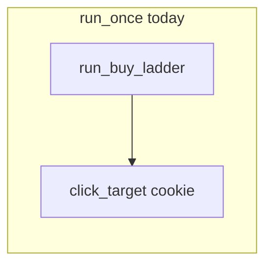
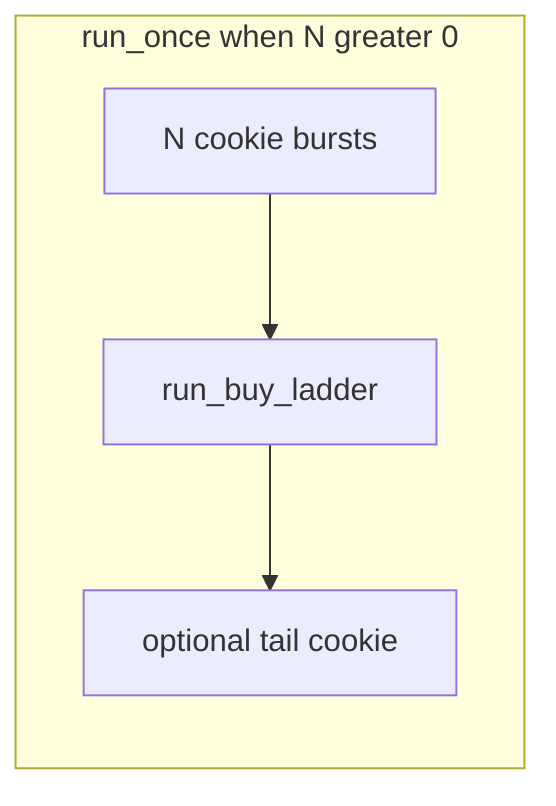

<!-- 54f2f0fb-537a-420e-9c98-ed4c74f07aae -->
---
todos:
  - id: "spec-semantics"
    content: "Record trailing-cookie (A vs B) and -S interaction in plan-014 before code"
    status: pending
  - id: "loop-sh"
    content: "Add getopts flag, validate N, refactor run_once order in macos_mouse_click_loop.sh"
    status: pending
  - id: "preview"
    content: "Extend cookie_clicker_preview_plan.py + loop manifest/options_hash + render_preview_artifacts"
    status: pending
  - id: "docs-tests"
    content: "Update osx/README.md, plan-014, plans README; add minimal test or manual checklist"
    status: pending
isProject: false
---
# Plan: Cookie bursts before buy ladder (`macos_mouse_click_loop.sh`)

## Current behavior (evidence)

In [`osx/macos_mouse_click_loop.sh`](osx/macos_mouse_click_loop.sh), `run_once` (lines 354–366) always:

1. Runs **`run_buy_ladder`** when **`SKIP_BUY_LADDER`** is false (twelve **`click_target`** calls, each **`LADDER_CLICK_COUNT`** clicks from profile, default 5).
2. Then runs **one** cookie **`click_target`** with **`COOKIE_CLICK_COUNT`** (profile default 3000).

So every cycle spends many short **`macos_mouse_click.py`** invocations on the ladder **before** the long cookie burst—matching your observation that the ladder runs repeatedly while purchases may not land.

## Goal

Add a **CLI parameter** (integer **N ≥ 0**) meaning: **run N full cookie bursts** (same as today’s single cookie invocation: `click_target "click the cookie" … COOKIE_CLICK_COUNT`) **before** **`run_buy_ladder`**, when the ladder is not skipped.

- **N = 0** (default): preserve **today’s order** (ladder then cookie) for backward compatibility.
- **N ≥ 1**: each cycle becomes **N × cookie**, then **ladder** (if enabled), then decide trailing cookie (see “Semantics” below).

## Semantics (to lock in before coding)

1. **What counts as one “cookie round”**  
   One **`click_target`** call on **`COOKIE_X` / `COOKIE_Y`** with **`COOKIE_CLICK_COUNT`** (same as the existing cookie line). No change to `macos_mouse_click.py` flags unless you later want a smaller `-n` per “round.”

2. **Trailing cookie after ladder**  
   When **N > 0**, choose explicitly:
   - **Option A (recommended):** After ladder, **still run one** final cookie burst (cycle ends like today but with **N extra** cookie bursts up front). Total cookie bursts per cycle when ladder on: **N + 1**.
   - **Option B:** After ladder, **no** extra cookie (total **N** cookie bursts only). Simpler but changes total cookie time vs today.

   The plan document should record the chosen option in **plan-014**; default recommendation is **A** so operators do not lose the post-ladder cookie spam unless they set **N=0** or use **`-S`**.

3. **Interaction with `-S` / `SKIP_BUY_LADDER`**  
   When the ladder is skipped, **`-k N`** (name TBD) should either:
   - **No-op** (only cookie runs, as today— clearest), or
   - Be **rejected** with `usage` (“`-k` is meaningless with `-S`”).  
   Recommend **reject** to avoid silent confusion.

4. **Default `N`**  
   **0** preserves current behavior without migration.

## CLI shape (implementation sketch)

- Add **`getopts`** token, e.g. **`-k <n>`** (`cookie bursts before ladder`), with validation **`n` is a non-negative integer** (same style as **`-c`** cycle count validation around lines 126–131).
- Extend **`usage`** heredoc with the new flag and examples (e.g. **`-k 3 -c 1`**).
- Avoid overloading **`-c`** (already cycle count) or **`-n`** (not used by this shell script today).

## Preview and manifest (`-P` / `-R` / `-N`)

[`osx/cookie_clicker_preview_plan.py`](osx/cookie_clicker_preview_plan.py) builds targets in **`_build_targets`**: ladder phases then one **`cookie_burst`** (see lines ~85–111). [`render_preview_artifacts`](osx/macos_mouse_click_loop.sh) passes **`--cookie-clicks`**, **`--ladder-clicks`**, **`--skip-ladder`**. [`verify_preview_manifest`](osx/macos_mouse_click_loop.sh) hashes **`options`** including `skip_ladder`, `cookie_clicks`, `ladder_clicks` (lines 292–296).

**Required follow-on work** so previews match reality:

1. Add a preview flag, e.g. **`--cookie-bursts-before-ladder N`**, plumbed from the loop script.
2. Extend **`_build_targets`** to emit **N × `cookie_burst`** entries (or one entry with annotated count—prefer multiple phases for clarity on the PNG) **before** ladder rows when **N > 0** and ladder not skipped.
3. Include **`cookie_bursts_before_ladder`** (or similar key) in the manifest **`options`** dict and in the loop’s **`verify_preview_manifest`** Python snippet so **`-R`** remains correct.

If preview work is deferred, document that **`-R` must not be used** with the new flag until preview parity ships (worse than extending preview in the same change).

## Documentation and plans index

- Update [`osx/README.md`](osx/README.md) operator-loop section: new flag, semantics, example commands.
- Add **[`docs/osx/plans/plan-014-macos-mouse-click-loop-cookie-before-ladder.md`](docs/osx/plans/plan-014-macos-mouse-click-loop-cookie-before-ladder.md)** (normative spec for this feature) and a row in [`docs/osx/plans/README.md`](docs/osx/plans/README.md). Optionally cross-link from [plan-002](docs/osx/plans/plan-002-macos-mouse-click-terminal-ux.md) § operator loop if that section lists loop flags.

## Testing

- Extend or add a test under [`osx/tests/`](osx/tests/) that invokes the loop with **`bash -n`** / dry path is weak; better: **pytest** subprocess that runs **`macos_mouse_click_loop.sh -h`** and asserts help mentions the new flag, and/or a small fixture that mocks **`mouse_click`** … only if the repo already patterns that way. Otherwise **manual checklist** in plan-014 for first ship.

## Non-goals (this feature)

- Changing **`COOKIE_CLICK_COUNT`** / profile schema (unless you later add a profile default for **N**—optional, not required for v1).
- Changing buy-ladder **scroll** or **purchase detection** (game logic).

## Implementation order (suggested)

1. **`macos_mouse_click_loop.sh`**: variable, **`getopts`**, validation, refactor **`run_once`** loop order + **`SKIP_BUY_LADDER`** rules.
2. **`cookie_clicker_preview_plan.py`** + loop manifest hash + **`render_preview_artifacts`** args.
3. **`osx/README.md`** + **plan-014** + plans **README** index.
4. Tests / manual matrix.
