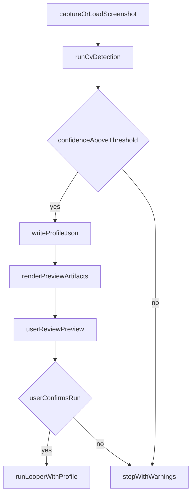

<!-- 7b30f896-9430-4faf-ae44-92b593896e92 -->
---
todos:
  - id: "plan-cv-detector"
    content: "Specify CV detector script inputs/outputs, confidence thresholds, and profile schema."
    status: pending
  - id: "plan-previewer"
    content: "Specify preview artifact format and click-count labeling rules."
    status: pending
  - id: "plan-loop-integration"
    content: "Specify loop flags and safety gating between preview and real clicks."
    status: pending
isProject: false
---
# Plan: CV-generated coordinates + click previewer safety gate

## Assumptions selected

- **Preview mode:** Generate an **annotated PNG** plus **JSON summary** (no live overlay required in v1).
- **CV stack:** **OpenCV primary** (`opencv-python`) with a **manual calibration fallback** when confidence is low.

## Goal

Add a pre-click safety workflow so the looper can:
1) detect cookie/store coordinates with CV,
2) write a coordinate profile JSON,
3) render a preview artifact showing every planned click target and per-target click count,
4) require user confirmation before any real click run that uses fresh CV output.

## Files to update

- `docs/osx/plans/agent/plan-agent-looper-cookie-clicker-ui-research.plan.md`
  - Add a dedicated section for CV-based config generation + previewer UX and acceptance criteria.
- `osx/macos_mouse_click_loop.sh`
  - Add flags for profile path, preview-only mode, and strict preflight validation.
- `osx/README.md`
  - Document the new CV detect -> preview -> confirm -> run workflow.
- `osx/requirements-test.txt` (or runtime requirements file if present)
  - Add OpenCV dependency needed by new CV helper scripts.

## New scripts/files to create

- `osx/cookie_clicker_detect_coords.py`
  - Input: screenshot path (or latest screen capture), optional profile name.
  - Output: `osx/config/cookie_clicker_profiles/<name>.json` with coordinates + confidence metadata.
  - Responsibilities:
    - detect cookie center,
    - detect store panel and row spacing,
    - infer ladder row centers,
    - persist confidence scores and detection warnings.

- `osx/cookie_clicker_preview_plan.py`
  - Input: coordinate profile JSON + loop options (`-S`, burst count, ladder enabled, per-row count).
  - Output:
    - annotated PNG (e.g. `docs/osx/screenshots/cookie-clicker/previews/<timestamp>-preview.png`),
    - JSON manifest listing each planned click target and count.
  - Responsibilities:
    - draw numbered markers for each target,
    - include click counts in labels,
    - color-code phases (cookie burst vs ladder).

- `osx/config/cookie_clicker_profile.schema.json`
  - Formal schema for profile validation.

- `osx/config/cookie_clicker_profiles/*.json`
  - Generated machine-local profiles (git-ignore actual machine profiles; commit sample).

- `osx/config/cookie_clicker_profile.sample.json`
  - Minimal valid sample profile.

- `osx/tests/test_cookie_clicker_detect_coords.py`
  - Unit tests for CV outputs and fallback handling with fixture screenshots.

- `osx/tests/test_cookie_clicker_preview_plan.py`
  - Unit tests ensuring preview manifest includes expected target count/labels and click counts.

## Data model (profile JSON)

Required fields:
- `profile_name`
- `source_image`
- `detected_at`
- `cookie`: `{x, y, confidence}`
- `store`: `{x, panel_top, panel_bottom, row_spacing, confidence}`
- `ladder_rows`: array of `{name, x, y, confidence}` in execution order
- `preview_defaults`: `{cookie_click_count, ladder_click_count, cycle_sleep_seconds}`
- `warnings`: string array

## Execution flow

## CLI additions (planned)

For `osx/macos_mouse_click_loop.sh`:
- `-P <profile_json>`: use this coordinate profile.
- `--preview-only`: generate preview and exit without clicking.
- `--require-preview`: block execution unless a recent preview artifact exists for the selected profile/options.
- `--detect-from <image.png>`: run detection helper first, then preview.

For helper scripts:
- `cookie_clicker_detect_coords.py --input <image> --profile <name> --min-confidence <float>`
- `cookie_clicker_preview_plan.py --profile <json> --output-dir <dir> --cookie-clicks <n> --ladder-clicks <n> [--skip-ladder]`

## Safety rules

- Never trigger real clicks from detect/preview scripts.
- If any critical anchor confidence is below threshold, emit warnings and fail closed.
- Require explicit operator confirmation step between preview generation and click execution.
- Stamp preview with profile hash/options hash to prevent stale-preview mismatch.

## Phased implementation

1. **Phase 1: Schema + previewer first (no CV yet)**
   - Build manifest + annotated preview from manual profile JSON.
2. **Phase 2: CV detector v1**
   - Add OpenCV detection for cookie center/store bounds/row spacing.
3. **Phase 3: Loop integration**
   - Wire `macos_mouse_click_loop.sh` to profile + `--preview-only` / `--require-preview`.
4. **Phase 4: Confidence hardening**
   - Add fallback prompts/manual override path and better diagnostics.

## Validation and review checklist

- `bash -n osx/macos_mouse_click_loop.sh`
- Unit tests for detect/preview scripts pass locally.
- Preview PNG clearly labels:
  - cookie burst target + count,
  - each ladder row target + count,
  - skipped phases (if `-S`) explicitly shown.
- Manual review on at least two screenshot layouts (x1 vs x100 state).

## Deliverable update in the existing research doc

In `docs/osx/plans/agent/plan-agent-looper-cookie-clicker-ui-research.plan.md`, add a new subsection:
- **"CV config generation and previewer safety gate"** with:
  - selected approach,
  - scripts updated/created,
  - JSON schema summary,
  - preview artifact examples,
  - acceptance criteria.
