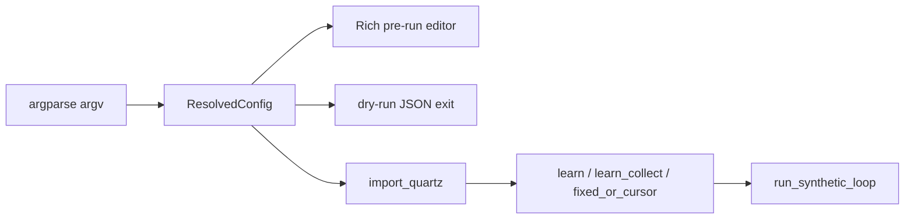

<!-- 54f2f0fb-537a-420e-9c98-ed4c74f07aae -->
---
todos:
  - id: "await-user"
    content: "User to provide follow-up instructions (optional changes, tests, or docs)"
    status: pending
isProject: false
---
# Review: `osx/macos_mouse_click.py`

## Role

Single-file CLI (~1737 lines) for **synthetic left clicks** on macOS via **Quartz (PyObjC)**, with modes: **learn** (event tap for first real click), **fixed** `-x/-y`, **at-cursor**, **learn-collect** (`--learn-points`). Optional **Rich** pre-run TTY table, **`MACOS_MOUSE_CLICK_DRY_RUN`** / `--dry-run-after-start` for CI, **abort-on-mouse-move** (DEF-010/011), and extensive **TUI debug** (`MACOS_MOUSE_CLICK_DEBUG_TUI`). Documented cross-links: [docs/osx/README.md](docs/osx/README.md), plans under `docs/osx/plans/`.

## Architecture (high level)

- **Config**: `ResolvedConfig` + `namespace_to_cfg` / `apply_defaults` / source tracking for TUI styling.
- **I/O**: Lazy `/dev/tty` FD for raw keys; `termios`/`tty` split from `sys.stdin` to work with PTY/Rich; `_tty_setraw_now` uses `TCSANOW` to avoid flushing pexpect bytes (documented).
- **Safety**: `install_signal_handlers` + `sleep_interruptible`; learn tap disables on shutdown.

## Strengths

- **Lazy Quartz** — import only after dry-run path; clear `import_quartz()` error message and exit code 2.
- **Operator ergonomics** — `-Y`/`--yes` vs `-y` coordinate called out in docstring and argparse; duplicate-flag scan ([`argv_duplicate_cli_option_error`](osx/macos_mouse_click.py)) for DEF-007.
- **TUI robustness** — CSI/SS3 arrow handling with deadlines and `_drain_stdin_burst` for ambiguous ESC; stdout flush before stderr debug (DEF-009); Rich console size sync after resize ([`_sync_rich_console_size`](osx/macos_mouse_click.py)).
- **Mouse-move abort** — state machine in `run_synthetic_loop` matches documented semantics (arm radius, threshold, `n_done` / `ever_within_thr` gating).
- **Testability** — dry-run JSON shape via `resolved_config_for_dry_run_json`; learn-collect dry fake stdout; repo has PTY tests under `osx/tests/`.

## Risks / edge cases (informational)

- **`wait_for_anchor_click`**: If `CGEventTapCreate` succeeds but run loop never delivers (unusual), behavior relies on shutdown or anchor; tap/source removal in `finally` is correct for normal paths.
- **`read_raw_key` vs `_read_raw_key_impl`**: `read_raw_key` uses `tty.setraw` (default may be `TCSAFLUSH` in some Python versions)—loop uses `_tty_setraw_now` intentionally; worth knowing if anything still calls `read_raw_key` on paths that need the non-flush behavior (quick grep: mostly internal; loop uses `_read_raw_key_impl` after `_tty_setraw_now`).
- **Globals**: `_kbd_tty_fd`, `_rich_editor_tty_cooked_attrs`, shutdown flag—fine for a CLI single process; would matter if imported as a library (not the intended use).
- **`_sync_rich_console_size`**: Broad `except Exception` swallows unexpected errors silently (acceptable for best-effort UI).

## Code quality

- Module docstring and DEF/plan references aid maintenance.
- Typing is pragmatic (`Any` for Quartz/Rich); dataclass for config is clear.
- No trailing-whitespace issues visible in the read; structure is long but sectioned by concern.

## Next steps

**None from this review** until you specify (e.g. refactor, new flag, bugfix, or test gap). Say what you want changed or explored.
