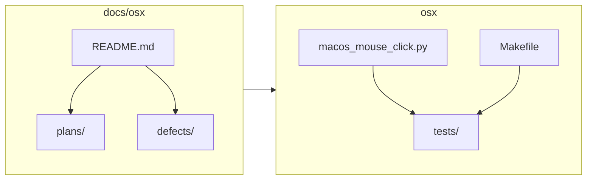

<!-- 7b30f896-9430-4faf-ae44-92b593896e92 -->
---
todos:
  - id: "clarify-scope"
    content: "Decide next concrete goal (feature, defect, tests, or docs-only) and which plan-00x / plan-agent file owns it"
    status: pending
  - id: "loop-script-policy"
    content: "If committing: confirm whether macos_mouse_click_loop.sh changes should be included or reverted/split"
    status: pending
  - id: "implement-test"
    content: "Change macos_mouse_click.py + osx/tests; run make -C osx test or test-coverage"
    status: pending
  - id: "docs-sync"
    content: "Update plan-002 table and/or defects README + def- file when closing defects; link new agent plans in plans/agent/README.md"
    status: pending
isProject: false
---
# Review: `docs/osx` and `osx`

## Purpose and relationship

- **`osx/`** is the product tree: **[`osx/macos_mouse_click.py`](osx/macos_mouse_click.py)** (Quartz clicks + optional Rich pre-run TTY UI), **[`osx/macos_mouse_click_loop.sh`](osx/macos_mouse_click_loop.sh)** (local bash wrapper that repeatedly invokes the Python tool), **[`osx/tests/`](osx/tests/)** (pytest + PTY harnesses), **[`osx/Makefile`](osx/Makefile)**, **`pytest.ini`**, **`.coveragerc`**, **`requirements-test.txt`**.
- **`docs/osx/`** is the **documentation hub** for that script only: product specs, defects, agent session plans, and coverage notes. The hub entry point is **[`docs/osx/README.md`](docs/osx/README.md)**.

## `docs/osx/` layout (what to open when)

| Path | Role |
|------|------|
| [`docs/osx/plans/README.md`](docs/osx/plans/README.md) | Index: **plan-001** (shipped) through **plan-009** (roadmap), plus hand-off session notes. |
| [`docs/osx/plans/agent/README.md`](docs/osx/plans/agent/README.md) | **Cursor/agent plans** for this program; filenames **`plan-agent-*`** (per [`.cursorrules`](.cursorrules): store new mouse-clicker session plans here, kebab-case). |
| [`docs/osx/defects/README.md`](docs/osx/defects/README.md) | **DEF-001**–**DEF-009** detail files; canonical **summary table** with fix SHAs still lives in **[`plan-002`](docs/osx/plans/plan-002-macos-mouse-click-terminal-ux.md)** — update table + matching `def-###` file together when closing defects. |
| [`docs/osx/macos-mouse-click-coverage-gap.md`](docs/osx/macos-mouse-click-coverage-gap.md) | Plan 11 / coverage baseline notes (pairs with `make -C osx test-coverage`). |
| [`docs/osx/OSX-DOCS-REORGANIZATION-PLAN.md`](docs/osx/OSX-DOCS-REORGANIZATION-PLAN.md) | Historical **reorg spec** (mostly executed); still useful for naming rules (`plan-###`, `plan-agent-`, `def-###`). |

**Plan vs agent plan:** numbered **`plan-00x-*.md`** = product/UX specs; **`plans/agent/plan-agent-*.md`** = implementation/session design (PTY tests, refactors, investigations).

## `osx/` implementation notes

- **Core behavior** is concentrated in **`macos_mouse_click.py`** (~1.3k+ lines): argparse, dry-run JSON, signal handling, Rich table + raw TTY key path (`read_raw_key`, `/dev/tty`), debug NDJSON via **`MACOS_MOUSE_CLICK_DEBUG_TUI`** (documented in [`osx/README.md`](osx/README.md)).
- **Tests** use repo-root-relative invocation (`cd` to repo root in Makefile) and **`import macos_mouse_click`** via **`conftest.py`** path setup. Markers include **`table_nav`** for slower PTY tests (excluded by **`test-quick`** / **`coverage-quick`**).
- **Tooling:** `make -C osx test-setup` creates **`osx/.venv`** (gitignored). Coverage/junit artifacts under `osx/` are gitignored per [`.gitignore`](.gitignore).

## Practical gotchas before you change things

1. **Working tree:** Git shows **`osx/macos_mouse_click_loop.sh`** modified — it is a **personal automation loop** (hard-coded coordinates, debug env exports). Decide whether that belongs in the shared repo or should stay local/uncommitted when you ship other work.
2. **Doc drift:** [`OSX-DOCS-REORGANIZATION-PLAN.md`](docs/osx/OSX-DOCS-REORGANIZATION-PLAN.md) inventory still mentions **DEF-001–008** in places; the live defects index already includes **DEF-009**. When touching that reorg doc, align wording with [`defects/README.md`](docs/osx/defects/README.md).
3. **Scratch under tests:** Files like **`osx/tests/_scratch_phase1_rich_table_pty.md`** and **`_tmp_tty_probe.py`** exist for probes; treat as non-canonical unless README points to them.

## Suggested workflow for upcoming work

1. Pick or add a **product plan** row in [`docs/osx/plans/README.md`](docs/osx/plans/README.md) if scope is user-visible behavior.
2. For agent-driven implementation, add/update a **`docs/osx/plans/agent/plan-agent-*.plan.md`** file and link it from that folder’s README if it is a major thread.
3. Implement in **`macos_mouse_click.py`** with tests in **`osx/tests/`**; run **`make -C osx test`** (or **`test-quick`** / **`test-coverage`** as appropriate).
4. If you fix a tracked defect, update **`docs/osx/defects/def-###-….md`** and the **plan-002 defect summary table** in the same change set.

No code or doc edits are proposed in this review; this is baseline context for whatever work you schedule next.
