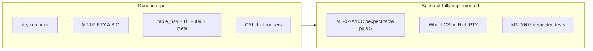

<!-- ff4ac983-a9e7-4d07-87af-fd018d3757b0 -->
---
todos:
  - id: "audit-plan02-matrix"
    content: "Spot-check plan-02 MT-xx automation column vs actual tests; align wording if plan 03 Phase 4 is to stay accurate"
    status: pending
  - id: "resolve-mt02-scope"
    content: "Product choice: implement MT-02-A pexpect OR narrow plan-03 MT-02 section + test_dry_run docstring to match"
    status: pending
  - id: "optional-backlog"
    content: "If desired: wheel CSI Rich PTY, MT-06/07 pipe tests, CI Python matrix, --dry-run-after-editor spec"
    status: pending
isProject: false
---
# Plan 03 review: completed vs spec, and whether it still makes sense

## Source of truth

- Full spec: [`docs/osx/plans/plan-003-macos-mouse-click-tui-automation.md`](docs/osx/plans/plan-003-macos-mouse-click-tui-automation.md)
- CI: [`.github/workflows/macos-mouse-click.yml`](.github/workflows/macos-mouse-click.yml) runs `make -C osx test` → full `pytest osx/tests` **including** `table_nav` on `macos-latest` ([`osx/Makefile`](osx/Makefile) `test` target; `test-quick` excludes `table_nav` only).

## What is genuinely done (matches plan intent)

| Plan area | Evidence in repo |
|-----------|------------------|
| **Phase 0** — dry-run before Quartz | `--dry-run-after-start`, `MACOS_MOUSE_CLICK_DRY_RUN`, helpers and subprocess tests in [`osx/tests/test_dry_run.py`](osx/tests/test_dry_run.py); used by MT-09-B ([`osx/tests/test_mt09.py`](osx/tests/test_mt09.py)). |
| **Phase 3** — macOS CI | Workflow installs deps and runs full test suite (Python **3.11** only). |
| **MT-09 A / B / C** | [`osx/tests/test_mt09.py`](osx/tests/test_mt09.py): fake `rich` via `PYTHONPATH`, PTY for A/B, subprocess for C — aligns with plan § MT-09 table. |
| **Phase 1 (partial)** — Rich PTY / keys | **Darwin + `table_nav`:** [`osx/tests/test_rich_table_nav_down_pty.py`](osx/tests/test_rich_table_nav_down_pty.py) (Down + highlight), [`osx/tests/test_def009_rich_table_layout_pty.py`](osx/tests/test_def009_rich_table_layout_pty.py) (layout + resize), [`osx/tests/test_debug_tui_logging_meta.py`](osx/tests/test_debug_tui_logging_meta.py) (NDJSON contract). |
| **CSI / `read_raw_key`** (not full editor) | [`osx/tests/test_read_raw_key_csi.py`](osx/tests/test_read_raw_key_csi.py), [`osx/tests/test_read_raw_key_up_slow_gap.py`](osx/tests/test_read_raw_key_up_slow_gap.py) + child runners. |
| **`auto-mt-09-implement`** | Implemented as above. |

## Gaps vs the written plan (body still describes work not in tests)

1. **MT-02-A/B/C (§ MT-02 automation plan)**  
   The spec calls for **pexpect** driving: panel → **Enter** on Mode → **Console.input** edits → **Count/Delay** → **S** → assert dry-run JSON.  
   **Actual “MT-02” test:** [`test_mt02_rich_branch_dry_run_skips_quartz`](osx/tests/test_dry_run.py) **monkeypatches** `run_rich_pre_run_editor` to return `True` and asserts `main()` never calls `import_quartz` — the docstring itself says full PTY was **deferred**. So **MT-02-A/B/C as written are not implemented**; only a **narrow integration slice** is.

2. **Phase 1 bullets not fully covered in Rich PTY**  
   Plan lists **wheel CSI**, **Q** / **Ctrl+D** / **Ctrl+C**, **S** producing dry-run line **in the same PTY flow**. Current Rich PTY tests mostly send **Down** / **q** and assert layout/logging — not the full cancel/start matrix on a live editor.

3. **Phase 0 “`--dry-run-after-editor`”**  
   Plan Phase 0 still mentions an optional hook **after the editor** by that name; **shipped** hook is **`--dry-run-after-start`** (post-**Running:**), not a separate `--dry-run-after-editor` flag.

4. **Phase 3 “optional Python matrix 3.10–3.12”**  
   **Not done** — CI is fixed **3.11** only (acceptable as optional).

5. **Phase 2 breadth (MT-06/07 “pipe + stderr” in mapping table)**  
   Mapping table claims **high** potential for MT-06/07; there is **no dedicated test file** mirroring those rows beyond incidental subprocess coverage (e.g. dry-run, MT-09-C). Treat as **backlog** unless you add explicit tests.

6. **Phase 4**  
   Frontmatter says **completed**; worth spot-checking [plan-02 manual matrix](docs/osx/plans/plan-002-macos-mouse-click-terminal-ux.md) that every MT row’s “automated vs human” column matches today’s tests (readonly audit).

## Does plan 03 still make sense?

**Yes**, as:

- A **normative backlog** for the gaps above (especially **real MT-02 PTY** or an explicit decision to **narrow the spec** to “monkeypatch + table_nav + dry-run subprocess” and drop MT-02-A/B/C pexpect).
- A **pointer** for which MT-xx are actually automated vs manual.

**No**, if interpreted literally as “all Phase 1 bullets are done” — the **frontmatter is ahead of the body** for MT-02 and some Phase 1 bullets.

## Suggested doc/code directions (after your answers)

- **Option A — Close the gap:** Add pexpect tests for **MT-02-A** (minimal: learn defaults + **S** + dry-run JSON) and optionally **B/C**, reusing [`pty_harness.spawn_clicker_pexpect`](osx/tests/pty_harness.py); keep them **`darwin` + `mt02`** and accept runtime cost in CI.
- **Option B — Narrow the spec:** Rewrite plan § MT-02 to define **“MT-02 automated = dry-run wiring + table navigation PTY subset”** and list MT-02-A pexpect as **future / optional**; adjust plan-02 matrix wording to match.
- **Option C — CI only:** Add **Python matrix** in workflow if you want parity with plan Phase 3 optional bullet.

## Clarifying questions (need your product call before implementation)

1. **MT-02 scope:** Do you want **pexpect MT-02-A** (full table path through **S** + dry-run JSON) in CI, or is **monkeypatch + subprocess `-Y`** plus **table_nav** tests enough and the plan text should be **rewritten** to match?
2. **`--dry-run-after-editor`:** Is a **separate** flag (exit immediately after editor, before **Running:**) still a requirement, or is **`--dry-run-after-start`** sufficient for all automation you care about?
3. **Rich PTY negative cases:** Should we add explicit tests for **wheel** / **bogus CSI** in the **Rich editor** (assert no spurious **`Cancelled.`**), or is DEF-003 coverage elsewhere enough?
4. **CI Python versions:** Is **3.11-only** acceptable long-term, or should the workflow match the plan’s **optional 3.10–3.12 matrix**?
5. **MT-06/07:** Do you want **new** subprocess tests for pipe / `-Y` error strings, or defer until a regression appears?
