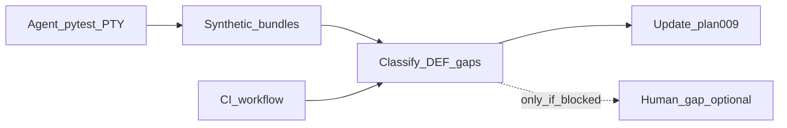

<!-- 493b81a3-5f4d-4869-9445-21ddf8772098 -->
---
todos:
  - id: "agent-checklist-proxy"
    content: "Agent: run osx pytest (full + focused PTY/meta), build synthetic evidence bundles from NDJSON/stderr; map each plan-009 checklist row to covered/partial/gap"
    status: pending
  - id: "ci-local-pytest"
    content: "Record GitHub Actions macos-mouse-click.yml + local `make -C osx test` (optional test-quick) on same rev"
    status: pending
  - id: "analyze-evidence"
    content: "Classify agent bundles + CI vs DEF-002/003/006/008 and plan-009 log contract; list human-only gaps (if any)"
    status: pending
  - id: "draft-plan09-phase3"
    content: "Edit plan-009: agent checklist proxy record, automation coverage matrix, Phase 3+ backlog from evidence (human bundle optional)"
    status: pending
isProject: false
---
# Resume plan-009: agent checklist proxy, CI, Phase 3+

## Goal shift (per user)

The **AI agent should perform as many operator-checklist tasks as possible**, **analyze** the outputs, and **draft Phase 3+** from that evidence. The **human should not need to do any** checklist steps **unless** automation cannot produce an equivalent signal (document those gaps explicitly).

## Context (repo)

- **Plan narrative:** `docs/osx/plans/plan-009-macos-mouse-click-tui-arrow-navigation-narrative.md` — Phase 1 shipped (`a8c3e93`); operator checklist may be **satisfied by agent-proxy evidence** when tests cover the same scenarios.
- **Evidence bundle** — plan-009 § *Evidence bundle*; agent assembles **synthetic bundles** (NDJSON + stderr + machine transcript from log lines).
- **CI:** `.github/workflows/macos-mouse-click.yml` — `make -C osx test` on `macos-latest`.

## Checklist row → agent strategy

| Operator row | Agent approach | Human only if |
|--------------|----------------|---------------|
| Environment snapshot | `git rev-parse HEAD`, `python3 -V`, `$TERM`, `pip show rich` (venv via test-setup) | User-only environment |
| Debug env + log file | pytest `tmp_path` + env vars | N/A |
| stderr capture | PTY/subprocess tests | N/A |
| learn + interactive → table | Existing PTY nav tests; extend if gap | No harness |
| Down / Up once | CSI injection + NDJSON contract | — |
| Edit then arrow | Run/add PTY test if missing | — |
| Wheel / Esc | Byte-sequence tests (search `osx/tests`) | Physical wheel quirks |
| Transcript | Synthesize from `ts_wall` / `ts_mono_ns` in logs | Optional narrative |
| Screenshot | Skip unless CI captures | UI vs log conflict |
| Handoff | Doc update in plan-009 | — |

## Flow

1. **Agent checklist proxy** — `make -C osx test` + focused reruns; per checklist theme, collect log excerpts + timeline; per-row **covered / partial / gap**.

2. **CI** — Record workflow outcome for target rev.

3. **Analysis** — plan-009 validation table on synthetic bundles + CI; list **human-only gaps** (target: empty).

4. **Draft Phase 3+** — plan-009: **Agent checklist proxy record**, **automation coverage matrix**, concrete Phase 3 tasks (tests, harness, product, optional stdin hex).

## Success criteria

- Each checklist row: **agent-done**, **agent-partial**, or **human-required** + reason.
- CI + local pytest recorded for same rev.
- Phase 3+ traceable to tests/logs/CI.
- **No human** unless a row stays **human-required** after the agent pass.

## Repo canonical copy

Full detail: **`docs/osx/plans/agent/plan-agent-plan-09-phase-3-resume.plan.md`** (under the `pub-bin` repository).
