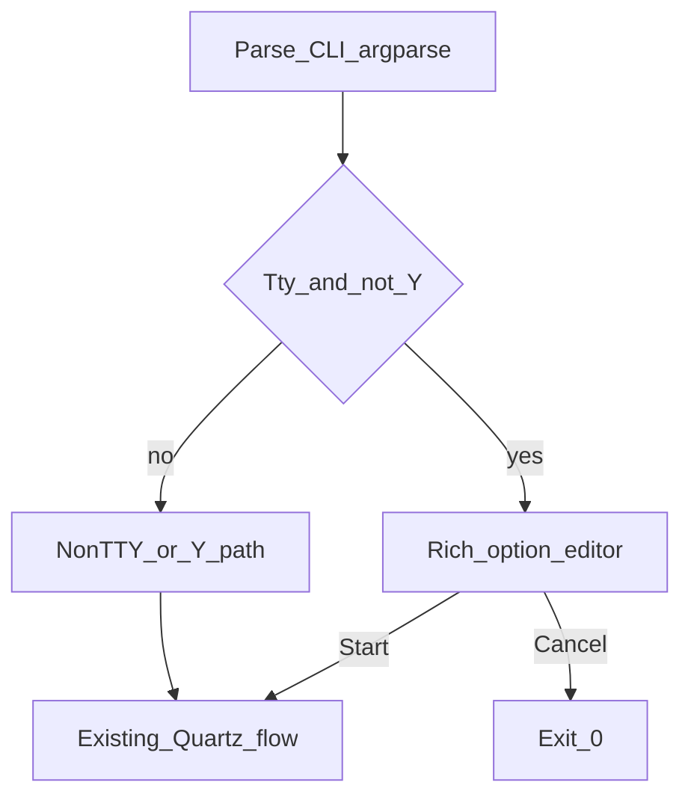

---
todos:
  - id: add-plan-02
    content: "Write docs/osx/plans/plan-002-macos-mouse-click-terminal-ux.md (goals, matrix, keys, phases, tests)"
    status: completed
  - id: refactor-ui-entry
    content: "Refactor macos_mouse_click.py post-parse into pluggable TTY Rich path vs legacy"
    status: completed
  - id: rich-editor
    content: "Implement Rich table/panels + row nav + edit + Start/Cancel without breaking -Y or non-TTY"
    status: completed
  - id: deps-doc
    content: "Update script docstring/help + plan 01 cross-link for pip install including rich"
    status: completed
  - id: manual-mt-01-tty-rich-learn
    content: "MT-01: TTY+Rich --learn, table edits, S start, real clicks (Accessibility)"
    status: completed
  - id: manual-mt-02-tty-rich-partial-cli
    content: "MT-02: TTY+Rich partial CLI; editor fills missing fields (no --interactive text flow)"
    status: completed
  - id: manual-mt-03-y-learn-minimal
    content: "MT-03: -Y --learn minimal; no Rich TUI; stderr one-liner then run"
    status: completed
  - id: manual-mt-04-y-learn-cli-args
    content: "MT-04: -Y --learn with CLI count/delay (e.g. -n 200 -d 0)"
    status: completed
  - id: manual-mt-05-y-fixed
    content: "MT-05: -Y fixed mode (-x/-y) finite run"
    status: completed
  - id: manual-mt-06-pipe-no-y-hint
    content: "MT-06: piped stdin without -Y; sensible error and -Y hint; no TUI"
    status: completed
  - id: manual-mt-07-pipe-y
    content: "MT-07: piped stdin + -Y (--at-cursor/fixed and --learn -Y)"
    status: completed
  - id: manual-mt-08-resize-narrow
    content: "MT-08: narrow/shallow terminal; Rich editor layout still readable"
    status: completed
  - id: manual-mt-09-interactive-legacy
    content: "MT-09: TTY without rich + --interactive; legacy prompts + confirmation sheet"
    status: completed
  - id: defect-def-001-rich-input-highlight
    content: "DEF-001: Console.input(highlight=) crash on older Rich — fixed in script"
    status: completed
  - id: defect-def-002-arrow-misread-as-esc
    content: "DEF-002: Down/Up arrow mis-read as lone Esc → false cancel — fixed in script"
    status: completed
  - id: defect-def-003-wheel-esc-cancel
    content: "DEF-003: scroll / unknown ESC mis-cancel; cancel = Q Ctrl+C Ctrl+D only"
    status: completed
  - id: defect-def-004-tui-edit-echo-special-chars
    content: "DEF-004: TUI field edit echo — closed deferred to plan 07"
    status: completed
  - id: defect-def-005-rich-tui-terminal-resize
    content: "DEF-005: Rich TUI does not reflow on resize — closed deferred to plan 06"
    status: completed
  - id: defect-def-006-tui-arrow-multi-press
    content: "DEF-006: Rich table Up/Down needs multiple presses — CSI inter-byte timeout"
    status: completed
  - id: defect-def-007-cli-duplicate-options-silent
    content: "DEF-007: Repeated -n/--count (etc.) silently uses last value — should error"
    status: completed
  - id: defect-def-008-tui-arrow-double-press-residual
    content: "DEF-008: Up/Down still feels like double press — log vs stdin (see arrow analysis plan)"
    status: completed
  - id: plan-02-v1-closure
    content: "Plan 02 v1 closed; DEF-003 manual verification signed off at plan close-out"
    status: completed
isProject: false
---

# Plan 02: macOS clicker terminal UX (Rich + TTY)


**Terminology:** **CSI** (*Control Sequence Introducer*) — terminal control sequences usually beginning with **`ESC` `[`** (bytes `0x1B 0x5B`), including common **arrow-key** encodings. **SS3** (historically *Single Shift 3*; **arrow** sequences in this doc) — bytes introduced by **`ESC` `O`** (`0x1B 0x4F`) instead of **`ESC` `[`**. **PTY** (*pseudo-terminal*) — a paired **kernel TTY** (master/slave) so test harnesses (**pexpect**, **pytest** subprocess) can attach a fake terminal. **PTY tests** spawn **`osx/macos_mouse_click.py`** under a PTY and assert on captured transcripts (sometimes with stderr merged into the capture).

This document is the **UX / terminal overlay** spec for [`osx/macos_mouse_click.py`](../../../osx/macos_mouse_click.py). Functional behavior (modes, Quartz, signals, CLI semantics) remains defined in **[`plan-001-macos-clicker.md`](plan-001-macos-clicker.md)** unless this plan explicitly overrides presentation only.

**v1 is closed** for active development on this plan: operator checklist **MT-01**–**MT-09** is complete, implementation todos are complete, and follow-on work lives in **plans [03](plan-003-macos-mouse-click-tui-automation.md)**–**[07](plan-007-macos-mouse-click-tui-field-edit-input.md)**. This file stays the **normative UX reference** and **audit log** for shipped v1 behavior. See **[Plan status (v1 — closed)](#plan-status-v1--closed)**.

## Table of contents

- [Plan status (v1 — closed)](#plan-status-v1--closed)
  - [Close-out digest (before commit)](#close-out-digest-before-commit)

- [Goals](#goals)
- [Comparison: plan 02 vs what-is-left.py](#comparison-vs-what-is-left)
  - [What `what-is-left.py` uses today](#what-is-left-uses-today)
  - [How plan 02 aligns and how it differs](#plan-02-alignment-differs)
- [Behavior matrix (locked)](#behavior-matrix-locked)
- [UX design](#ux-design)
  - [Keybinding summary (v1)](#keybinding-summary-v1)
- [Implementation touchpoints](#implementation-touchpoints)
- [Plan 03: TUI automation (related)](plan-003-macos-mouse-click-tui-automation.md)
- [Plan 04: Run progress UI (related)](plan-004-macos-mouse-click-run-progress-ui.md)
- [Plan 05: Target preview before run (related)](plan-005-macos-mouse-click-target-preview.md)
- [Plan 06: Rich TUI terminal resize (related)](plan-006-macos-mouse-click-rich-tui-terminal-resize.md)
- [Plan 07: TUI field-edit input / DEF-004 (related)](plan-007-macos-mouse-click-tui-field-edit-input.md)
- [Plan 08: Stop during run without terminal focus (related)](plan-008-macos-mouse-click-stop-during-run.md)
- [Plan 09: TUI Up/Down arrows — phased remediation (narrative + phases)](plan-009-macos-mouse-click-tui-arrow-navigation-narrative.md)
- [Todos](#todos)
  - [Implementation and docs (closed)](#implementation-and-docs-closed)
  - [Manual tests (operator checklist)](#manual-tests-operator-checklist)
- [Pre-run editor: controls (normative)](#pre-run-editor-controls-normative)
- [Defects](#defects)
  - [Defect summary + detail files](#defect-detail-documents) — **[`../defects/README.md`](../defects/README.md)**
- [Manual QA checklist (after implementation)](#manual-qa-checklist-after-implementation)
- [Out of scope (v1)](#out-of-scope-v1)
- [Implementation order](#implementation-order)
- [Implementation status](#implementation-status)

## Plan status (v1 — closed)

| Item | State |
|------|--------|
| **Rich pre-run editor** (goals, matrix, keys) | **Shipped** — see **Implementation status** |
| **Operator checklist MT-01–MT-09** | **Complete** (logs under **Implementation status**) |
| **Implementation / defect frontmatter todos** | **All `completed`** |
| **DEF-001**, **DEF-002** | **Fixed** + manual **Passed** |
| **DEF-003** | **Fixed** (script); manual **Passed** at v1 plan close-out — see [DEF-003 detail](../defects/def-003-wheel-esc-cancel.md) |
| **DEF-004**, **DEF-005** | **Closed (deferred)** to **[plan 07](plan-007-macos-mouse-click-tui-field-edit-input.md)** / **[plan 06](plan-006-macos-mouse-click-rich-tui-terminal-resize.md)** |
| **DEF-007**, **DEF-008** | **Fixed** (script) — duplicate CLI flags rejected; **`after_key`** debug uses post-arrow **`selected`** — see [DEF-007 detail](../defects/def-007-duplicate-n-flag-last-wins.md) / [DEF-008 detail](../defects/def-008-residual-arrow-double-press.md) |

**No further v1 scope** is tracked in this document. New UX or behavior changes should add a **new plan** or a **new MT-xx** row here only if plan 02 remains the canonical overlay spec for that release.

### Close-out digest (before commit)

Edits made to **close plan 02 for v1** (this section is the audit trail for the closure commit):

1. **Intro** — Added **“v1 is closed”** paragraph: operator checklist and implementation todos complete; follow-on work in **plans 03–07**; this file remains **normative UX + audit** for shipped v1.
2. **Table of contents** — Link to **Plan status (v1 — closed)** (and this digest).
3. **`## Plan status (v1 — closed)`** — Summary table: shipped editor, **MT-01–MT-09** complete, todos complete, **DEF-001–003 Passed**, **DEF-004/005** deferred to **plan 07** / **plan 06**, no further v1 scope in this doc.
4. **Frontmatter** — New completed todo **`plan-02-v1-closure`**.
5. **DEF-003** — Defect summary **Manual verification** → **Passed**; **[detail file](../defects/def-003-wheel-esc-cancel.md)** updated with **2026-04-18** v1 plan close-out note (dedicated wheel-only session not re-logged; rationale ties **MT-01** / **MT-02** / **MT-08**, **DEF-002**, and fix commit **`a96d6fe0175dd15d02094a889e915d4da451e671`**; **Regression check** kept as canonical smoke if this regresses).
6. **MT checklist summary** (under manual tests) — Replaced lingering “DEF-003 open” language with **DEF-001–003 Passed** and deferred **DEF-004/005** pointers.
7. **Defects blurb** (below defect summary table) — Replaced **“Needs manual verification now”** with a single line: **DEF-001–003 Passed**; **DEF-004/005** N/A deferrals.
8. **Implementation order** — Prefixed **Historical (v1 — all steps done)**.
9. **Implementation status** — *Last updated* notes **Plan 02 v1 closed**; intro no longer implies open v1 human QA (new work → new **MT-xx** or successor plans).

## Goals

1. **Prettier output:** consistent **colors** (errors, warnings, headers, values, keys) using **`rich`** (`Console`, `Panel`, `Table`, styled `Text`).
2. **More interactive pre-run:** on a **real TTY** and **without** **`-Y`/`--yes`**, replace:
   - current **`--interactive`** stdin prompts, and
   - the plain **“Resolved configuration” + `Proceed? [y/N]`** sheet  
   with a **single Rich-driven flow** where the user can **move up/down** through options and change values **before** starting taps/clicks.
3. **Non-TTY and `-Y` paths unchanged:** scripting, pipes, and automation stay aligned with plan 01.

<a id="comparison-vs-what-is-left"></a>

## Comparison: plan 02 vs [`what-is-left.py`](../../../what-is-left.py)

Existing repo script **`what-is-left.py`** is the stylistic reference for Rich-based terminal output in pub-bin.

<a id="what-is-left-uses-today"></a>

### What `what-is-left.py` uses today

- **`rich.console.Console`** — primary print path.
- **`rich.panel.Panel`** — main UI: titled panels, **`border_style`** (e.g. cyan, red, yellow, green, blue), summary and file blocks.
- **Imports** also include **`rich.table.Table`**, **`rich.text.Text`**, **`rich.progress.Progress`**, **`rich.columns.Columns`**; much of the layout is **string-built content inside `Panel`s** and **hand-rolled column alignment** (split lists, padding, join), not necessarily those widgets everywhere in the code path.
- **Optional Rich:** `try` / `except ImportError` → `RICH_AVAILABLE`, with a **plain-text fallback** when Rich is missing.
- **Interaction:** **batch only** — run, print a color report, exit. **No** arrow-key UI, **no** `rich.live.Live`, **no** full-screen editor.

So the “look” there is **Rich panels + colored borders + structured text**, not a separate TUI framework.

<a id="plan-02-alignment-differs"></a>

### How plan 02 aligns and how it differs

| Aspect | `what-is-left.py` | Plan 02 (this document) |
|--------|-------------------|---------------------------|
| **UI library** | **Rich** only | **Rich** only (same stack) |
| **Colors / panels** | Panels, border styles, emoji in strings | Same vocabulary: **`Panel`**, **`Table`**, styled **`Text`**, explicit color roles |
| **Optional import** | Try/import + plain fallback | **Lazy-import `rich`** on the TTY path; same *idea* as optional Rich |
| **Interactivity** | None (read-only dashboard) | **New:** row focus, edit, Start/Cancel — needs **extra** patterns (`rich.live.Live` or clear/redraw, plus **stdin / termios** for keys), which `what-is-left.py` does **not** use today |
| **Other stacks** | No Textual / prompt_toolkit | Plan 02 also excludes **Textual** (explicit out-of-scope) |

**Summary:** Plan 02 matches **`what-is-left.py` on dependency choice (`rich`) and general presentation style** (Console + Panel + tables/text). Plan 02 **adds** a **stateful, keyboard-driven pre-run editor**, which is a layer beyond what that script implements; implementation should still **mirror its optional-Rich and Panel-first style** for consistency across pub-bin tools.

## Behavior matrix (locked)

| Condition | Behavior |
|-----------|----------|
| **TTY** and **not** `-Y`/`--yes` | Use **Rich TUI** for missing fields + review/edit + confirm **Start** / **Cancel** |
| **`-Y`/`--yes`** | No Rich TUI; keep current stderr one-liner + immediate run |
| **Not a TTY** (pipe, CI) | No TUI; keep current rules (confirmation still requires TTY today → error suggests `-Y`) |

## UX design

- **Entry:** After `argparse` + validation of **mutually exclusive** mode flags (same rules as plan 01), build **`ResolvedConfig`** from CLI + defaults.
- **Editor screen:** `rich` **Table** (or stacked **Panels**) of rows: **Mode**, **X / Y** (only when mode is fixed), **Count**, **Delay**; highlight **current row**; show **value** and **source** (`cli` / `default` / `prompt` / missing).
- **v1 key model (recommended):** **Up / Down** move between rows; **Enter** on a row opens a short **prompt** to edit that field (still framed with `rich`). **S** = Start, **Q** / **Ctrl+C** / **Ctrl+D** = Cancel (exit `0`, same as today’s cancel), **R** = reset current row to plan default (optional but useful). **Esc** does **not** cancel (avoids mouse-wheel / focus CSI noise); see **DEF-003**.
- **v2 (optional later):** in-place digit edit with **Left / Right** without Enter, using `termios`/`tty` arrow sequences—more fragile across terminals; document only after v1 is stable.
- **Colors:** explicit styles, e.g. `error` red, `warning` yellow, `title` bold cyan, `value` green, `muted` dim.

### Keybinding summary (v1)

| Key | Action |
|-----|--------|
| Up / Down | Change selected row |
| Enter | Edit selected field (prompt) |
| S | Start run (after validation) |
| Q | Quit without running (exit 0) |
| Ctrl+C / Ctrl+D | Quit without running (exit 0) |
| R | Reset selected row to default (optional) |



## Implementation touchpoints

- **File:** [`osx/macos_mouse_click.py`](../../../osx/macos_mouse_click.py) — refactor **post-parse** path: a **resolve UI** step chooses **TTY Rich path** vs **legacy** (`run_interactive_prompts`, `print_confirmation_sheet`, `confirm_or_abort` today).
- **Dependencies:** document `python3 -m pip install pyobjc-framework-Quartz rich`. **Lazy-import `rich`** only on the TTY non-`-Y` path so `--help` stays fast and Quartz-free until run.
- **Accessibility:** unchanged; Rich only affects **before** Quartz runs.
- **Automated TUI / pre-Quartz testing (future):** **[`plan-003-macos-mouse-click-tui-automation.md`](plan-003-macos-mouse-click-tui-automation.md)** — PTY tests, dry-run hook, CI; defers implementation until picked up.
- **Run-time Rich output (after Start):** **[`plan-004-macos-mouse-click-run-progress-ui.md`](plan-004-macos-mouse-click-run-progress-ui.md)** — settings summary + progress during the click loop; defers implementation until picked up.
- **Click target preview (spatial):** **[`plan-005-macos-mouse-click-target-preview.md`](plan-005-macos-mouse-click-target-preview.md)** — dry preview-only + show-before-run so fixed **`-x`/`-y`** is interpretable on real displays; defers implementation until picked up.
- **Terminal resize / Rich reflow:** **[`plan-006-macos-mouse-click-rich-tui-terminal-resize.md`](plan-006-macos-mouse-click-rich-tui-terminal-resize.md)** — **SIGWINCH** + redraw so shrink/expand does not leave broken wrap or stale width (**DEF-005**); defers implementation until picked up.
- **Field-edit prompt hygiene:** **[`plan-007-macos-mouse-click-tui-field-edit-input.md`](plan-007-macos-mouse-click-tui-field-edit-input.md)** — **`Console.input`** echo / CSI noise (**DEF-004**); acceptable for now; defers implementation until picked up.
- **Stop during run (no terminal focus):** **[`plan-008-macos-mouse-click-stop-during-run.md`](plan-008-macos-mouse-click-stop-during-run.md)** — **`-Y`** / long runs need abort without **Ctrl+C** in foreground (stop file, optional global hotkey); defers implementation until picked up.

## Todos

Task tracking lives in **two places** that should stay in sync:

1. **YAML frontmatter** at the top of this file (`todos:`) — one entry per item below (`id` matches the **MT-xx** / implementation keys).
2. **Checklists in this section** — human-friendly steps, suggested commands, and pass criteria.

When you finish a manual run, mark **`[x]`** here and set the matching frontmatter entry to **`status: completed`**.

### Implementation and docs (closed)

| ID | Frontmatter `id` | Status | Notes |
|----|------------------|--------|-------|
| DOC | `add-plan-02` | completed | This plan document |
| IMPL | `refactor-ui-entry` | completed | TTY Rich vs legacy branch in `main()` |
| IMPL | `rich-editor` | completed | Panel/table editor, keys, Start/Cancel |
| IMPL | `deps-doc` | completed | Help/epilog, `rich` pip line, plan 01 link |

### Manual tests (operator checklist)

Run from repo root unless noted. Script path: [`osx/macos_mouse_click.py`](../../../osx/macos_mouse_click.py).

| ID | Frontmatter `id` | Status | Command / scenario | Pass criteria | Plan 03 automation |
|----|------------------|--------|-------------------|---------------|---------------------|
| MT-01 | `manual-mt-01-tty-rich-learn` | **completed** | Real TTY, `rich` installed: `./osx/macos_mouse_click.py --learn -n 2000 -d 0` (no `-Y`; count/delay edited in TUI) | Rich table; edits to count/delay; **S** starts; synthetic click count matches edited value; Accessibility OK | **Human** — real clicks + Accessibility |
| MT-02 | `manual-mt-02-tty-rich-partial-cli` | **completed** | TTY + `rich`: **no CLI mode** (`./osx/macos_mouse_click.py` alone) and variants with partial flags; set **Mode**, **Count**, **Delay** in TUI | Rich TUI (not legacy `--interactive` prompts); all required fields settable before **S** | **Partial** — `pytest` integration: [`osx/tests/test_dry_run.py`](../../../osx/tests/test_dry_run.py) `test_mt02_rich_branch_dry_run_skips_quartz` (Rich branch + `--dry-run-after-start` skips Quartz); full **no-argv** table navigation via **PTY + `read_raw_key`** deferred (flakey on some hosts) |
| MT-03 | `manual-mt-03-y-learn-minimal` | **completed** | `./osx/macos_mouse_click.py --learn -Y` | No Rich UI; immediate “Running:” then learn tap + loop per plan 01 | **Human / optional CI** — hits Quartz + Accessibility |
| MT-04 | `manual-mt-04-y-learn-cli-args` | completed | `./osx/macos_mouse_click.py --learn -n 200 -d 0 -Y` | No TUI; count/delay from CLI honored; learn + loop behaves as expected | **Human / optional CI** — Quartz |
| MT-05 | `manual-mt-05-y-fixed` | completed | `./osx/macos_mouse_click.py -x 400 -y 300 -n 2 -d 0 -Y` (adjust coords) | Fixed mode, no TUI, clicks at given point (**manually verified**). Interpreting raw **`-x`/`-y`** on screen is still weak UX — see **[plan 05 — target preview](plan-005-macos-mouse-click-target-preview.md)** | **Human / optional CI** — Quartz |
| MT-06 | `manual-mt-06-pipe-no-y-hint` | completed | `echo ""` piped to `./osx/macos_mouse_click.py --learn` (no `-Y`) | No TUI; **Resolved configuration** on stderr, then **`Error: confirmation requires a TTY stdin. Use -Y/--yes for non-interactive runs.`**; exit **2** (**manually verified** 2026-04-18) | **Not automated** in plan 03 v1 |
| MT-07 | `manual-mt-07-pipe-y` | completed | **A:** `echo ""` piped to `./osx/macos_mouse_click.py --at-cursor -n 1 -d 0 -Y` (or fixed `-x/-y`). **B:** `echo ""` piped to `./osx/macos_mouse_click.py --learn -Y` | No TUI; **`-Y`** path runs without confirmation; no Rich table. **B** verified **2026-04-18**: **Running:** line, learn wait + anchor + warmup; operator **Ctrl+C** during warmup (**Stopped.**, exit **130**) | **Not automated** in plan 03 v1 |
| MT-08 | `manual-mt-08-resize-narrow` | completed | Shrink Terminal width/height; open TUI (`--learn` without `-Y`, with `rich`) | **Manually verified** **2026-04-18** (`yoda.local`): **no dynamic reflow** — shrink → awkward wrap; expand → layout **stays** narrow. Filed as **DEF-005** (**closed deferred**); improvement work: **[plan 06 — terminal resize](plan-006-macos-mouse-click-rich-tui-terminal-resize.md)** | **Human** |
| MT-09 | `manual-mt-09-interactive-legacy` | completed | **TTY** + **no `rich` for this process** (see [MT-09 one-liner](#mt-09-operator-one-liner-hide-rich)); **`--interactive`** so missing mode is filled via stdin | **Manually verified** **2026-04-18** (`yoda.local`): **Tip:** line, **Select mode** menu, prompts, **Resolved configuration**, **`Proceed?`**, **Running:** then learn path. Automated slice spec: **[plan 03 § MT-09](plan-003-macos-mouse-click-tui-automation.md#mt-09-automation-plan-legacy-interactive-without-rich)** | **Automated** — [`osx/tests/test_mt09.py`](../../../osx/tests/test_mt09.py) (MT-09-A/B/C on `macos-latest` CI) |

#### MT-09 operator one-liner hide Rich

**`--interactive` alone is not enough** if **`rich` is installed**: the script will still use the Rich table on a TTY. To exercise the **legacy text prompts** without uninstalling anything, shadow **`rich`** for **one process** using a throwaway module on **`PYTHONPATH`** (must be a **real TTY**, not piped stdin).

From **repo root**:

```bash
d=$(mktemp -d) && printf '%s\n' 'raise ImportError("no rich for MT-09 test")' >"$d/rich.py" && PYTHONPATH="$d" ./osx/macos_mouse_click.py --interactive
```

Then walk the **Select mode** menu, optional field prompts, **Resolved configuration**, and **`Proceed? [y/N]`** (answer **`n`** to exit without Quartz if you only need the path).

**Checkbox copy (same order as table)**

- [x] **MT-01** (`manual-mt-01-tty-rich-learn`) — TTY + Rich learn: editor, edits, **S**, real clicks.
- [x] **MT-02** (`manual-mt-02-tty-rich-partial-cli`) — TTY + Rich partial CLI; editor fills gaps.
- [x] **MT-03** (`manual-mt-03-y-learn-minimal`) — `./osx/macos_mouse_click.py --learn -Y`.
- [x] **MT-04** (`manual-mt-04-y-learn-cli-args`) — `./osx/macos_mouse_click.py --learn -n 200 -d 0 -Y`.
- [x] **MT-05** (`manual-mt-05-y-fixed`) — `-Y` fixed coordinates run (operator verified). Spatial “where will this land?” feedback is deferred to **[plan 05 — target preview](plan-005-macos-mouse-click-target-preview.md)**.
- [x] **MT-06** (`manual-mt-06-pipe-no-y-hint`) — piped stdin, no `-Y`: resolved summary + TTY confirmation error + **`-Y`** hint; exit **2** (operator **2026-04-18**).
- [x] **MT-07** (`manual-mt-07-pipe-y`) — piped stdin + **`-Y`**: non-learn (**`--at-cursor`** / fixed) per table **A**; **learn** variant **B** verified **2026-04-18** (`echo "" | … --learn -Y`, anchor + warmup, **Ctrl+C** → **Stopped.**).
- [x] **MT-08** (`manual-mt-08-resize-narrow`) — resize exercise **2026-04-18**: reflow **missing** (**DEF-005** → **[plan 06](plan-006-macos-mouse-click-rich-tui-terminal-resize.md)**).
- [x] **MT-09** (`manual-mt-09-interactive-legacy`) — legacy **`--interactive`** + fake **`rich`** [one-liner](#mt-09-operator-one-liner-hide-rich); operator **2026-04-18** (`yoda.local`).

**Remaining manual work (pending only):** **None** — **MT-01**–**MT-09** **done** in the operator checklist (re-open rows only when behavior materially changes). **Defect audit:** **DEF-001**–**DEF-003** **Passed** (see **[Plan status](#plan-status-v1--closed)**); **DEF-004** / **DEF-005** **closed (deferred)** — **[plan 07 — TUI field-edit input](plan-007-macos-mouse-click-tui-field-edit-input.md)** / **[plan 06 — terminal resize](plan-006-macos-mouse-click-rich-tui-terminal-resize.md)**; no **Fix commit** for deferrals. **DEF-007** / **DEF-008** **fixed** in **`faeb3d89da6be12decfa39adb7027516c935c98b`** (duplicate argv guard + **`after_key`** row alignment); see **[Defects](#defects)** and **[`osx/tests/test_open_defects.py`](../../../osx/tests/test_open_defects.py)**. Automation roadmap: **[plan 03 — TUI automation](plan-003-macos-mouse-click-tui-automation.md)**.

## Pre-run editor: controls (normative)

Behavior for the Rich table in [`osx/macos_mouse_click.py`](../../../osx/macos_mouse_click.py) (`run_rich_pre_run_editor`). **Cancel** always exits **0** (same as legacy “no” at `Proceed?`).

| Input | Intended effect |
|-------|------------------|
| **Up** / **Down** | Move highlight only. **Must not** exit the script or stop the editor. |
| **Enter** | Open the prompt for the **selected** row (mode, count, delay, or x/y in fixed mode). After edits, use the **“Press Enter to return…”** line to go back to the table. |
| **S** | **Start:** validate (mode set; fixed needs x/y), then leave the editor and run the Quartz flow (learn / fixed / at-cursor). This is the only key that **starts** clicking from the table screen. |
| **Q** (either case) | **Cancel:** exit editor without running; process exits **0** (`Cancelled.` on stderr). |
| **Ctrl+C** | **Cancel** in the editor (exit **0**); SIGINT handling during Quartz unchanged from plan 01. |
| **Ctrl+D** (EOT, `\x04`) | **Cancel** in the editor (exit **0**). |
| **Esc** | **Ignored** in the editor table (does not cancel). Many sequences begin with **ESC** (mouse wheel, CSI); treating lone **Esc** as cancel caused false exits (**DEF-003**). |
| **R** | Reset the **selected** row toward plan defaults (see script `_apply_row_reset`). |

CSI / SS3 arrow sequences (`ESC [ A` / `ESC [ B`, optional numeric middle, and `ESC O A` / `ESC O B`) map to **Up** / **Down** only. Other **ESC**-led bursts are drained or ignored — they **must not** cancel.

## Defects

Known issues found during manual QA or review. Each defect has a stable **DEF-xxx** id, a row in the summary table, and a **[detail file](../defects/README.md)** with reproduction and resolution notes.

**Manual verification** (column + detail file): whether an operator has run that DEF’s **Regression check** on a real Mac TTY and signed off. **`Pending`** = fix is in `git` but the regression has not been recorded here; **`Passed`** = regression done (add date + MT id in the matching **`def-###`** file when you update the table).

### Git workflow (defect fixes)

Traceability: each code fix should have its own **git commit**, then this document is updated with **`Fix commit`** (full 40-character SHA from `git rev-parse HEAD` on that commit) and committed separately so history shows both the patch and the audit record.

1. **Report** — Add or update the DEF row and **[detail file](../defects/README.md)** (status may be open or fixed pending hash).
2. **Apply fix** — Change [`osx/macos_mouse_click.py`](../../../osx/macos_mouse_click.py) (and tests or other files if needed).
3. **Commit code** — Prefer **one commit per defect**; message subject/body should cite **`DEF-xxx`**. If two DEFs land in one commit, both rows share the **same** `Fix commit` SHA; note that in the DEF **detail file** (do not invent two SHAs for one commit).
4. **Record hash** — Run `git rev-parse HEAD` after the code commit; copy the full hash into the **Defect summary** table and into a **Git** bullet under **Resolution** for that DEF.
5. **Commit plan** — Commit `docs/osx/plans/plan-002-macos-mouse-click-terminal-ux.md` and any touched **`docs/osx/defects/def-*.md`** detail files so the hash update is visible in `git log` without amending the code commit.
6. **Manual verification** — Leave **`Manual verification`** = **Pending** until someone runs that DEF’s **Regression check**; then set **Passed** and add a dated line under **Manual verification** in the DEF **detail file** (and mirror the table column).

### Defect summary

| ID | Opened | Status | Summary | Affects (MT / area) | Fix commit | Manual verification |
|----|--------|--------|---------|---------------------|------------|---------------------|
| DEF-001 | 2026-04-18 | **Fixed** (script) | Pressing Enter to edit **Mode** crashed: `Console.input()` got unexpected keyword `highlight` | MT-01, MT-02, MT-08 (any TUI field edit via `_prompt_cooked`) | `2319207007b2c65703e192250e3cb13ae54a16a6` | **Passed** |
| DEF-002 | 2026-04-18 | **Fixed** (script) | **Down**/**Up** after returning from mode edit was treated as lone **Esc** → spurious **Cancel**; mode edit also reset **Count** when re-confirming **learn** | MT-01, MT-02, MT-08; `read_raw_key` / `_edit_row` | `2319207007b2c65703e192250e3cb13ae54a16a6` | **Passed** |
| DEF-003 | 2026-04-18 | **Fixed** (script) | Mouse **wheel** / unknown **ESC**-led input exited the TUI (`Cancelled.`); cancel must be **Q** / **Ctrl+C** / **Ctrl+D** only | MT-01, MT-08; `read_raw_key` / `run_rich_pre_run_editor` | `a96d6fe0175dd15d02094a889e915d4da451e671` | **Passed** |
| DEF-004 | 2026-04-18 | **Closed (deferred)** | TUI row **Enter** → `Console.input` prompts **echo** or **capture** stray / special characters; validation rejects bad values but UX is noisy (**acceptable for now**) | MT-01, MT-02 | — | **N/A** |
| DEF-005 | 2026-04-18 | **Closed (deferred)** | Rich pre-run TUI **does not reflow** on terminal resize: shrink → bad wrap; expand → layout stays at old effective width (**MT-08**) | MT-08; `run_rich_pre_run_editor` | — | **N/A** |
| DEF-006 | 2026-04-18 | **Fixed** (script) | On the main Rich table, **Up**/**Down** sometimes need **several** presses per row: **CSI** arrow bytes can arrive **>250 ms** apart; `read_raw_key` timed out mid-sequence → **`other`** + orphan tail (**DEF-002**-class timing, distinct symptom) | MT-01, MT-02; `read_raw_key` | `7cfec5161c20ee36db2fe5f95b2ebe8cc92bfd3c` | **Pending** |
| DEF-007 | 2026-04-19 | **Fixed** (script) | Same option repeated on the argv (**`-n`** / **`--count`**, etc.): **no error**; **last occurrence wins** — easy to typo **`-n 10 … -n 100 -n 5`** and run **5** clicks without noticing | CLI / `argparse`; MT-05-style runs | `faeb3d89da6be12decfa39adb7027516c935c98b` | **Passed** (automated: `test_open_defects.py`) |
| DEF-008 | 2026-04-19 | **Fixed** (script) | After **DEF-006** fix, **Up**/**Down** can still feel like **two presses** per row: mix of **`after_key` logged before `selected` updates**, partial CSI → **`other`**, or Rich **`console.clear`** / stdin timing — see analysis plan | MT-01, MT-02; `run_rich_pre_run_editor` / `read_raw_key` | `faeb3d89da6be12decfa39adb7027516c935c98b` | **Pending** (operator spot-check on TTY; log semantics covered in tests) |
| DEF-009 | 2026-04-21 | **Fixed** (script) | Rich pre-run **Panel** + **Table** layout: inner **``HEAVY_HEAD``** table rules (U+2501) fused with light **``Panel``** top on short TTYs — editor **``Table``** uses **`box.ROUNDED`** and stdout is flushed after each Rich frame before stderr debug | MT-01, MT-02, MT-08; `_build_editor_table` / `_run_rich_pre_run_editor_loop` | `3bd517d6adb4e0d3fa112cb7b6a6f39aeee9317a` | **Passed** (automated: `test_def009_rich_table_layout_pty.py`) |
| DEF-010 | 2026-04-26 | **Fixed** (script) | **`--abort-on-mouse-move`**: first ship compared cursor to **burst-start**; fixed to **arm within radius of click target** `(x,y)` then abort when cursor **leaves** target beyond threshold (optional `--mouse-arm-radius-px`) | Cookie Clicker / `-Y` looper; `run_synthetic_loop` | `a4361c307e046c3fb2d56ac4932b12d3345cdf01` | **Passed** (automated: `test_mouse_move_abort.py`) |
| DEF-011 | 2026-04-26 | **Fixed** (script) | **DEF-010 follow-on:** arm radius **>** threshold → same-tick arm+abort before first click (**`n_done`** gate, `8e2843c`); then false stop when read cursor still off-target on next tick (**`ever_within_thr`**, `703ceeb`) | Cookie Clicker / `macos_mouse_click_loop.sh`; `run_synthetic_loop` | `703ceeb583e835742b3ad8ffea7c6169924ced40` | **Passed** (automated: `test_mouse_move_abort.py`; `make -C osx test`) |
| DEF-012 | 2026-04-28 | **Fixed** (script + docs) | **`-P`** forced OpenCV preview; **`source_image: "builtin"`** → **`imread`** fail. Fixed: **`COORDS_ONLY_PROFILE`**, gates, **`samefile`** default normalize, tests; follow-up: defect/plan status, preview helper sentinel, **`samefile`** stderr | Cookie Clicker / `macos_mouse_click_loop.sh`; `cookie_clicker_preview_plan.py` | `deb0389107dce98b0f7927e080523ecf069914c9` | **Passed** (automated: `test_def012_loop_preview_coords_only.py`, `test_preview_plan_builtin_source_image_exits_before_imread`; operator §6 optional) |
| DEF-013 | 2026-05-02 | **Fixed** (script + preview + docs) | **`-k`** runs **K** separate cookie **`click_target`** calls (**`-n` = `COOKIE_CLICK_COUNT`** each) with **`CYCLE_SLEEP_SECONDS`** between phases inside **`run_once`**; preview emits **K** **`cookie_burst`** rows. See **[DEF-013](../defects/def-013-loop-k-factor-cookie-single-burst-vs-phased.md)** | Cookie Clicker / `macos_mouse_click_loop.sh`; `cookie_clicker_preview_plan.py`; plan-014 | — | **Passed** (automated: `test_plan014_loop_cookie_burst_factor.py`) |
| DEF-014 | 2026-05-03 | **Fixed** (script + test + docs) | Sweeper moved to **end** of **`run_phased_cookie_bursts`** (one run per **`run_once`** after all cookie phases); inter-phase block is sleep-only. See **[DEF-014](../defects/def-014-golden-sweeper-loop-sleep-placement-k1.md)** | Cookie Clicker / `macos_mouse_click_loop.sh`; plan-015 | `f0fdbcf` | **Passed** (automated: `test_def014_loop_golden_sweeper_hook.py`) |

**Manual verification:** **DEF-001**, **DEF-002**, and **DEF-003** are **Passed** (see **[DEF-003 detail](../defects/def-003-wheel-esc-cancel.md)** for v1 plan close-out note). **DEF-004** / **DEF-005** are **closed (deferred)** — no **Fix commit**; **Manual verification** **N/A** (documentation-only deferrals). **DEF-006** — automated regression in [`osx/tests/test_read_raw_key_csi.py`](../../../osx/tests/test_read_raw_key_csi.py); operator **MT-01** / **MT-02** spot-check when convenient. **DEF-007** — **Passed** via [`osx/tests/test_open_defects.py`](../../../osx/tests/test_open_defects.py). **DEF-008** — **Pending** on real TTY for full **MT-01** / **MT-02** feel; **`after_key`** row alignment covered in tests. **DEF-009** — **Passed** via automated PTY + transcript heuristics; optional operator spot-check on a real narrow terminal — **[DEF-009 detail](../defects/def-009-rich-pre-run-tui-table-layout-corruption.md)**. **DEF-010** — **Fixed**; see **[DEF-010 detail](../defects/def-010-mouse-move-abort-wrong-reference.md)**. **DEF-011** — **Fixed**; see **[DEF-011 detail](../defects/def-011-mouse-move-abort-arm-threshold-annulus.md)**. **DEF-012** — **Fixed**; see **[DEF-012 detail](../defects/def-012-loop-profile-forces-preview-on-builtin.md)** — automated **`test_def012_loop_preview_coords_only.py`**; operator §6 optional. **DEF-013** — **Fixed**; see **[DEF-013 detail](../defects/def-013-loop-k-factor-cookie-single-burst-vs-phased.md)** — automated **`test_plan014_loop_cookie_burst_factor.py`**. **DEF-014** — **Fixed**; see **[DEF-014 detail](../defects/def-014-golden-sweeper-loop-sleep-placement-k1.md)** — automated **`test_def014_loop_golden_sweeper_hook.py`**.


### Defect detail documents

Full narrative for each **DEF-001**–**DEF-014** lives under [`docs/osx/defects/`](../defects/README.md). Summary table above is canonical for status and fix SHAs; update the **detail file** when closing a defect, then mirror the **Defect summary** row here.

| DEF | Detail |
|-----|--------|
| DEF-001 | [def-001-console-input-highlight.md](../defects/def-001-console-input-highlight.md) |
| DEF-002 | [def-002-arrow-misread-as-esc.md](../defects/def-002-arrow-misread-as-esc.md) |
| DEF-003 | [def-003-wheel-esc-cancel.md](../defects/def-003-wheel-esc-cancel.md) |
| DEF-004 | [def-004-tui-edit-echo-special-chars.md](../defects/def-004-tui-edit-echo-special-chars.md) |
| DEF-005 | [def-005-rich-tui-terminal-resize.md](../defects/def-005-rich-tui-terminal-resize.md) |
| DEF-006 | [def-006-tui-arrow-multi-press.md](../defects/def-006-tui-arrow-multi-press.md) |
| DEF-007 | [def-007-duplicate-n-flag-last-wins.md](../defects/def-007-duplicate-n-flag-last-wins.md) |
| DEF-008 | [def-008-residual-arrow-double-press.md](../defects/def-008-residual-arrow-double-press.md) |
| DEF-009 | [def-009-rich-pre-run-tui-table-layout-corruption.md](../defects/def-009-rich-pre-run-tui-table-layout-corruption.md) |
| DEF-010 | [def-010-mouse-move-abort-wrong-reference.md](../defects/def-010-mouse-move-abort-wrong-reference.md) |
| DEF-011 | [def-011-mouse-move-abort-arm-threshold-annulus.md](../defects/def-011-mouse-move-abort-arm-threshold-annulus.md) |
| DEF-012 | [def-012-loop-profile-forces-preview-on-builtin.md](../defects/def-012-loop-profile-forces-preview-on-builtin.md) |
| DEF-013 | [def-013-loop-k-factor-cookie-single-burst-vs-phased.md](../defects/def-013-loop-k-factor-cookie-single-burst-vs-phased.md) |
| DEF-014 | [def-014-golden-sweeper-loop-sleep-placement-k1.md](../defects/def-014-golden-sweeper-loop-sleep-placement-k1.md) |

**Doc reorg (DEF bodies):** Long-form reproduction and resolution text for each **DEF-001**–**DEF-014** lives only under **[`../defects/`](../defects/README.md)** (`def-###-….md`). This plan keeps the **Defect summary** table, **Manual verification** blurb, workflow, and the link matrix above—no duplicate full narratives here (see **[`../OSX-DOCS-REORGANIZATION-PLAN.md`](../OSX-DOCS-REORGANIZATION-PLAN.md)**).

## Manual QA checklist (after implementation)

Canonical checklist: **[Todos → Manual tests (operator checklist)](#manual-tests-operator-checklist)** (table + checkboxes + frontmatter ids). Keep that section in sync when recording runs (see also [Completed manual checks (log)](#completed-manual-checks-log) under **Implementation status**).

## Out of scope (v1)

- **Textual** full-screen app (Rich only per decision).
- Mouse-driven widgets.
- Persisting last-used defaults to disk.

## Implementation order

**Historical (v1 — all steps done):**

1. Land this document (this file) and link from plan 01 or script docstring if desired.
2. Add **`rich`** dependency + lazy import + TTY branch in `main()`.
3. Implement Rich editor + wire Start/Cancel to existing Quartz flows.
4. Remove redundant plain-text confirmation when TUI runs; keep legacy path for non-TTY.
5. Commit per **`README-AI-CODING-STANDARDS.md`** (show commit summary, confirm in a separate message).

## Implementation status

*Last updated: 2026-04-18. **Plan 02 v1 closed** — see [Plan status (v1 — closed)](#plan-status-v1--closed).*

This section records what was **implemented and verified** for v1. Follow-on human QA for new behavior belongs in new **MT-xx** rows or successor plans (**03**–**07**).

### Shipped behavior (vs locked matrix)

| Condition | Actual behavior |
|-----------|-----------------|
| TTY stdin **and** TTY stdout, not `-Y`/`--yes`, **`rich` installed** | Rich `Panel` + `Table`: Up/Down move focus only; Enter edits; **S** starts Quartz; **Q**, **Ctrl+C**, or **Ctrl+D** cancel (exit 0); **Esc** ignored; **R** resets row; legacy “Resolved configuration” + `Proceed?` sheet is skipped. |
| **`-Y`/`--yes`** | No Rich TUI; stderr “Running:” one-liner then existing Quartz flow; no duplicate `apply_defaults` oddities from the TUI merge. |
| **Non-TTY** or **missing `rich`** | Legacy path: `--interactive` uses text prompts when selected; otherwise errors or post-sheet confirmation per plan 01; stderr tip to `python3 -m pip install rich` when stdin/stdout are a TTY but Rich is not importable. |

### Code and doc touchpoints (consolidated)

- **Script:** [`osx/macos_mouse_click.py`](../../../osx/macos_mouse_click.py) — lazy `try_import_rich()`, `tty_can_use_rich_editor()`, `run_rich_pre_run_editor()`, `read_raw_key()` / `termios`+`tty`, legacy `run_interactive_prompts`, `print_confirmation_sheet`, `confirm_or_abort` when not on the Rich path.
- **`main()`:** TUI path runs the editor then `apply_defaults`; legacy path applies defaults when mode is already set from CLI; “Running:” is always printed before Quartz (Rich stderr console on TUI path, plain stderr otherwise).
- **Help / epilog:** `python3 -m pip install pyobjc-framework-Quartz rich`; `--interactive` help notes the Rich table editor when TTY + `rich` is available.
- **Plan 01:** cross-link from [`plan-001-macos-clicker.md`](plan-001-macos-clicker.md) to this document for the TTY UX overlay.

### Automated checks run (agent / CI-friendly)

- `python3 -m py_compile osx/macos_mouse_click.py`
- `./osx/macos_mouse_click.py --help` (epilog lists both dependencies)
- Piped stdin: `echo "" | ./osx/macos_mouse_click.py --learn` → confirmation requires TTY; message suggests `-Y`/`--yes`; non-zero exit as expected (no TUI)

### Completed manual checks (log)

- **2026-04-18** — **MT-01** — `./osx/macos_mouse_click.py --learn -n 2000 -d 0` — Rich TUI: edited **Count** to **2**, **Delay** to **1**, **S** to start; run completed with **2** synthetic clicks at learned anchor as expected (Accessibility).
- **2026-04-18** — **MT-02** — Operator: **no CLI params** (`./osx/macos_mouse_click.py` alone) and other partial-CLI mixes; Rich TUI used to set **Mode**, **Count**, and **Delay**; no legacy `--interactive` text flow; no spurious exit before **S** (Accessibility for full run).
- **2026-04-18** — **MT-03** — `./osx/macos_mouse_click.py --learn -Y` — operator run: no Rich table; **Running:** one-liner then learn anchor + synthetic loop per plan 01.
- **2026-04-18** — **MT-04** — `./osx/macos_mouse_click.py --learn -n 200 -d 0 -Y` — operator run: `-Y` learn path (no Rich TUI), count and delay from CLI (`-n 200`, `-d 0`), synthetic click loop.
- **2026-04-18** — **MT-05** — `./osx/macos_mouse_click.py -x 400 -y 300 -n 2 -d 0 -Y` (coords adjusted to a safe test point) — operator run: fixed **`-Y`**, no TUI, **2** synthetics at the given global point as expected. **Note:** CLI-only coords are still hard to map mentally to the desktop; follow-up UX is **[plan 05 — target preview](plan-005-macos-mouse-click-target-preview.md)**.
- **2026-04-18** — **MT-06** — `echo "" | ./osx/macos_mouse_click.py --learn` (08:14:18) — no Rich TUI; stderr shows **Resolved configuration** (mode **learn**, default count/delay), then **`Error: confirmation requires a TTY stdin. Use -Y/--yes for non-interactive runs.`**; exit code **2**.
- **2026-04-18** — **MT-07** (variant **B**, `yoda.local`) — `echo "" | ./osx/macos_mouse_click.py --learn -Y` (08:16:33) — no TUI; **Running:** `mode=learn` + default count/delay; learn tap recorded anchor **`(1622.8, -2.7)`**; **Warmup: sleeping 5.0s…**; operator **Ctrl+C** → **`Stopped.`** (exit **130**). Table **A** (`--at-cursor` / fixed `-x/-y` with pipe + **`-Y`**) still recommended as a quick finite check when convenient.
- **2026-04-18** — **MT-08** (`yoda.local`) — `./osx/macos_mouse_click.py --learn` (Rich TUI): resize **shrink** → awkward wrap; resize **wider** → UI **did not** expand with the window. **DEF-005** filed and **closed (deferred)** to **[plan 06 — Rich TUI terminal resize](plan-006-macos-mouse-click-rich-tui-terminal-resize.md)**.
- **2026-04-18** — **MT-09** (`yoda.local`, 08:35:27) — [One-liner](#mt-09-operator-one-liner-hide-rich) + **`--interactive`**: **Tip:** install **rich**; **Select mode** (choice **1** learn); count **2**, delay **1.0**; **Resolved configuration** with **(prompt)** sources; **`Proceed? y`**; **Running:** `mode=learn count=2 delay=1.0s`; learn anchor **`(1588.5, 43.9)`** + warmup (**Accessibility**). Pytest target: **[plan 03 § MT-09](plan-003-macos-mouse-click-tui-automation.md#mt-09-automation-plan-legacy-interactive-without-rich)**.

### Remaining manual QA (operator)

Checklist **MT-01**–**MT-09** is **complete** as of **2026-04-18**; add new **MT-xx** rows if new scenarios are introduced. **Plan 03** tracks which cases move to **CI** (see **[Mapping to plan 02 manual tests](plan-003-macos-mouse-click-tui-automation.md#mapping-to-plan-02-manual-tests-mt-xx)**).

## Operator loop, Cookie Clicker, and preview pipeline (merged context)

*Former split session plans under **`docs/osx/plans/agent/`** are folded into this section and into **[plan-003 — Additional automation backlog](plan-003-macos-mouse-click-tui-automation.md#additional-automation-backlog-session-notes-merge)** / **[plan-009 — Appendix](plan-009-macos-mouse-click-tui-arrow-navigation-narrative.md#appendix-merged-engineering-notes-formerly-split-agent-plans)** so each feature area has a **single** canonical plan file.*

### `macos_mouse_click_loop.sh` (operator automation)

- **Cycle:** each iteration runs **`run_once`**; **`-c`** limits total cycles; **`CYCLE_SLEEP_SECONDS`** (default **30**) sleeps between completed cycles.
- **Buy ladder:** **`run_buy_ladder`** walks a **fixed** building order with **`run_click_row`** (**`-n 5 -Y`** per row at profile coordinates).
- **Cookie burst:** after the ladder, or immediately with **`-S`** (skip ladder), **`click_target`** burst(s) at the big-cookie coordinate (**`COOKIE_CLICK_COUNT`** from profile, often **3000** per phase). **`-k N`** runs **N** separate profile-sized bursts with **`CYCLE_SLEEP_SECONDS`** between phases inside each **`run_once`** (default **N = 1**).
- **Assumptions today:** stable window geometry and column alignment; no affordability detection, golden-cookie sweep, or dynamic store scroll in the shell script.

### Cookie Clicker UI research (condensed)

Screenshot set under **`docs/osx/screenshots/cookie-clicker/`** motivated a **prioritized backlog** (candidates only):

| Tier | Examples |
|------|-----------|
| **1 — low complexity** | External config for ladder coords / counts / sleep; CLI flags for burst length and cycle sleep; explicit bulk-buy contract; structured per-cycle logs; named window profiles. |
| **2 — state-aware** | Skip likely-disabled rows; optional scroll / ladder profiles; header-offset calibration before first row click. |
| **3 — advanced** | Golden-cookie region sweep (**v0 script + roadmap:** **[plan-015](plan-015-cookie-clicker-golden-cookie-sweeper.md)**); upgrades-strip pass; richer template automation than static Y offsets. |

Cross-cutting risks: **bulk mode** toggles which rows are purchasable; **CpS** swings with buffs; **scrollable** store breaks fixed **Y**; **upgrades strip** shifts header and first visible building row.

### Buy-ladder timing vs cycle sleep

Per-cycle sleep runs **after** a full **`run_once`** (ladder + cookie phase(s)). With **`-k` > 1**, **`CYCLE_SLEEP_SECONDS`** also runs **between** cookie **`click_target`** subprocesses (not between each synthetic click inside one **`macos_mouse_click.py -n`**). Inner bursts still use **`-d 0`** — see **Cookie burst rate control** and **[DEF-011](../defects/def-011-mouse-move-abort-arm-threshold-annulus.md)**.

### Cookie burst rate control (in-band abort + pacing backlog)

**Shipped (Phase 1):** **`macos_mouse_click.py`** supports **in-band abort** (mouse-move threshold vs **click target**; **[DEF-010](../defects/def-010-mouse-move-abort-wrong-reference.md)**) so operators can stop long **`-Y`** bursts without refocusing the terminal. **Backlog (Phase 2):** profile keys for inter-click delay / settle time, optional chunking and **`SIGINT`** wiring in **`macos_mouse_click_loop.sh`**, README tuning notes. Prefer conservative **`-d`** defaults until Phase 2 pacing is explicit — see **[DEF-011](../defects/def-011-mouse-move-abort-arm-threshold-annulus.md)** for ladder false-stop history.

### DEF-012 (`-P` / `builtin` / preview pipeline)

**Fixed:** coords-only profiles (**`builtin`**, missing, or empty **`source_image`**) no longer force OpenCV preview; **`cookie_clicker_preview_plan.py`** exits clearly on coords-only; **`samefile`** normalization does not hide stderr. Normative detail: **[DEF-012](../defects/def-012-loop-profile-forces-preview-on-builtin.md)**; tests: **`osx/tests/test_def012_loop_preview_coords_only.py`**.

### DEF-013 (**`-k`** cookie phases vs single burst)

**Fixed:** **`run_phased_cookie_bursts`** + preview **N** **`cookie_burst`** rows; inter-phase sleep uses **`CYCLE_SLEEP_SECONDS`**. Normative detail: **[DEF-013](../defects/def-013-loop-k-factor-cookie-single-burst-vs-phased.md)**; **[plan-014 v2](../plans/plan-014-macos-mouse-click-loop-cookie-before-ladder.md)**.

### DEF-014 (golden sweeper vs **`-k`**, two sleep sites)

**Fixed:** **`cookie_clicker_golden_sweeper.py`** runs **once** after **`run_phased_cookie_bursts`** completes (all **`-k`** values); inter-phase **`if i < k`** is sleep-only. Normative detail: **[DEF-014](../defects/def-014-golden-sweeper-loop-sleep-placement-k1.md)**; **[plan-015](../plans/plan-015-cookie-clicker-golden-cookie-sweeper.md)** (looper §7).
