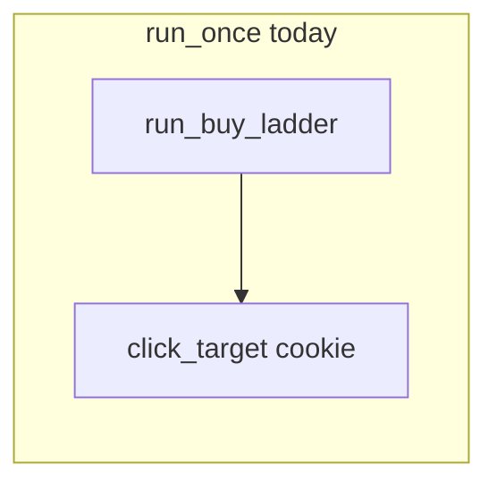
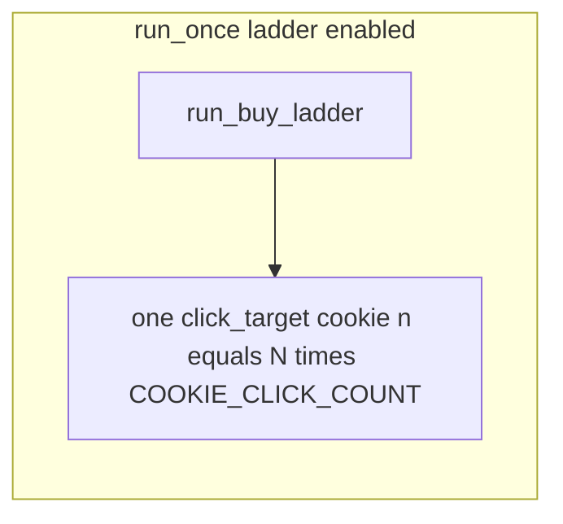

# Plan 014 — Post-ladder cookie burst factor (`macos_mouse_click_loop.sh`)

**Status:** Roadmap / not implemented (read this plan before shipping code).

**Note:** Filename still says `cookie-before-ladder`; **normative behavior is after the buy ladder only**, with **one** combined cookie phase (no separate prefix/trailing subprocesses).

**Implementation:** [`osx/macos_mouse_click_loop.sh`](../../../osx/macos_mouse_click_loop.sh), [`osx/cookie_clicker_preview_plan.py`](../../../osx/cookie_clicker_preview_plan.py), [`osx/README.md`](../../../osx/README.md). Related: [plan-002](plan-002-macos-mouse-click-terminal-ux.md) (operator loop / preview), [plan-005](plan-005-macos-mouse-click-target-preview.md).

---

## 1. Current behavior (evidence)

In [`osx/macos_mouse_click_loop.sh`](../../../osx/macos_mouse_click_loop.sh), `run_once` always:

1. Runs **`run_buy_ladder`** when **`SKIP_BUY_LADDER`** is false (twelve **`click_target`** calls, each **`LADDER_CLICK_COUNT`** clicks from profile, default 5).
2. Then runs **one** cookie **`click_target`** with **`COOKIE_CLICK_COUNT`** (profile default 3000).

So every cycle spends many short **`macos_mouse_click.py`** invocations on the ladder **before** the long cookie burst.

---

## 2. Goal

Add a **CLI parameter** (integer **N ≥ 1**), e.g. **`-k N`**, meaning: **after** the buy ladder (or alone when **`-S`**), run **exactly one** cookie **`click_target`** whose synthetic click count is **N × `COOKIE_CLICK_COUNT`** — i.e. **N** profile-sized cookie “bursts” in **one** **`macos_mouse_click.py`** invocation (**no** second cookie phase, **no** separate “trailing” subprocess).

- **Default when `-k` is omitted:** **N = 1** — same as today’s single post-ladder cookie (**`-n` = `COOKIE_CLICK_COUNT`**).
- **N > 1:** same **one** post-ladder cookie call, with **`-n` = N × `COOKIE_CLICK_COUNT`** (more clicking time per cycle without extra process overhead).

When **`-S`** (skip ladder): each cycle is **only** that **one** cookie **`click_target`** with **`-n` = N × `COOKIE_CLICK_COUNT`** (same **N** semantics).

---

## 3. Semantics (locked for implementation)

### 3.1 Single post-ladder cookie phase (ladder enabled)

When **`SKIP_BUY_LADDER`** is false:

1. **`run_buy_ladder`** (unchanged).
2. **One** **`click_target "click the cookie" …`** with the fourth argument ( **`macos_mouse_click.py -n`** ) set to **`N * COOKIE_CLICK_COUNT`** (integer product).

There is **no** separate “trailing” cookie call beyond this — the former tail is **merged** into this single phase by defining its size with **N** ( **N = 1** reproduces today).

### 3.2 Cookie-only cycles (**`-S`**)

When **`SKIP_BUY_LADDER`** is true:

- **One** cookie **`click_target`** per cycle with **`-n` = N × `COOKIE_CLICK_COUNT`**.

**`-k`** is **meaningful** with **`-S`** (scales cookie-only runs). **Do not** error on **`-S -k 3`**.

### 3.3 Validation

- **`N`** must be a **positive integer** ( **≥ 1** ). Reject **0**, negative values, and non-numeric **`-k`** arguments with **`usage`** and non-zero exit.

### 3.4 Default

If **`-k`** is **not** passed, treat **N = 1** (backward compatible with current **`COOKIE_CLICK_COUNT`** tail).

---

## 4. CLI shape (implementation sketch)

- Add **`getopts`** token, e.g. **`-k <n>`** (`post-ladder cookie burst factor` or similar wording in **`usage`**), validated as **integer ≥ 1**.
- Extend **`usage`** with the new flag and examples (e.g. **`-k 3 -c 1`**).
- Do not overload **`-c`** (cycle count).

---

## 5. Preview and manifest (**`-P`** / **`-R`** / **`-N`**)

[`osx/cookie_clicker_preview_plan.py`](../../../osx/cookie_clicker_preview_plan.py) builds targets: ladder (unless skipped) then **one** **`cookie_burst`**. The loop passes **`--cookie-clicks`**, **`--ladder-clicks`**, **`--skip-ladder`**. **`verify_preview_manifest`** hashes **`options`**.

**Required for parity:**

1. Add a preview CLI flag aligned with semantics, e.g. **`--post-ladder-cookie-burst-factor N`** (or a shorter stable name), plumbed from **`render_preview_artifacts`**.
2. Extend **`_build_targets`**: the **sole** **`cookie_burst`** after the ladder (when ladder present) uses **`click_count` = N × `cookie_clicks`** (preview’s **`cookie_clicks`** arg is still the profile unit; factor **N** comes from the new flag, default **1**). When **`--skip-ladder`**, the single **`cookie_burst`** uses the same **`click_count` = N × `cookie_clicks`**. There is still **only one** **`cookie_burst`** row in the manifest for that cycle shape — **not** two cookie rows.
3. Add the same factor to the manifest **`options`** (e.g. **`post_ladder_cookie_burst_factor`**) and to **`verify_preview_manifest`** so **`-R`** stays correct.

---

## 6. Documentation

- Update [`osx/README.md`](../../../osx/README.md): new flag, **after-ladder** semantics, **one** combined cookie phase, **`-k`** with **`-S`**, default **N = 1**.
- This file (**plan-014**) is the normative spec; update [`docs/osx/plans/README.md`](README.md) index title/row text if the plan title changes in the index for clarity.

---

## 7. Testing

- **pytest:** **`macos_mouse_click_loop.sh -h`** mentions **`-k`**; preview test that manifest has **one** **`cookie_burst`** when ladder on, with **`click_count`** reflecting **N ×** base.
- **Manual checklist:** **`-k 1`** matches today; **`-k 2`** doubles post-ladder clicks in **one** subprocess; **`-S -k 2`** cookie-only with doubled clicks.

---

## 8. Non-goals (plan 014)

- Splitting the post-ladder cookie into **multiple** **`click_target`** calls for the same phase.
- Profile JSON schema for **N** (optional later).

---

## 9. Suggested implementation order

1. [`macos_mouse_click_loop.sh`](../../../osx/macos_mouse_click_loop.sh): **`getopts`**, validation, **`run_once`** (ladder then **one** cookie with combined **`-n`**; **`-S`** path uses same **N**).
2. [`cookie_clicker_preview_plan.py`](../../../osx/cookie_clicker_preview_plan.py) + manifest **`options_hash`** + loop **`render_preview_artifacts`** / **`verify_preview_manifest`**.
3. [`osx/README.md`](../../../osx/README.md) + tests.
4. Mark this plan **Shipped** or **Closed (v1)** in the index when behavior matches the spec.
