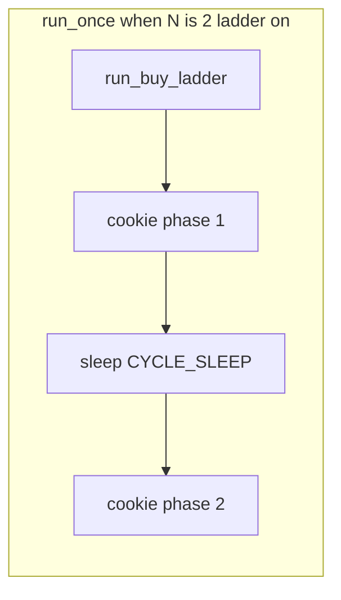

# Plan 014 — Post-ladder cookie burst factor (`macos_mouse_click_loop.sh`)

**Status:** Shipped (v2) — **`-k`** runs **N** phased cookie **`click_target`** calls (profile **`cookie_click_count`** each) with **`CYCLE_SLEEP_SECONDS`** between phases; preview emits **N** **`cookie_burst`** rows. **DEF-013** fixed (same train).

**Note:** Filename still says `cookie-before-ladder`; **normative behavior is after the buy ladder** (when the ladder runs), then **N** cookie phases.

**Implementation:** [`osx/macos_mouse_click_loop.sh`](../../../osx/macos_mouse_click_loop.sh), [`osx/cookie_clicker_preview_plan.py`](../../../osx/cookie_clicker_preview_plan.py), [`osx/README.md`](../../../osx/README.md). Related: [plan-002](plan-002-macos-mouse-click-terminal-ux.md), [plan-005](plan-005-macos-mouse-click-target-preview.md), **[DEF-013](../defects/def-013-loop-k-factor-cookie-single-burst-vs-phased.md)**.

---

## 1. Baseline (before **`-k`**)

In [`osx/macos_mouse_click_loop.sh`](../../../osx/macos_mouse_click_loop.sh), **`run_once`** ran **`run_buy_ladder`** (if not **`-S`**), then **one** cookie **`click_target`** with **`COOKIE_CLICK_COUNT`**.

---

## 2. Goal

**`-k N`** (**N ≥ 1**, default **1**): **after** the buy ladder when the ladder runs (or **only** cookie phases when **`-S`**), run **N** separate cookie **`click_target`** invocations, **each** with **`macos_mouse_click.py -n` = `COOKIE_CLICK_COUNT`** (profile unit).

Between phase **i** and **i+1** (**i < N**), **`sleep "${CYCLE_SLEEP_SECONDS}"`** (same profile value used between outer cycles). **No** sleep after the **N**th phase inside **`run_once`** (outer cycle sleep still applies as today).

---

## 3. Semantics

### 3.1 Ladder enabled

1. **`run_buy_ladder`** (unchanged).
2. **`run_phased_cookie_bursts`**: loop **i = 1 … N** — **`click_target`** with **`COOKIE_CLICK_COUNT`**; if **i < N**, **`sleep CYCLE_SLEEP_SECONDS`**.

### 3.2 **`-S`** (cookie-only)

Same **N** phased cookie **`click_target`** calls and sleeps; no ladder.

### 3.3 Validation

**N** is a positive integer (**≥ 1**); invalid **`-k`** → **`usage`** and exit **1**.

### 3.4 Default

Omitted **`-k`** → **N = 1** (one profile-sized cookie burst per cycle, backward compatible).

---

## 4. Preview and manifest

[`cookie_clicker_preview_plan.py`](../../../osx/cookie_clicker_preview_plan.py): **`--post-ladder-cookie-burst-factor N`**; **`_build_targets`** appends **N** **`cookie_burst`** targets (same **x/y**, **`click_count` = cookie-clicks** each, names **`cookie_phase_1`** … **`cookie_phase_N`**). Manifest **`options.post_ladder_cookie_burst_factor`** participates in **`options_hash`** (**`-R`** parity).

---

## 5. Documentation and tests

- [`osx/README.md`](../../../osx/README.md) describes phased **`-k`** and sleep.
- **`osx/tests/test_plan014_loop_cookie_burst_factor.py`** — help text + manifest shape.

---

## 6. Non-goals

- Per-phase **`-d`** on **`macos_mouse_click.py`** (still **`-d 0`** in **`click_target`** unless changed elsewhere).
- Profile JSON field for inter-phase sleep (reuse **`cycle_sleep_seconds`** only).
