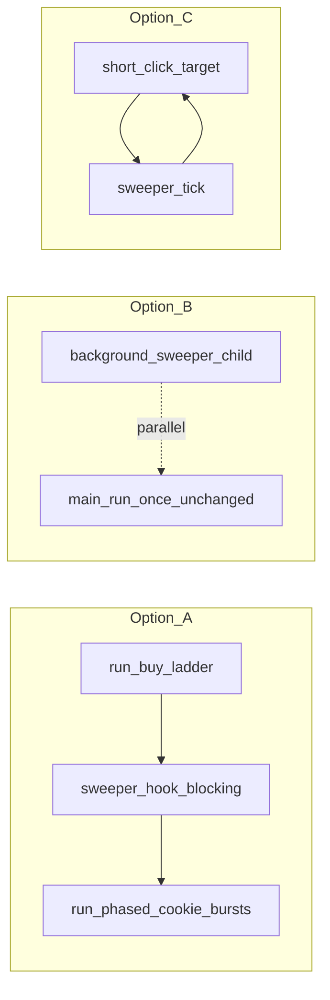

# Plan 015 — Cookie Clicker golden / “magic” cookie sweeper

**Status:** Design / roadmap (no implementation commitment in this document until v1 scope is locked).

**Scope:** Design a **sweeper** that repeatedly captures the **browser window** (or a defined screen region), detects **special cookies** that appear transiently in Cookie Clicker (commonly **golden cookies**; optionally **wrath** cookies, seasonal variants, **reindeer**, etc.), and **always outputs the coordinates** of each magic-cookie hit (global **Quartz** **x, y** suitable for `macos_mouse_click.py`), then optionally triggers clicks. Coordinate emission is **required** whenever a candidate is accepted by the detector — including **`--dry-run`** (no click, but still print / JSON-log the hit). The deliverable **must** support **two invocations**: (1) **standalone** — operator runs the script directly for long sessions or smoke tests; (2) **looper-callable** — [`macos_mouse_click_loop.sh`](../../../osx/macos_mouse_click_loop.sh) (or a thin shell wrapper it invokes) calls the **same Python entrypoint** with non-interactive flags so behavior is identical whether run alone or from the loop. This plan is the **normative product spec**; implementation would add a new script or module under [`osx/`](../../../osx/) and tests under [`osx/tests/`](../../../osx/tests/).

**Related:** [plan-002 — operator loop / backlog](plan-002-macos-mouse-click-terminal-ux.md) (tier 3 “golden-cookie region sweep”), [plan-013 — profile layout / window-relative coords](plan-013-cookie-clicker-profile-layout-and-calibration.md), [plan-014 — post-ladder cookie burst factor](plan-014-macos-mouse-click-loop-cookie-before-ladder.md), [`osx/cookie_clicker_detect_coords.py`](../../../osx/cookie_clicker_detect_coords.py), [`osx/macos_mouse_click_loop.sh`](../../../osx/macos_mouse_click_loop.sh), [`osx/macos_mouse_click.py`](../../../osx/macos_mouse_click.py), screenshot corpus [`docs/osx/screenshots/cookie-clicker/`](../../screenshots/cookie-clicker/).

---

## 1. Terminology

| Term | Meaning |
|------|---------|
| **Magic cookie** | Operator shorthand for any **non-big-cookie** special pickup the game spawns at unpredictable **(x, y)** — primarily **golden cookie**; may include **wrath cookie**, event sprites. |
| **Big cookie** | The permanent large cookie; already automated via profile **`cookie`** coordinates in the loop. **Must not** be confused with golden-cookie detection. |
| **Sweeper** | A **poll loop**: capture → detect → **emit coordinates** → optional click → sleep; runs concurrently with or **between** other automation phases. |
| **Hit coordinates** | The **global** **(x, y)** (floating-point or rounded **px**) of the **click target** for a detected magic cookie — typically **centroid** or **template peak** after mapping from capture space to Quartz space. **Must** be written to stdout/stderr or JSON per **§6.1** on every accepted hit. |
| **Capture frame** | Bitmap in **window** or **display** space used for CV; mapping to **global Quartz (x, y)** for `macos_mouse_click.py` must be explicit. |

---

## 2. Goals

1. **Detect** at least one visual class (v1 TBD) of special cookies in a captured frame with acceptable false-positive rate on a **fixed** layout (same assumptions as today’s loop: stable window size and position relative to profile coordinates).
2. **Report** every accepted magic-cookie detection by **outputting its coordinates** — **global Quartz (x, y)** in a stable, machine-parsable form (**§6.1**). Coordinates are **required** on each hit even when clicks are disabled (**`--dry-run`**); optional clicks use the **same** emitted pair for **`macos_mouse_click.py -x -y`**. If multiple cookies appear in one frame, emit **one record per hit** (sorted by confidence or scan order, documented in CLI help).
3. **Operate** on macOS with documented **Screen Recording** (and any other) permissions.
4. **Run standalone** as the **primary operator and QA path**: same process used for development, demos, and “prove it finds a magic cookie when one spawns” without starting the full buy ladder loop.
5. **Run under the looper** when integration options in **§7** are enabled: the loop script must call the sweeper as a **subprocess** (or `source` a shared shell snippet that execs the same CLI) with explicit **argv** — **no** reliance on TTY prompts for that path unless `-A`-style auto flags are also defined.

### 2.1 Non-goals (initial)

- Full **game state** parsing (CpS, buffs, store scroll) beyond what CV needs for the cookie sprite.
- **Headless** browser or injected JS (out of scope unless product explicitly pivots).
- **Guaranteed** click before despawn under all lag conditions (document race; optional best-effort click is a follow-on).
- Replacing **plan-013** window-relative calibration (sweeper may **depend** on absolute coords until plan-013 lands).

### 2.2 Standalone vs looper-callable (normative)

| Mode | Who starts it | Purpose |
|------|----------------|---------|
| **Standalone** | Operator (`./osx/…sweeper.py` or `python3 -m …`) | Long watch sessions; **manual verification** that detections fire when a golden appears; tuning **HSV / templates** with stderr/JSON logs. |
| **Looper-callable** | `macos_mouse_click_loop.sh` (optional **§7** hook) | Bounded sweeps between phases or a managed background child — **same binary**, different **CLI flags** (e.g. `--max-polls`, `--max-wall-seconds`, `--no-tty`). |

**Design rule:** implement **one** Python module / script whose **`main()`** parses argparse **once**; both standalone and looper use that entrypoint. Avoid a second “embedded” code path that drifts from the CLI.

---

## 3. Product decisions to lock before implementation

| Decision | Options | Notes |
|----------|---------|--------|
| **Visual classes (v1)** | Golden only; golden + wrath; + seasonal | Each class may need separate templates or HSV rules. |
| **Output mode** | JSON lines; stdout **`x y`**; overlay PNG; all | **Coordinates are mandatory** in **text** and **json** modes (see **§6.1**). Overlay mode still should log coords to stderr or a sidecar JSONL for automation. |
| **Click integration** | None (detect only); subprocess `macos_mouse_click.py`; **`macos_mouse_click_loop.sh`** hook (see **§7**) | In-loop integration implies **ordering**, **wall-clock budget**, and/or **chunking** vs long **`-Y`** bursts. |
| **Latency budget** | e.g. poll every **250 ms–2 s** | Tradeoff: CPU vs miss window before cookie fades or moves. |
| **Capture target** | Frontmost browser window; named app window; full display crop | See §4. |

---

## 4. Capture strategy (macOS)

No live capture exists in [`cookie_clicker_detect_coords.py`](../../../osx/cookie_clicker_detect_coords.py) today (file path → OpenCV). The sweeper **must** add capture.

| Approach | Pros | Cons |
|----------|------|------|
| **`screencapture -l<windowid>`** (window by id) | Simple CLI; can target browser | Need reliable **window id** discovery; Retina / scaling quirks |
| **Quartz `CGWindowListCreateImage`** | Programmatic; can filter by layer | Same scaling; API deprecation / permission nuances |
| **Full display + ROI crop** from profile | Reuses absolute coords from existing JSON | Wastes pixels; breaks if window moves unless plan-013 |
| **Accessibility frame** for browser window | Semantic window bounds | Accessibility permission; browser-specific chrome |

**Recommendation for design doc:** Spike **two** paths (window-only vs display+profile ROI), document **pixel scale** (1x vs 2x) and mapping to **global Quartz** coordinates in the plan’s implementation section when coding starts.

**Permissions:** Document failure modes when **Screen Recording** is denied (empty image, error from `screencapture`, etc.).

---

## 5. Detection strategy (OpenCV)

Reuse **`opencv-python`** (same as detect/preview stack in `osx/`).

| Method | Fit |
|--------|-----|
| **Template matching** (`matchTemplate`) | Small reference crops per cookie type; rotation-sensitive |
| **Color / HSV blob** | Golden hues distinct from many backgrounds; tune with false positives on UI gold accents |
| **ORB / feature match** | Heavier; possible v2 |
| **Hybrid** | HSV pre-filter → template on ROIs |

**Big-cookie exclusion:** Require **maximum size**, **distance from known big-cookie anchor** (from profile), or **mask polygon** excluding the big-cookie region so the sweeper does not “click” the main cookie thinking it is golden.

**Training corpus:** Use and extend [`docs/osx/screenshots/cookie-clicker/`](../../screenshots/cookie-clicker/) plus committed **synthetic crops** (golden present / absent) for regression tests.

---

## 6. CLI shape (sketch)

No script exists yet; normative sketch for v1 discussion. Flags below must work for **both** standalone and looper subprocess invocation.

```text
cookie_clicker_golden_sweeper.py  # name TBD
  --poll-interval SEC
  --run-seconds SEC | --max-polls N | --max-wall-seconds SEC   # stop (standalone: long watch; looper: tight budget)
  --output json|text|overlay-path
  [--window frontmost|TITLE_SUBSTRING]
  [--profile PROFILE.json]   # optional: big-cookie mask + display ROI (align with loop -P profile)
  [--dry-run]                # detect only, no click
  [--yes|-Y]                 # non-interactive click sub-invocation (mirror macos_mouse_click.py)
```

**Standalone “smoke test” run:** operator starts Cookie Clicker, runs the sweeper with **`--dry-run`** or real clicks, and **waits** for a natural golden spawn — confirms capture permissions, window targeting, and detector false-positive rate **without** `macos_mouse_click_loop.sh`. This is the **default acceptance** path before enabling any **§7** hook.

**Looper subprocess contract:** the shell passes **absolute** paths to **`--profile`**, fixed **`--poll-interval`**, and a **hard** **`--max-wall-seconds`** (or **`--max-polls`**) so a stuck sweeper cannot block the loop forever. Exit codes: **0** = finished normally (timeout or max polls); **non-zero** = error (bad capture, import failure) so the loop can **`set -e`** or log and continue per product choice.

**Click path (optional v1):** invoke `macos_mouse_click.py -x … -y … -n 1 -d 0 -Y` (or at-cursor if design prefers) per detection; document **double-click** or **miss** behavior.

### 6.1 Coordinate output (normative)

Whenever the detector **accepts** at least one magic cookie in a poll (or in a still frame for tests), the script **must** emit coordinates before any optional click:

| `--output` | Required coordinate emission |
|------------|-------------------------------|
| **`text`** | One line per hit to **stdout**: whitespace-separated **`x y`** (global Quartz), optional third column **`confidence`** if implemented; use a **`#`** prefix for human-only comments so shell pipelines can **`grep -v '^#'`**. |
| **`json`** | One **JSON object per line** (**JSONL**) to **stdout** for each hit, minimum keys: **`x`**, **`y`** (numbers), **`kind`** (e.g. `golden`), **`ts`** (ISO8601 or monotonic counter). Extra keys (`confidence`, `bbox`, `frame_id`) are allowed. |
| **`overlay-path`** | Write annotated PNG to the given path **and** emit the same **`json`** or **`text`** records to **stderr** (or a **`--coord-log PATH`** file) so operators and the looper can parse hits without OCR of the image. |

**Precision:** document whether **`x`/`y`** are **integers** (rounded) or **floats**; match what `macos_mouse_click.py` accepts on **`-x`/`-y`**.

**No hit:** when a poll finds nothing, emit **no** coordinate lines (or a single **`json`** status line only if **`--verbose-polls`** is enabled — product choice; default should stay quiet to avoid flooding logs).

---

## 7. Integration with [`macos_mouse_click_loop.sh`](../../../osx/macos_mouse_click_loop.sh)

This section revises the earlier “future hook” sketch into **three alternative in-repo integration strategies** plus a **baseline** that does not change the shell script. **No code changes are specified here** — only product and ordering decisions for a future implementation.

**Looper integration always calls the standalone script:** Options **A–C** assume the loop runs the **same** `cookie_clicker_golden_sweeper.py` (name TBD) the operator would run alone, with **stricter** time/poll limits and **no** interactive prompts. There is **no** separate “embedded” sweeper implementation inside the shell except for **`fork`/`trap`** wiring (Option B) or **ordering** of **`run_once`** steps (Options A/C).

### 7.1 Current looper contract (reference)

Today each **outer cycle** runs **`run_once`**: optionally **`run_buy_ladder`** (unless **`-S`**), then **`run_phased_cookie_bursts`** (one or more **`click_target`** calls to **`macos_mouse_click.py`**, each potentially a **long** **`-Y`** synthetic burst). The main script then **`sleep`s** **`CYCLE_SLEEP_SECONDS`** and repeats. Golden cookies can appear **during** those long bursts or during sleep; the loop has **no** visibility into the framebuffer between **`click_target`** invocations.

### 7.2 Baseline (no shell integration)

**Sidecar:** operator runs the sweeper CLI in a **second terminal** (or **tmux** pane). **`macos_mouse_click_loop.sh`** is unchanged. **Pros:** zero risk to loop stability; easiest to ship and A/B test. **Cons:** no lifecycle coupling; two processes must agree on profile/window assumptions manually.

**Recommendation:** treat sidecar as **v0 / v1 ship** while CV and capture mature; pick one of **§7.3–§7.5** only after false-click rates and operator workflow are acceptable.

### 7.3 Option A — Serialized **pre-cookie** (or **pre-cycle**) hook inside `run_once`

**Idea:** Add an optional shell function (e.g. **`run_golden_sweeper_phase`**) invoked from **`run_once`** at a fixed point in the sequence — typically **after** **`run_buy_ladder`** when the ladder runs, and **before** **`run_phased_cookie_bursts`**, or at the **very start** of **`run_once`** so goldens that appeared during the previous sleep can be collected before the ladder consumes the screen.

**Mechanics (conceptual):** new **`getopts`** flag (e.g. **`-G`** “enable golden sweeper”) plus optional env or profile keys for **max wall time per hook**, **poll interval**, and **dry-run**. The hook runs a **Python** sweeper entrypoint (or a small wrapper) that **blocks** until timeout, **N** detections, or “no candidate for **M** polls”; each confirmed hit optionally invokes **`macos_mouse_click.py`** once (same as today’s **`click_target`** pattern).

| Pros | Cons |
|------|------|
| Deterministic ordering; easy to reason about in logs (ladder → sweep → cookie phases). | Does **not** cover goldens that spawn **during** long cookie **`click_target`** bursts unless combined with Option B or shorter **`-n`** chunks. |
| Single terminal; one PID owns the session. | Adds **wall-clock** to every cycle when enabled; may desync from operator’s mental model of “cookie burst starts immediately after ladder.” |

**Best when:** operator prioritizes **simplicity** and mostly misses goldens **between** ladder and cookie or **during** **`CYCLE_SLEEP_SECONDS`**.

### 7.4 Option B — **Loop-managed background** sweeper (parallel child)

**Idea:** When the loop starts (after profile load / preview gates), **`macos_mouse_click_loop.sh`** **`fork`s** a **background** sweeper subprocess ( **`python …/cookie_clicker_golden_sweeper.py … &`** ), stores **`$!`**, and registers **`trap`** cleanup to **`kill`** the child on exit or **SIGINT**. The main **`while`** loop and **`run_once`** sequence stay **unchanged**; the child independently polls the screen and clicks goldens.

| Pros | Cons |
|------|------|
| Can catch goldens **during** long **`macos_mouse_click.py`** bursts and during **outer sleep** — maximum temporal coverage. | **Two** automation writers to the same game: risk of **cursor fights**, mis-clicks on UI, and harder **repro** when something goes wrong. |
| No need to chunk cookie **`-n`** for coverage. | Requires strict sweeper rules (cooldown after click, ignore regions, **mutex**-style “do not click while ladder row is active” is hard in shell). |

**Best when:** operator accepts **complexity** and tuning in exchange for fewer missed spawns during long **`-Y`** runs.

### 7.5 Option C — **Cooperative interleaving** (chunked cookie / burst slicing)

**Idea:** Keep a **single** foreground automation writer but **shorten** each **`macos_mouse_click.py`** invocation (split **`COOKIE_CLICK_COUNT`** into **chunks** of **K** synthetic clicks, or insert sweeper ticks between **`click_target`** rows). Between chunks, call the same sweeper **tick** function as Option A (non-blocking **one** capture + detect + optional click).

| Pros | Cons |
|------|------|
| Only one “primary” writer at a time; easier than Option B to reason about **cursor** ownership. | **Largest** change to loop and possibly **manifest / preview** parity if cookie phases multiply or **`options_hash`** gains new dimensions. |
| Goldens during “cookie grind” get periodic chances without a permanent background process. | More **subprocess** overhead; may reduce effective CpS from big-cookie spam; needs careful defaults so operators do not feel “stuttery.” |

**Best when:** operator wants **integrated** behavior without a **24/7** background poller, and is willing to adjust **`-k`**, **chunk size**, and **`-d`** to balance throughput vs sweep cadence.

### 7.6 Comparison and sequencing

| Criterion | Option A (serialized hook) | Option B (background child) | Option C (chunked interleave) |
|-----------|----------------------------|-----------------------------|--------------------------------|
| Catches mid–**`click_target`** burst | Poor unless chunks added | Strong | Good (if chunk boundary frequent enough) |
| Shell / process complexity | Low | Medium (trap, PID, logs) | High (refactor **`click_target`** usage) |
| Cursor contention | None | Highest | Low |
| Preview / **`-R`** impact | Small (new options in manifest if sweeps become first-class targets) | Small to none | Potentially larger |

**Suggested product path:** ship **sidecar (§7.2)** → prototype **Option A** behind a flag → collect miss-rate data → only then consider **B** or **C** depending on whether misses cluster **during** bursts (**B**/**C**) vs **between** phases (**A**).



---

## 8. Testing strategy

| Layer | Approach |
|-------|----------|
| **Unit / CV** | Static PNG fixtures: assert **count** and **(x, y)** within tolerance vs known golden positions (pytest + `cv2`, skip if import fails — mirror existing `osx/tests` patterns). |
| **Capture** | Mock frame injection in tests; one **manual** or CI-skipped test that runs `screencapture` only when `RUN_WINDOW_CAPTURE=1`. |
| **Integration** | Optional: dry-run against a saved full-screen PNG in repo (large file policy: prefer crops). |
| **Standalone operator acceptance** | Run **`cookie_clicker_golden_sweeper.py`** **alone** (game open, golden allowed to spawn): verify **stdout** (or coord log) contains **§6.1** records with **`x`/`y`** when a magic cookie appears — **`--dry-run`** must still emit coordinates. Repeat without **`--dry-run`** to validate clicks use the **same** pair. **Do not** require the looper for this gate — once standalone is trusted, add a short **`macos_mouse_click_loop.sh -G`** (or equivalent) smoke test that only checks subprocess exit **0** and bounded runtime. |

---

## 9. Documentation touchpoints (when implemented)

- [`osx/README.md`](../../../osx/README.md): sweeper CLI, deps, permissions, link to this plan.
- [plan-002](plan-002-macos-mouse-click-terminal-ux.md): update backlog row from “tier 3 candidate” to “see plan-015” when a script ships.

---

## 10. Open questions

1. Which **browser** is in scope for window capture (Safari vs Chrome vs Electron Cookie Clicker)?
2. Are **wrath** cookies in v1 if golden-only HSV band overlaps?
3. Should clicks use **fixed** `-x/-y` or **learn** mode once per session?
4. Legal / ToS: Cookie Clicker is Orteil’s game — automation is local dogfooding only; keep README disclaimer consistent with existing operator docs.

---

## 11. Suggested implementation order (after scope lock)

1. **Spike:** one-off capture → disk PNG + manual OpenCV playground on corpus images.
2. **Library:** `detect_special_cookies(image_bgr) -> list[Detection]` with tests on fixtures.
3. **CLI:** poll loop + JSON output; **dry-run** default; **sidecar (§7.2)** as first operator-facing ship.
4. **Looper integration (pick §7.3–§7.5)** only after sidecar metrics justify complexity; update **`usage`**, preview **`options_hash`** if new flags affect **`-R`**, and extend [`osx/README.md`](../../../osx/README.md) with the chosen option’s caveats.
