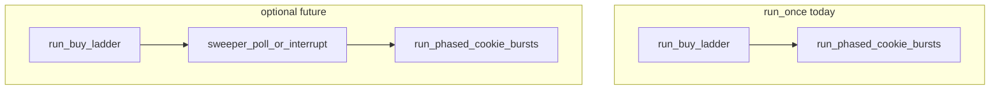

# Plan 015 — Cookie Clicker golden / “magic” cookie sweeper

**Status:** Design / roadmap (no implementation commitment in this document until v1 scope is locked).

**Scope:** Design a **sweeper** that repeatedly captures the **browser window** (or a defined screen region), detects **special cookies** that appear transiently in Cookie Clicker (commonly **golden cookies**; optionally **wrath** cookies, seasonal variants, **reindeer**, etc.), and surfaces coordinates (and optionally triggers clicks). This plan is the **normative product spec** for that feature; implementation would add a new script or module under [`osx/`](../../../osx/) and tests under [`osx/tests/`](../../../osx/tests/).

**Related:** [plan-002 — operator loop / backlog](plan-002-macos-mouse-click-terminal-ux.md) (tier 3 “golden-cookie region sweep”), [plan-013 — profile layout / window-relative coords](plan-013-cookie-clicker-profile-layout-and-calibration.md), [plan-014 — post-ladder cookie burst factor](plan-014-macos-mouse-click-loop-cookie-before-ladder.md), [`osx/cookie_clicker_detect_coords.py`](../../../osx/cookie_clicker_detect_coords.py), [`osx/macos_mouse_click_loop.sh`](../../../osx/macos_mouse_click_loop.sh), [`osx/macos_mouse_click.py`](../../../osx/macos_mouse_click.py), screenshot corpus [`docs/osx/screenshots/cookie-clicker/`](../../screenshots/cookie-clicker/).

---

## 1. Terminology

| Term | Meaning |
|------|---------|
| **Magic cookie** | Operator shorthand for any **non-big-cookie** special pickup the game spawns at unpredictable **(x, y)** — primarily **golden cookie**; may include **wrath cookie**, event sprites. |
| **Big cookie** | The permanent large cookie; already automated via profile **`cookie`** coordinates in the loop. **Must not** be confused with golden-cookie detection. |
| **Sweeper** | A **poll loop**: capture → detect → emit/act → sleep; runs concurrently with or **between** other automation phases. |
| **Capture frame** | Bitmap in **window** or **display** space used for CV; mapping to **global Quartz (x, y)** for `macos_mouse_click.py` must be explicit. |

---

## 2. Goals

1. **Detect** at least one visual class (v1 TBD) of special cookies in a captured frame with acceptable false-positive rate on a **fixed** layout (same assumptions as today’s loop: stable window size and position relative to profile coordinates).
2. **Report** detections as **global coordinates** (or window-local + window origin) suitable for **`macos_mouse_click.py -x -y -Y`**.
3. **Operate** on macOS with documented **Screen Recording** (and any other) permissions.

### 2.1 Non-goals (initial)

- Full **game state** parsing (CpS, buffs, store scroll) beyond what CV needs for the cookie sprite.
- **Headless** browser or injected JS (out of scope unless product explicitly pivots).
- **Guaranteed** click before despawn under all lag conditions (document race; optional best-effort click is a follow-on).
- Replacing **plan-013** window-relative calibration (sweeper may **depend** on absolute coords until plan-013 lands).

---

## 3. Product decisions to lock before implementation

| Decision | Options | Notes |
|----------|---------|--------|
| **Visual classes (v1)** | Golden only; golden + wrath; + seasonal | Each class may need separate templates or HSV rules. |
| **Output mode** | JSON lines; stdout **x y**; overlay PNG; all | Drives CLI and composability with shell. |
| **Click integration** | None (detect only); subprocess `macos_mouse_click.py`; future **`macos_mouse_click_loop.sh`** phase | Loop integration implies **pausing** or **interleaving** long **`-Y`** bursts (see §7). |
| **Latency budget** | e.g. poll every **250 ms–2 s** | Tradeoff: CPU vs miss window before cookie fades or moves. |
| **Capture target** | Frontmost browser window; named app window; full display crop | See §4. |

---

## 4. Capture strategy (macOS)

No live capture exists in [`cookie_clicker_detect_coords.py`](../../../osx/cookie_clicker_detect_coords.py) today (file path → OpenCV). The sweeper **must** add capture.

| Approach | Pros | Cons |
|----------|------|------|
| **`screencapture -l<windowid>`** (window by id) | Simple CLI; can target browser | Need reliable **window id** discovery; Retina / scaling quirks |
| **Quartz `CGWindowListCreateImage`** | Programmatic; can filter by layer | Same scaling; API deprecation / permission nuances |
| **Full display + ROI crop** from profile | Reuses absolute coords from existing JSON | Wastes pixels; breaks if window moves unless plan-013 |
| **Accessibility frame** for browser window | Semantic window bounds | Accessibility permission; browser-specific chrome |

**Recommendation for design doc:** Spike **two** paths (window-only vs display+profile ROI), document **pixel scale** (1x vs 2x) and mapping to **global Quartz** coordinates in the plan’s implementation section when coding starts.

**Permissions:** Document failure modes when **Screen Recording** is denied (empty image, error from `screencapture`, etc.).

---

## 5. Detection strategy (OpenCV)

Reuse **`opencv-python`** (same as detect/preview stack in `osx/`).

| Method | Fit |
|--------|-----|
| **Template matching** (`matchTemplate`) | Small reference crops per cookie type; rotation-sensitive |
| **Color / HSV blob** | Golden hues distinct from many backgrounds; tune with false positives on UI gold accents |
| **ORB / feature match** | Heavier; possible v2 |
| **Hybrid** | HSV pre-filter → template on ROIs |

**Big-cookie exclusion:** Require **maximum size**, **distance from known big-cookie anchor** (from profile), or **mask polygon** excluding the big-cookie region so the sweeper does not “click” the main cookie thinking it is golden.

**Training corpus:** Use and extend [`docs/osx/screenshots/cookie-clicker/`](../../screenshots/cookie-clicker/) plus committed **synthetic crops** (golden present / absent) for regression tests.

---

## 6. CLI shape (sketch)

No script exists yet; normative sketch for v1 discussion:

```text
cookie_clicker_golden_sweeper.py  # name TBD
  --poll-interval SEC
  --max-iter N | --run-seconds T
  --output json|text|overlay-path
  [--window frontmost|TITLE_SUBSTRING]
  [--profile PROFILE.json]   # optional: big-cookie mask + display ROI
  [--dry-run]                # detect only, no click
```

**Click path (optional v1):** invoke `macos_mouse_click.py -x … -y … -n 1 -d 0 -Y` (or at-cursor if design prefers) per detection; document **double-click** or **miss** behavior.

---

## 7. Integration with `macos_mouse_click_loop.sh` (future)



Options:

- **Sidecar process:** operator runs sweeper in a second terminal; no loop changes.
- **Pre-cookie phase:** run sweeper **N** ms or **until idle** before `run_phased_cookie_bursts`; requires **yield** from long bursts or shorter **`-n`** chunks so golden cookies are not starved.
- **Signal / IPC:** sweeper signals parent to inject a click (complex).

Plan recommends **sidecar for v1**; loop hook is **v2** after metrics on false clicks.

---

## 8. Testing strategy

| Layer | Approach |
|-------|----------|
| **Unit / CV** | Static PNG fixtures: assert **count** and **(x, y)** within tolerance vs known golden positions (pytest + `cv2`, skip if import fails — mirror existing `osx/tests` patterns). |
| **Capture** | Mock frame injection in tests; one **manual** or CI-skipped test that runs `screencapture` only when `RUN_WINDOW_CAPTURE=1`. |
| **Integration** | Optional: dry-run against a saved full-screen PNG in repo (large file policy: prefer crops). |

---

## 9. Documentation touchpoints (when implemented)

- [`osx/README.md`](../../../osx/README.md): sweeper CLI, deps, permissions, link to this plan.
- [plan-002](plan-002-macos-mouse-click-terminal-ux.md): update backlog row from “tier 3 candidate” to “see plan-015” when a script ships.

---

## 10. Open questions

1. Which **browser** is in scope for window capture (Safari vs Chrome vs Electron Cookie Clicker)?
2. Are **wrath** cookies in v1 if golden-only HSV band overlaps?
3. Should clicks use **fixed** `-x/-y` or **learn** mode once per session?
4. Legal / ToS: Cookie Clicker is Orteil’s game — automation is local dogfooding only; keep README disclaimer consistent with existing operator docs.

---

## 11. Suggested implementation order (after scope lock)

1. **Spike:** one-off capture → disk PNG + manual OpenCV playground on corpus images.
2. **Library:** `detect_special_cookies(image_bgr) -> list[Detection]` with tests on fixtures.
3. **CLI:** poll loop + JSON output; **dry-run** default.
4. **Optional click** + operator README + link from plan-002 / plan-013.
