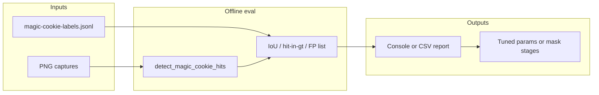

# Plan 017 — Magic cookie detector eval and tuning (label-driven)

**Status:** **Roadmap** — measurement and `detect_magic_cookie_hits` tuning guided by human labels in JSONL.

**Related:** [plan-015 — golden / magic cookie sweeper](plan-015-cookie-clicker-golden-cookie-sweeper.md) (detector entrypoint), [plan-016 — screenshot label tool](plan-016-magic-cookie-screenshot-label-tool.md) (JSONL schema), [`osx/cookie_clicker_golden_sweeper.py`](../../../osx/cookie_clicker_golden_sweeper.py), [`docs/osx/golden-sweeper-corpus-INDEX.md`](../golden-sweeper-corpus-INDEX.md) (heuristic triage; not ground truth vs labels).

**Execution status:** [plan-018 — magic cookie detection remediation](plan-018-magic-cookie-detection-remediation.md) owns the **measurement-first** rollout (offline eval script, baseline metrics table, detector tuning CLI, phased tracks). Use plan-018 as the working tracker; this document stays the **eval metric definition** and label snapshot reference.

---

## 1. Data snapshot (`magic-cookie-labels.jsonl`)

Path (default operator location): `docs/osx/screenshots/golden-sweeper-captures/magic-cookie-labels.jsonl` (gitignored with captures).

- **Total rows:** 54
- **`magic_cookie: true`:** 16 (each with `bbox_px`)
- **`magic_cookie: false`:** 38
- **`magic_cookie: null` (skip):** 0
- **Image size:** 3360×2100 (all rows in the analyzed snapshot)

**Counts drift:** As labeling continues, totals above become **stale**. Treat the **Metrics appendix** in [plan-018](plan-018-magic-cookie-detection-remediation.md) (dated eval rows) as the **live measurement snapshot** for FN/FP/recall; refresh this §1 table when you publish a new label-set snapshot.

**Positive bboxes:** centroids and sizes vary widely (examples: top-left ~`(200,450)` ~185×153 px; center-right ~`(550,950)` ~160×171; bottom ~`(180,1750)` ~249×218; one tight **63×60** box). The detector must handle **scale and placement** across the full canvas, not a fixed ROI.

**Context:** The corpus index still describes v2 hits with heuristic “No verified golden” text for many stems; human labels now mark **16** frames as present. **Human labels are the ground truth for this plan**; use label-vs-detector metrics for tuning, not the index assessment column alone.

**Current detector:** `detect_magic_cookie_hits` in `cookie_clicker_golden_sweeper.py` — HSV dual-range mask, morphology, contour filters (`min_area` / `max_area`, aspect, extent, solidity, circularity, `max_hits`, optional `exclude_xy`). Tests today are **synthetic blobs** only (`osx/tests/test_cookie_clicker_golden_sweeper.py`).

---

## 2. Phase 1 — Measurement (blocking)

Add a **read-only offline script** (e.g. `tools/eval_magic_cookie_labels.py`, as sketched in plan-016) that:

1. Loads JSONL via existing `LabelStore` / `LabelRecord` in `osx/magic_cookie_labels.py` (reuse `image_path` resolution; skip rows with `magic_cookie is None` if they appear later).
2. For each row, loads BGR with OpenCV, calls `detect_magic_cookie_hits(bgr, exclude_xy=None)` (same defaults as production unless CLI overrides are added for A/B).
3. **Positives (`magic_cookie: true`):** convert each detector `Hit.bbox` `(x,y,w,h)` to IoU with label `bbox_px`. Define **recall@K** (e.g. success if any of top-K hits has IoU ≥ threshold; start **0.3–0.5**). Record **best IoU**, **miss** (no hits), **wrong location** (hits but IoU below threshold).
4. **Negatives (`magic_cookie: false`):** **FP** if any hit exists (optionally filter by `confidence`).
5. Emit a **summary**: FN/FP counts, mean/median best IoU on positives, sorted list of stems for worst cases; optional `--write-debug-dir` with annotated overlays.

Run once on the current JSONL to establish a **baseline** before changing detector thresholds.

---

## 3. Phase 2 — Diagnose failure modes

From the eval report, typical buckets:

- **False negatives on positives:** HSV too tight, `min_area` / `min_circularity` / `min_solidity` too aggressive, or cookie split across mask fragments (morphology / blur).
- **False positives on negatives:** gold-tinted UI still passing compactness filters (v2 caps at `max_hits` blobs).

Use raw PNG + label bbox + detector top hit overlay (`_annotate_hits_on_bgr` or extend with GT box in another color) for the worst N files.

---

## 4. Phase 3 — Detector changes (iterative)

Keep changes in `osx/cookie_clicker_golden_sweeper.py` unless a small helper module is justified.

Likely levers (evidence-driven):

- HSV bounds and V/S floors.
- Contour filters: `min_area`, `max_area`, `min_circularity`, `min_extent`, `min_solidity`, `max_aspect`, `min_side_px`, and the **18% of min dimension** cap on `max(cw,ch)`.
- Morphology (`medianBlur`, `MORPH_OPEN` kernel / iterations).
- `max_hits` ranking; optional soft ROI from `cookie_clicker_detect_coords.py` profile (Phase 4).

After each substantive change: re-run eval; keep **existing pytest** green; add **small new tests** only without large binaries (synthetic / in-memory `numpy`).

---

## 5. Phase 4 — Optional / later

- ROI mask from saved Cookie Clicker window rect.
- Temporal logic across `f00000` / `f00001` pairs if single-frame stays ambiguous.
- Grow JSONL (more skips and hard negatives) before aggressive threshold moves to avoid overfitting ~54 rows.

---

## 6. Documentation

- Cross-link this plan from plan-015 § detector when eval lands.
- Record baseline and improved metrics in this file or PR description (optional: no committed metrics CSV unless useful).

---

## 7. Success criteria

- Eval script runs locally with one command.
- **FN rate on positives** and **FP rate on negatives** improve vs baseline without breaking synthetic sweeper tests.
- Before/after metric table documented (plan or PR).

---

## 8. Implementation checklist

**Canonical tracker:** [plan-018](plan-018-magic-cookie-detection-remediation.md) (deliverables, metrics appendix, open questions).

- [x] Add `tools/eval_magic_cookie_labels.py`: load JSONL, run `detect_magic_cookie_hits`, IoU on positives, FP on negatives, stem list + optional debug dir (**shipped**; see plan-018).
- [x] Run eval on current `magic-cookie-labels.jsonl`; record FN/FP counts (**baseline row** in plan-018 metrics appendix, 2026-05-04).
- [ ] Inspect worst FN/FP overlays; bucket causes (HSV vs area vs morphology vs UI blobs).
- [ ] Adjust `detect_magic_cookie_hits` parameters / mask pipeline; re-run eval until metrics improve.
- [x] Extend tests (`bbox_iou`, eval smoke, `min_confidence`) without large binaries (**shipped**).
