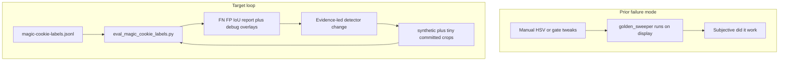

# Plan 018 — Magic cookie detection remediation (measurement-first)

**Status:** In progress — eval tooling and detector tuning surface shipped; label-driven metrics and further detector tracks are iterative.

**Related:** [plan-015 — golden / magic cookie sweeper](plan-015-cookie-clicker-golden-cookie-sweeper.md), [plan-016 — screenshot label tool](plan-016-magic-cookie-screenshot-label-tool.md), [plan-017 — detector eval and tuning](plan-017-magic-cookie-detector-eval-and-tuning.md) (Phase 1 script; execution status cross-linked), [plan-019 — label tool find by stem](plan-019-magic-cookie-label-tool-find-image.md), [`osx/cookie_clicker_golden_sweeper.py`](../../../osx/cookie_clicker_golden_sweeper.py), [`tools/eval_magic_cookie_labels.py`](../../../tools/eval_magic_cookie_labels.py).

---

## Why prior rounds likely failed (evidence from the repo)

1. **No closed-loop metrics.** [plan-017](plan-017-magic-cookie-detector-eval-and-tuning.md) calls for `tools/eval_magic_cookie_labels.py` (IoU on positives, FP on negatives, worst-stem reports). Until that existed, threshold changes were blind: regressions on negatives or positives were invisible until manual play.

2. **Detector is a single HSV-blob pipeline tuned on synthetic geometry only.** [`detect_magic_cookie_hits`](../../../osx/cookie_clicker_golden_sweeper.py) uses fixed dual HSV ranges, morphology, and contour gates (`min_area` … `min_circularity`, `max_hits=6`). Unit tests in [`osx/tests/test_cookie_clicker_golden_sweeper.py`](../../../osx/tests/test_cookie_clicker_golden_sweeper.py) only assert behavior on **hand-drawn yellow circles and rectangles**—not on real Cookie Clicker frames.

3. **Corpus triage confirms “gold UI” vs “golden cookie” is the core conflict.** [`docs/osx/golden-sweeper-corpus-INDEX.md`](../golden-sweeper-corpus-INDEX.md) (built by [`tools/build_golden_sweeper_corpus_index.py`](../../../tools/build_golden_sweeper_corpus_index.py)) repeatedly notes **legacy JSON lines in the dozens** and **v2 still listing 6 hits** on frames assessed as **no verified golden**—i.e. compact gold-tinted UI still scores like a cookie. The index’s **assessment column is heuristic**, not ground truth; plan-017 states **human JSONL labels are ground truth** once present.

4. **Operational confusion is separate from CV.** [DEF-014](../defects/def-014-golden-sweeper-loop-sleep-placement-k1.md) was about **when** the sweeper ran in the loop (`-k 1`); it is **fixed** and does not explain detection quality.

5. **Large assets are gitignored.** [`docs/osx/screenshots/golden-sweeper-captures/`](../screenshots/golden-sweeper-captures/) is in `.gitignore`. Labels default to `magic-cookie-labels.jsonl` beside captures. **CI cannot see a private corpus**; work splits **(a)** small committed fixtures vs **(b)** local-only eval the operator runs.



## Scope of “temporary cookie” (normative)

Align with [plan-015](plan-015-cookie-clicker-golden-cookie-sweeper.md): **magic / golden cookie** = transient pickup, **not** the big cookie (profile `cookie` anchor). **v1** may remain **golden-only**; wrath / seasonal sprites are stretch goals with separate HSV or template tracks.

## Recommended strategy (phased)

### Phase 0 — Freeze semantics and inputs

- Document capture invariants: **main display** `screencapture`, resolution, browser zoom, and whether **exclude_xy** is passed from `--profile` when dimensions match detector metadata in the profile JSON.
- **Evaluation exclude policy:** `tools/eval_magic_cookie_labels.py` supports `--profile` and `--exclude-radius` to mirror production big-cookie exclusion; eval can also run with `--no-exclude` for ablations.

### Phase 1 — Offline eval (blocking)

- **`tools/eval_magic_cookie_labels.py`** loads JSONL via [`LabelStore`](../../../osx/magic_cookie_labels.py), runs `detect_magic_cookie_hits`, **positives:** best IoU and recall@K vs `bbox_px`; **negatives:** FP if any hit (optional `--fp-min-confidence`); optional `--write-debug-dir` with detector overlay plus **magenta** ground-truth box.
- **Baseline run:** operator runs against `magic-cookie-labels.jsonl`; record summary in **Metrics appendix** below.
- **Acceptance:** script exits 0; deterministic on same files; CLI documented in this plan and [`osx/README.md`](../../../osx/README.md).

### Phase 2 — Label and corpus hygiene (parallel)

- Grow labels: more **hard negatives** (gold UI, buffs, store glow) and **skips** for ambiguous frames per [plan-016](plan-016-magic-cookie-screenshot-label-tool.md).
- Optionally export a **tiny** anonymized subset for **committed** regression tests—only if acceptable; otherwise keep gold standard local.

### Phase 3 — Detector improvements (evidence-led branches)

Pick **one primary line** after Phase 1 numbers; combine only if metrics justify.

| Track | When to use | Main idea |
|-------|-------------|-----------|
| **A. Heuristic refinement** | FP dominated by compact gold UI | Second-pass on **normalized ROIs** (histogram, edge density, radial gradient) on top-K HSV blobs. |
| **B. Template / ORB** | Positives fail HSV | Small template bank from **positive crops**; NCC on HSV-prefiltered ROIs. |
| **C. Temporal cue** | Cookie is transient | Frame diff or “new blob since last poll”; needs two captures or stateful sweeper. |
| **D. ROI from game window** | Full-screen noise | [plan-013](plan-013-cookie-clicker-profile-layout-and-calibration.md) `browser_rect` or eval-only `--crop x,y,w,h` experiments. |

**Shipped in plan-018 (foundation):** optional **`min_confidence`** filter and **CLI overrides** for all `detect_magic_cookie_hits` numeric gates on [`cookie_clicker_golden_sweeper.py`](../../../osx/cookie_clicker_golden_sweeper.py), so tuning and eval runs do not require editing Python constants.

**Guardrail:** changes must not break existing [`osx/tests/test_cookie_clicker_golden_sweeper.py`](../../../osx/tests/test_cookie_clicker_golden_sweeper.py).

### Phase 4 — Product integration

- Re-run eval after detector changes; regenerate [`docs/osx/golden-sweeper-corpus-INDEX.md`](../golden-sweeper-corpus-INDEX.md) when local captures change (`tools/build_golden_sweeper_corpus_index.py`).

## Open questions / information needed from the operator

1. **Browser and layout:** Safari vs Chrome vs Steam build; fixed zoom %; single vs multi-monitor (capture is **main display** today).
2. **Label file location and freshness:** path to authoritative `magic-cookie-labels.jsonl`; whether the 54-row snapshot in plan-017 is still accurate.
3. **Failure symptom priority:** worse **false positives** vs **false negatives**—drives threshold direction.
4. **Click policy:** keep looper **`--dry-run`** until precision is acceptable, or gate real clicks on confidence?
5. **Asset policy:** may cropped positives/negatives be committed under `osx/tests/fixtures/` for CI?
6. **Sprite scope:** golden only for v1, or wrath / seasonal in scope?

## Deliverables checklist

- [x] This **`plan-018`** document and index row in [`README.md`](README.md).
- [x] **`tools/eval_magic_cookie_labels.py`** + tests.
- [x] Detector **`min_confidence`** + **`--det-*`** CLI on golden sweeper.
- [x] Baseline eval on default `magic-cookie-labels.jsonl` (see **Metrics appendix**).
- [ ] Operator: re-run eval after each substantive detector change; append rows to **Metrics appendix**.

---

## Field observations (2026-05 operator / research session)

Captures under [`golden-sweeper-captures/`](../screenshots/golden-sweeper-captures/) are **gitignored**; this section records **triage conclusions** from live Cookie Clicker + sweeper runs so they are not only in chat history.

### Exemplar stem

- **`golden-sweeper-20260504-223259-223436-f00001`** (and siblings **`-annotated.png`**, **`.json`** when present): anchor frame for discussing **middle-column false positives** vs **missed spawns** on the **big cookie** or **Mine** row art.

### Observed detector behavior (v2 HSV, full display)

- **`max_hits=6`** often **saturates** with **compact gold-ish blobs** in the **building preview column** and nearby UI — not necessarily the **transient** golden the operator cares about.
- **High-confidence false positives:** static **row chrome / Portal-style** icons can reach **~0.95**, **outranking** a **true** floating golden when that blob’s score sits **~0.72–0.77** (similar band to **garden / plant** false positives).
- **False negatives:** a **spawned** golden on the **large cookie** or over **Mine** artwork may **fail** to appear in the top six after **HSV + geometry** gates, or interact with **profile big-cookie exclusion** when **`--profile`** is enabled — **annotated boxes present** does not imply the **click-worthy** golden was found.

### Sidecar JSON triage

- For **`coord_space": "quartz_global"`** rows, **`bbox`** is **PNG pixel space**; **`x`/`y`** are **Quartz**. See **plan-015 §5.2** sidecar contract callout.

### Evaluation follow-up

- **Offline eval** without **`--profile`** can show **recall@K = 0** on positives if detector centroids never reach **IoU** threshold against human **`bbox_px`** — rerun with **`--profile`** when label **`image_wh`** matches profile **`detector`** metadata so exclusion matches production.

### Label tool workflow

- Jump to a known stem: **[plan-019](plan-019-magic-cookie-label-tool-find-image.md)** (**Ctrl+F**, **F3**, **`--jump-query`**) — e.g. resume on **`golden-sweeper-20260504-223259-223436-f00001`** without linear paging.

---

## Metrics appendix

Run (from repo root, with labels and images present):

```bash
./osx/.venv/bin/python3 tools/eval_magic_cookie_labels.py \
  --labels docs/osx/screenshots/golden-sweeper-captures/magic-cookie-labels.jsonl
```

Optional: `--profile osx/config/cookie_clicker_profile.defaults.json` when image size matches profile `detector` metadata; `--write-debug-dir /tmp/magic-eval-debug`.

| Date | Command / notes | Positives (N) | Negatives (N) | FN | FP | recall@K | fp_rate | mean best IoU | Notes |
|------|-----------------|---------------|---------------|----|----|------------|---------|----------------|-------|
| 2026-05-04 | `eval_magic_cookie_labels.py` default labels, `--iou-threshold 0.4`, `--top-k 6`, no `--profile` | 17 | 38 | 17 | 38 | 0.0 | 1.0 | 0.0021 | Baseline v2: no positive reached IoU ≥ 0.4 vs human `bbox_px`; every negative still had ≥1 hit (compact gold UI). Next: run with `--profile` when `detector` metadata matches capture size; tune `--det-*` / `--min-confidence` using this script; consider plan-018 Phase 3 tracks. |
