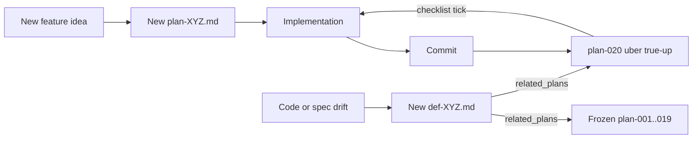

# Plan 020 — Uber true-up (single open plan; consolidate residuals)

**Status:** **Open / In progress** — the **only** open plan in [`docs/osx/plans/`](.). All other plans (`plan-001` … `plan-019`, hand-offs, `cursor-plans-import/`) are **Frozen — superseded by plan-020** as of **2026-05-06**.

**Scope:** macOS clicker ([`osx/macos_mouse_click.py`](../../../osx/macos_mouse_click.py)), loop ([`osx/macos_mouse_click_loop.sh`](../../../osx/macos_mouse_click_loop.sh)), Cookie Clicker profile / detector ([`osx/cookie_clicker_detect_coords.py`](../../../osx/cookie_clicker_detect_coords.py), [`osx/cookie_clicker_preview_plan.py`](../../../osx/cookie_clicker_preview_plan.py)), golden sweeper ([`osx/cookie_clicker_golden_sweeper.py`](../../../osx/cookie_clicker_golden_sweeper.py)), label tool ([`osx/magic_cookie_label_tool.py`](../../../osx/magic_cookie_label_tool.py)), eval tool ([`tools/eval_magic_cookie_labels.py`](../../../tools/eval_magic_cookie_labels.py)).

**Why this plan exists:** The repo accumulated **20+ plan documents** in mixed states (`Shipped`, `Closed (v1)`, `Roadmap`, `Design`, `In progress`, `Closed (archive)`). Repeated edits to old plan files made it unclear which document was current and which residuals were still in scope. This plan **freezes everything else** and owns the **one consolidated checklist** going forward.

---

## 1. Process rules (effective 2026-05-06)

These rules also live in [`README.md`](README.md), [`.cursorrules`](../../../.cursorrules), and [`.cursor/rules/plans-in-docs-tree.mdc`](../../../.cursor/rules/plans-in-docs-tree.mdc); plan-020 is the canonical source.

1. **Plan-020 is the only open plan.** All other plans under [`docs/osx/plans/`](.) are **read-only**. Do not edit `plan-001` … `plan-019`, the two hand-offs, or `cursor-plans-import/`.
2. **New feature** ⇒ new `plan-021+` document. Do not extend a frozen plan to cover new scope.
3. **Code or spec drift** found while implementing or reviewing ⇒ new file under [`docs/osx/defects/`](../defects/). The defect's `related_plans:` frontmatter **must** include both the **historical** plan that documents the affected behavior **and** `plan-020-uber-true-up.md`. The fix updates plan-020's checklist (and any new plan), **not** the historical plan.
4. **Closing a checklist item:** edit only this file (and any successor `plan-021+`). Mark the box, link the commit SHA, and (if applicable) the new plan or defect that took the work.
5. **Successor plan:** when plan-020 itself is wrapped, write a `plan-021-…` covering remaining work and apply the same freeze banner to plan-020.

---

## 2. Frozen plan inventory

Each row preserves the historical status. **Verification verdict** is the operator's quick assessment of whether the plan's normative claims still match the code; **TU-NN** items in §4 expand on the open verifications.

| # | Title (link) | Was | Verification verdict |
|---|--------------|-----|----------------------|
| 001 | [macOS clicker — core behavior](plan-001-macos-clicker.md) | Shipped | TU-01: re-verify against [`osx/macos_mouse_click.py`](../../../osx/macos_mouse_click.py) |
| 002 | [Terminal UX (Rich pre-run)](plan-002-macos-mouse-click-terminal-ux.md) | Closed (v1) | TU-02: re-verify MT-01..MT-09 + DEF table |
| 003 | [TUI automation / CI](plan-003-macos-mouse-click-tui-automation.md) | Roadmap (YAML todos completed) | partial — verify CI / PTY tests still cover spec |
| 004 | [Run progress UI](plan-004-macos-mouse-click-run-progress-ui.md) | Roadmap | residual → CL-04 |
| 005 | [Target preview](plan-005-macos-mouse-click-target-preview.md) | Roadmap | residual → CL-05 |
| 006 | [Rich TUI resize](plan-006-macos-mouse-click-rich-tui-terminal-resize.md) | Roadmap (partial fix shipped) | residual → CL-06 |
| 007 | [TUI field-edit input](plan-007-macos-mouse-click-tui-field-edit-input.md) | Roadmap (DEF-004 deferred) | residual → CL-07 |
| 008 | [Stop during run](plan-008-macos-mouse-click-stop-during-run.md) | Roadmap | residual → CL-08 |
| 009 | [TUI Up/Down arrows](plan-009-macos-mouse-click-tui-arrow-navigation-narrative.md) | Roadmap (Phase 2 completed) | residual → CL-09 |
| 010 | [Learn-points collect](plan-010-macos-mouse-click-learn-points-collect.md) | Shipped | TU-10: re-verify `--learn-points` |
| 011 | [Code review archive (`macos_mouse_click.py`)](plan-011-macos-mouse-click-code-review.md) | Closed (archive) | archive only |
| 012 | [Code review archive (`macos_mouse_click_loop.sh`)](plan-012-macos-mouse-click-loop-code-review.md) | Closed (archive) | archive only |
| 013 | [Cookie Clicker profile layout / calibration](plan-013-cookie-clicker-profile-layout-and-calibration.md) | Design / roadmap | residual → CC-13 |
| 014 | [Post-ladder cookie burst factor](plan-014-macos-mouse-click-loop-cookie-before-ladder.md) | Shipped | TU-14: re-verify shell behavior |
| 015 | [Golden / magic cookie sweeper](plan-015-cookie-clicker-golden-cookie-sweeper.md) | Design / roadmap (v0 shipped) | residuals → GS-15.7.x, GS-15.10; TU-15v0 |
| 016 | [Magic cookie screenshot label tool](plan-016-magic-cookie-screenshot-label-tool.md) | Shipped | TU-16: re-verify Qt UI |
| 017 | [Magic cookie detector eval and tuning](plan-017-magic-cookie-detector-eval-and-tuning.md) | Roadmap | residuals → DE-17.8.3, DE-17.8.4 |
| 018 | [Magic cookie detection remediation](plan-018-magic-cookie-detection-remediation.md) | In progress | residual → DE-18 (metrics rolling appendix lives here now) |
| 019 | [Label tool find image by stem](plan-019-magic-cookie-label-tool-find-image.md) | Shipped | TU-19: re-verify Ctrl+F / F3 / `--jump-query` |
| — | [LinkedIn draft hand-off (2026-04-18)](plan-handoff-2026-04-18-linkedin-macos-clicker-draft.md) | Closed (archive) | archive only |
| — | [Rich pre-run TUI layout hand-off (2026-04-21)](hand-off-2026-04-21-rich-pre-run-tui-layout.md) | Closed (archive) | archive only |
| — | [Cursor home plans import](cursor-plans-import/README.md) | Archive | archive only (folder banner) |

---

## 3. Governance diagram

---

## 4. Open work checklist

Items use stable IDs so commits and defects can reference them (`CL-04`, `GS-15.7.3`, etc.). When an item ships, mark the box and link the commit SHA inline. When an item splits into a sub-plan, link the new `plan-021+` doc and close the box here.

### 4.1 Clicker / TUI residuals (was plans 003–009)

- [ ] **CL-04 — Post-Start progress UI.** Rich settings summary after **S** / `-Y`; throttled in-run progress (finite + infinite); clean Ctrl+C stop; never log every click for high `n` or `delay=0`. Touchpoint: [`osx/macos_mouse_click.py`](../../../osx/macos_mouse_click.py). Source: [plan-004](plan-004-macos-mouse-click-run-progress-ui.md).
- [ ] **CL-05 — Click target preview.** Display-bounds query + Rich/plain summary (which display, % position); optional on-screen indicator. Source: [plan-005](plan-005-macos-mouse-click-target-preview.md).
- [ ] **CL-06 — SIGWINCH / resize finalization.** Pick **SIGWINCH vs polling**; min-width messaging; finalize **DEF-005** verdict in a defect (since plan-002 is frozen, the verdict goes in [`docs/osx/defects/`](../defects/)). Note: `_sync_rich_console_size()` partial fix already shipped. Source: [plan-006](plan-006-macos-mouse-click-rich-tui-terminal-resize.md), [hand-off-2026-04-21](hand-off-2026-04-21-rich-pre-run-tui-layout.md).
- [ ] **CL-07 — Field-edit input sanitization (DEF-004).** Filter `Console.input` echo or move to raw mini-prompt for Mode / Count / Delay / X / Y edits. Source: [plan-007](plan-007-macos-mouse-click-tui-field-edit-input.md).
- [ ] **CL-08 — Stop during run.** Pick stop surface (file / hotkey / signal) for `-Y` and `count=0`; wire into existing `shutdown_requested()` / `sleep_interruptible()`. Source: [plan-008](plan-008-macos-mouse-click-stop-during-run.md).
- [ ] **CL-09 — Verify Up/Down acceptance.** Confirm "one keypress, one row" still holds in current `main` against the reporter's terminals; if not, file a defect referencing [plan-009](plan-009-macos-mouse-click-tui-arrow-navigation-narrative.md).
- [ ] **CL-SHOW-ONLY — Show-only target tour.** `--show-only` / `--show-dwell-seconds` / `--show-step` on [`osx/macos_mouse_click.py`](../../../osx/macos_mouse_click.py) plus `-T` / `-W` / `-X` pass-through on [`osx/macos_mouse_click_loop.sh`](../../../osx/macos_mouse_click_loop.sh). See [plan-021](plan-021-macos-mouse-click-show-only-target-tour.md).

### 4.2 Cookie Clicker profile / detector

- [ ] **CC-13 — Profile layout direction.** Pick **one** of [plan-013](plan-013-cookie-clicker-profile-layout-and-calibration.md) §4 phases (A `layout_transform`, B `browser_rect` + normalized, C wizard, D detector upgrades) and ship as a sub-plan or in plan-020. Schema lives in [`osx/config/cookie_clicker_profile.schema.json`](../../../osx/config/cookie_clicker_profile.schema.json).
- [ ] **CC-DETECT — Vertical alignment (operator-reported).** Current OCR row Y still misaligns on the operator's reference screenshot; tune `_OCR_NAME_COLUMN_FRAC` / multi-PSM thresholds, or add Buy-button template matching, or anchor rows to building icons. Touchpoint: [`osx/cookie_clicker_detect_coords.py`](../../../osx/cookie_clicker_detect_coords.py). File a defect when reproducing.

### 4.3 Golden sweeper / loop integration (was plan-015)

- [ ] **GS-15.7.3 — Option A: pre-cookie hook.** Add `run_golden_sweeper_phase` invoked from `run_once`, gated by `-G`; supports `--max-wall-seconds` / `--poll-interval` / `--dry-run`. Source: [plan-015 §7.3](plan-015-cookie-clicker-golden-cookie-sweeper.md).
- [ ] **GS-15.7.4 — Option B: background sweeper child.** Only if A is insufficient; needs `trap` cleanup and cursor-fight mitigation. Source: [plan-015 §7.4](plan-015-cookie-clicker-golden-cookie-sweeper.md).
- [ ] **GS-15.7.5 — Option C: chunked cookie + sweeper tick.** Only if A and B do not solve the temporal coverage gap. Source: [plan-015 §7.5](plan-015-cookie-clicker-golden-cookie-sweeper.md).
- [ ] **GS-15.10 — Open product questions.** Browser scope (Safari / Chrome / Steam), wrath cookies, click policy under `--dry-run`. Resolve as a short addendum here, then close.

### 4.4 Detector eval / remediation (was plans 017 / 018)

- [ ] **DE-17.8.3 — FN/FP overlay triage.** Run [`tools/eval_magic_cookie_labels.py`](../../../tools/eval_magic_cookie_labels.py) with `--write-debug-dir`; bucket failure causes (HSV vs area vs morphology vs UI blobs).
- [ ] **DE-17.8.4 — Detector tuning loop.** Adjust `detect_magic_cookie_hits` parameters / mask pipeline; re-run eval until metrics improve. Track changes here, not in [plan-018](plan-018-magic-cookie-detection-remediation.md).
- [ ] **DE-18 — Metrics rolling appendix.** Maintain dated metric rows below in §6 (one row per substantive change). Stop appending to the appendix in [plan-018](plan-018-magic-cookie-detection-remediation.md).

### 4.5 True-up verification of Shipped / Closed plans

For each item: read the plan's normative claims and walk through the current code / tests / git history (`git log --oneline -- <path>`); record outcome here. If drift is found, file a defect.

- [ ] **TU-01 — plan-001 clicker semantics.** Verify learn / fixed / at-cursor / `--learn-points` / Quartz / `-Y` / signals / confirmation rules against [`osx/macos_mouse_click.py`](../../../osx/macos_mouse_click.py).
- [ ] **TU-02 — plan-002 Rich pre-run TUI v1.** Walk MT-01..MT-09 + the DEF-001..014 table; flag any spec/code drift since `2026-04-21`.
- [ ] **TU-03 — plan-003 automation / CI.** Verify [`osx/tests/`](../../../osx/tests/) still covers Phase 0–4 PTY/subprocess paths.
- [ ] **TU-10 — plan-010 `--learn-points`.** Confirm CLI flag + tests still match plan-010 spec.
- [ ] **TU-14 — plan-014 phased `-k` bursts.** Confirm shell behavior in [`osx/macos_mouse_click_loop.sh`](../../../osx/macos_mouse_click_loop.sh) and [`osx/tests/test_plan014_loop_cookie_burst_factor.py`](../../../osx/tests/test_plan014_loop_cookie_burst_factor.py).
- [ ] **TU-15v0 — plan-015 v0 sweeper.** Confirm capture, sidecars, `--emit-empty-json` (post `80e0c27`), `min_confidence`, `--det-*` CLI overrides match plan-015 normative §s 5–7.
- [ ] **TU-16 — plan-016 label tool.** Confirm Qt UI behavior (yes/no/skip, JSONL append, schema) against [`osx/magic_cookie_label_tool.py`](../../../osx/magic_cookie_label_tool.py).
- [ ] **TU-19 — plan-019 find image by stem.** Confirm Ctrl+F / F3 / `--jump-query` paths against the label tool and tests.

---

## 5. Done criteria for plan-020

Plan-020 closes when **every** §4 item is one of:

1. **Shipped** (box ticked, commit SHA recorded inline);
2. **Explicitly deferred** with a one-line rationale and (if relevant) a follow-on plan-021+ link; or
3. **Moved to a successor plan-021+** that itself supersedes plan-020 with the same freeze pattern.

When that condition holds, freeze plan-020 with the same banner used on plan-001..019 and update [`README.md`](README.md) to point at the successor.

---

## 6. Metrics rolling appendix (DE-18)

Detector eval rows go here, replacing the appendix in [plan-018](plan-018-magic-cookie-detection-remediation.md). Each row: ISO date, eval invocation, label snapshot SHA / row counts, FN / FP / IoU summary, debug-dir path, and the commit SHA of the detector change.

| Date | Commit | Detector change | Labels (rows) | FN | FP | Median IoU (positives) | Notes |
|------|--------|-----------------|----------------|----|----|------------------------|-------|
| _initialize on first run after plan-020 lands_ | | | | | | | |

---

## 7. Out of scope

- No deletion of historical plan files; freezing only.
- No edits to any frozen plan after the initial freeze banner is applied.
- No code or test edits in this plan-020 introduction commit; subsequent §4 items each ship in their own commits.
