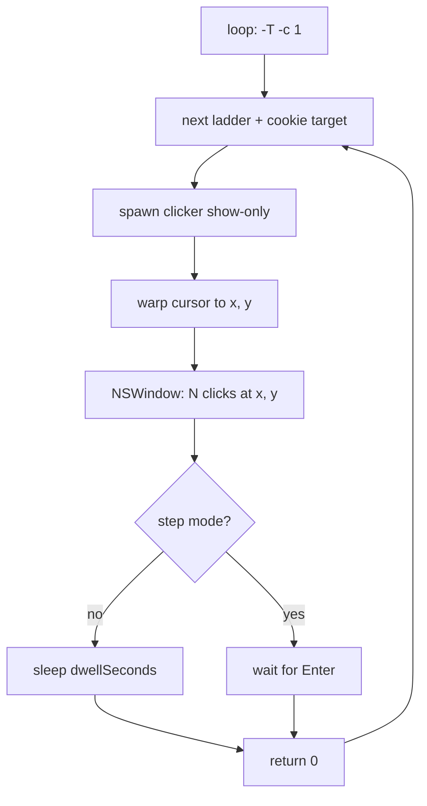

# Plan 021 — macOS clicker `--show-only` target tour (overlay window + loop pass-through)

**Status:** Open / In progress (2026-05-07). New plan-021+ per [`.cursorrules`](../../../.cursorrules) and [plan-020 §1](plan-020-uber-true-up.md) — no edits to frozen plan-001..019. Plan-020 §4.1 gains one checklist item (`CL-SHOW-ONLY`) that points back here.

## Goal

Operator runs `./osx/macos_mouse_click_loop.sh -T -c 1 -P /tmp/cookie-profile.json` and watches the cursor walk through every ladder + cookie target. At each target a small floating window appears beside the crosshair with the would-have-been click count (e.g. `5 clicks @ (1234, 567)`). No `kCGEventLeftMouseDown` / `kCGEventLeftMouseUp` events are posted.

Scope is preview-only: fixed-mode (`-x` / `-y`) tour for one target, plus loop-driven tour for all profile targets. Learn / `--learn-points` modes are not in scope (they already do not click).

## Touchpoints (existing code to leverage)

- [`osx/macos_mouse_click.py`](../../../osx/macos_mouse_click.py)
  - Argparse in `build_arg_parser` (lines 977–1106) — add three new flags.
  - `argv_duplicate_cli_option_error` (lines 1109–1198) — guard duplicates for the new flags.
  - `validate_ns` (lines 1201–1219) — gate against `--learn` / `--learn-points`.
  - `ResolvedConfig` (lines 235–255) and `namespace_to_cfg` (lines 1232–1265) — carry new fields.
  - `resolved_config_for_dry_run_json` (lines 258–276) — include show-only fields so PTY tests can assert.
  - `run_synthetic_loop` / `run_fixed_or_cursor_flow` / `run_learn_flow` (lines 1456–1597) — branch to a new `run_show_only_loop` that warps + overlays instead of clicking.
  - `_running_message` (lines 226–232) and `print_confirmation_sheet` (lines 1392–1442) — surface "show-only" status.
  - Debug TUI hooks (`_debug_tui_emit_*`) — emit `event: show_target` records.
- [`osx/macos_mouse_click_loop.sh`](../../../osx/macos_mouse_click_loop.sh)
  - `getopts` block (lines 85–130) and `usage` (lines 34–80) — add `-T`, `-W <s>`, `-X` flags.
  - `click_target` (lines 175–183) — when tour-on, pass `--show-only [--show-dwell-seconds N | --show-step]` and **drop** `--abort-on-mouse-move` (deliberate cursor movement).
  - `run_phased_cookie_bursts` / `run_buy_ladder` (lines 362–389) — already loop through targets; no change needed beyond `click_target`.
  - Skip the `cookie_clicker_golden_sweeper.py` invocation in tour mode (it captures the screen during a deliberately moving cursor — noisy).
- [`osx/README.md`](../../../osx/README.md) §"Operator loop" + new `### Show-only target tour` subsection.
- [`docs/osx/plans/plan-020-uber-true-up.md`](plan-020-uber-true-up.md) §4.1 — add `CL-SHOW-ONLY` row.

## Design

### `macos_mouse_click.py` — new flags

```text
--show-only                     Warp cursor to the target and draw an overlay; do
                                NOT post any synthetic mouse events. -n is shown
                                as a label only ("would click N").
--show-dwell-seconds SECONDS    Float, default 1.5. How long the overlay stays up
                                before the script exits (or returns to the loop).
                                Ignored when --show-step is set.
--show-step                     Wait for Enter on stdin between targets instead of
                                dwelling. Requires TTY stdin; with -Y or non-TTY,
                                error out (use --show-dwell-seconds).
```

Validation rules (`validate_ns`):

- `--show-only` requires fixed (`-x` + `-y`) or `--at-cursor` mode. Reject with `--learn` and `--learn-points` (the former would steal a real click; the latter is collect-only and orthogonal).
- `--show-step` requires `--show-only`.
- `--show-dwell-seconds` requires `--show-only` and `>= 0`.
- `--show-only` is compatible with `-Y` (recommended path from the loop).

`ResolvedConfig` gains:

```python
show_only: bool = False
show_dwell_seconds: float = 1.5
show_step: bool = False
```

`resolved_config_for_dry_run_json` adds the same three keys so PTY tests can assert without AppKit.

### Cursor warp + overlay

New module-level helpers in `macos_mouse_click.py`:

- `warp_cursor(qz, x, y)` — `qz.CGWarpMouseCursorPosition(qz.CGPoint(x=x, y=y))` followed by `qz.CGAssociateMouseAndMouseCursorPosition(True)` so future user motion is honored. Quartz already imported.
- `show_target_overlay(x, y, count, dwell_seconds, step)` — borderless `NSWindow` near `(x, y)` (offset so the crosshair isn't hidden by the panel), `NSStatusWindowLevel`, transparent background, contains:
  - One `NSTextField` line: `would click N` (or `would click ∞` when `count==0`).
  - One `NSTextField` line: `(x, y)` rounded to ints.
  - A small `NSView` crosshair drawn over the target point.
  - Auto-dismiss after `dwell_seconds` via `NSTimer.scheduledTimerWithTimeInterval_…` driving `NSApp.stop_(None)`, or wait for stdin Enter when `step` is true.
- All AppKit imports are **lazy** inside `show_target_overlay` so dry-run / tests / non-darwin imports stay clean.

Coordinate spaces: Quartz `CGWarpMouseCursorPosition` uses global display points (top-left origin). AppKit `NSWindow` uses bottom-left screen coordinates — convert via `NSScreen.mainScreen().frame()` height. Overlay offset = `(20, -20)` in Cocoa coords so the panel sits to the lower-right of the crosshair.

### `run_show_only_loop`

Replaces `run_synthetic_loop` when `cfg.show_only`:

```text
warp_cursor(qz, x, y)
show_target_overlay(x, y, cfg.count, cfg.show_dwell_seconds, cfg.show_step)
return 0
```

No looping inside the python process — a single tour step per invocation. The shell loop drives the cadence across targets.

### Permissions / dependencies

- Cursor warp via Quartz: only **Accessibility** (already required).
- AppKit overlay: no extra entitlement; `pyobjc-framework-Cocoa` is required. Already present transitively via `pyobjc-framework-Quartz` in [`osx/requirements.txt`](../../../osx/requirements.txt) — verify and pin if missing.

### `macos_mouse_click_loop.sh` — new flags

```text
-T              Tour / show-only. Every click_target invocation runs the python
                clicker with --show-only instead of clicking. Drops
                --abort-on-mouse-move. Skips cookie_clicker_golden_sweeper.py.
-W <seconds>    Dwell seconds per target (default 1.5). Pass-through to
                --show-dwell-seconds. Ignored when -X is set.
-X              Step mode: wait for Enter between targets. Pass-through to
                --show-step. Implies an interactive TTY.
```

`click_target` becomes:

```bash
function click_target {
    label=${1}; target_x=${2}; target_y=${3}; target_n=${4}
    echo "${label}"
    if [ "${TOUR_MODE}" == true ]; then
        args=(-d 0 -x "${target_x}" -y "${target_y}" -n "${target_n}" -Y --show-only)
        if [ "${TOUR_STEP}" == true ]; then
            args+=(--show-step)
        else
            args+=(--show-dwell-seconds "${TOUR_DWELL_SECONDS}")
        fi
        "${mouse_click}" "${args[@]}"
    else
        "${mouse_click}" -d 0 -x "${target_x}" -y "${target_y}" -n "${target_n}" -Y \
            --abort-on-mouse-move --mouse-move-threshold-px 20
    fi
}
```

Combined with existing `-S` (skip ladder), `-c <count>`, `-k <n>` so any subset can be toured.

### Flow diagram



## Tests

All new tests under [`osx/tests/`](../../../osx/tests/), darwin-gated where they exercise AppKit. PTY-driven where possible (matches existing patterns).

- `osx/tests/test_show_only_args.py` — `validate_ns` matrix, `argv_duplicate_cli_option_error` for repeats, dry-run JSON now includes `show_only`, `show_dwell_seconds`, `show_step`.
- `osx/tests/test_show_only_dry_run.py` — `--show-only --dry-run-after-start` exits 0 with no Quartz / AppKit import; one `MACOS_MOUSE_CLICK_DRY_RUN_JSON` line per invocation.
- `osx/tests/test_show_only_loop_invocation.py` — shim `mouse_click` shell variable to a stub that records argv; assert `-T` adds `--show-only`, picks dwell vs step, and drops `--abort-on-mouse-move`.
- `osx/tests/test_show_only_overlay_smoke.py` — darwin-only, gated by `pytest.importorskip("AppKit")`; renders the overlay for 0.1s and confirms the window is created and torn down (no clicks posted).

`make -C osx test-coverage` baseline must stay green; new code paths covered.

## Documentation

- [`osx/README.md`](../../../osx/README.md): new "Show-only target tour" subsection under "Operator loop" with examples (`-T -c 1`, `-T -X`, direct `./osx/macos_mouse_click.py -x … -y … -n … -Y --show-only`), permissions note (Accessibility only — same as today), and dwell vs step trade-off.
- [`docs/osx/plans/plan-020-uber-true-up.md`](plan-020-uber-true-up.md) §4.1 — add:
  - `[ ] CL-SHOW-ONLY — Show-only target tour. See [plan-021](plan-021-macos-mouse-click-show-only-target-tour.md).`
- [`docs/osx/plans/README.md`](README.md) — add plan-021 row to the index table and the shortcut table.
- This plan-021 document.

## Out of scope

- Headless / SSH overlay rendering (AppKit needs an active GUI session).
- Recording / video capture of the tour (existing `cookie_clicker_preview_plan.py` annotated PNG is the static artifact).
- Real clicks gated behind a separate confirmation in the tour (use the existing `-N` / `-R` / `-A` preview pipeline).
- Profile-aware overlay annotations (building name etc.); v1 shows count + (x, y) only.
