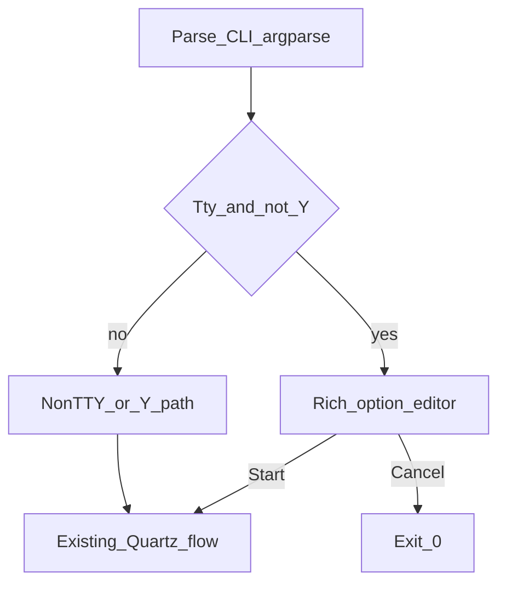

---
todos:
  - id: add-plan-02
    content: "Write docs/plans/02-macos-mouse-click-terminal-ux.md (goals, matrix, keys, phases, tests)"
    status: completed
  - id: refactor-ui-entry
    content: "Refactor macos_mouse_click.py post-parse into pluggable TTY Rich path vs legacy"
    status: completed
  - id: rich-editor
    content: "Implement Rich table/panels + row nav + edit + Start/Cancel without breaking -Y or non-TTY"
    status: completed
  - id: deps-doc
    content: "Update script docstring/help + plan 01 cross-link for pip install including rich"
    status: completed
  - id: manual-mt-01-tty-rich-learn
    content: "MT-01: TTY+Rich --learn, table edits, S start, real clicks (Accessibility)"
    status: pending
  - id: manual-mt-02-tty-rich-partial-cli
    content: "MT-02: TTY+Rich partial CLI; editor fills missing fields (no --interactive text flow)"
    status: pending
  - id: manual-mt-03-y-learn-minimal
    content: "MT-03: -Y --learn minimal; no Rich TUI; stderr one-liner then run"
    status: pending
  - id: manual-mt-04-y-learn-cli-args
    content: "MT-04: -Y --learn with CLI count/delay (e.g. -n 200 -d 0)"
    status: completed
  - id: manual-mt-05-y-fixed
    content: "MT-05: -Y fixed mode (-x/-y) finite run"
    status: pending
  - id: manual-mt-06-pipe-no-y-hint
    content: "MT-06: piped stdin without -Y; sensible error and -Y hint; no TUI"
    status: pending
  - id: manual-mt-07-pipe-y
    content: "MT-07: piped stdin + -Y non-learn path (e.g. -x/-y or --at-cursor)"
    status: pending
  - id: manual-mt-08-resize-narrow
    content: "MT-08: narrow/shallow terminal; Rich editor layout still readable"
    status: pending
  - id: manual-mt-09-interactive-legacy
    content: "MT-09: TTY without rich + --interactive; legacy prompts + confirmation sheet"
    status: pending
  - id: defect-def-001-rich-input-highlight
    content: "DEF-001: Console.input(highlight=) crash on older Rich — fixed in script"
    status: completed
  - id: defect-def-002-arrow-misread-as-esc
    content: "DEF-002: Down/Up arrow mis-read as lone Esc → false cancel — fixed in script"
    status: completed
isProject: false
---

# Plan 02: macOS clicker terminal UX (Rich + TTY)

This document is the **UX / terminal overlay** spec for [`osx/macos_mouse_click.py`](../../osx/macos_mouse_click.py). Functional behavior (modes, Quartz, signals, CLI semantics) remains defined in **[`01-macos-clicker.md`](01-macos-clicker.md)** unless this plan explicitly overrides presentation only.

## Table of contents

- [Goals](#goals)
- [Comparison: plan 02 vs what-is-left.py](#comparison-vs-what-is-left)
  - [What `what-is-left.py` uses today](#what-is-left-uses-today)
  - [How plan 02 aligns and how it differs](#plan-02-alignment-differs)
- [Behavior matrix (locked)](#behavior-matrix-locked)
- [UX design](#ux-design)
  - [Keybinding summary (v1)](#keybinding-summary-v1)
- [Implementation touchpoints](#implementation-touchpoints)
- [Todos](#todos)
  - [Implementation and docs (closed)](#implementation-and-docs-closed)
  - [Manual tests (operator checklist)](#manual-tests-operator-checklist)
- [Pre-run editor: controls (normative)](#pre-run-editor-controls-normative)
- [Defects](#defects)
  - [DEF-001: `Console.input(highlight=…)` on older Rich](#def-001-consoleinputhighlight-on-older-rich)
  - [DEF-002: Arrow keys mis-read as cancel (Escape)](#def-002-arrow-keys-mis-read-as-cancel-escape)
- [Manual QA checklist (after implementation)](#manual-qa-checklist-after-implementation)
- [Out of scope (v1)](#out-of-scope-v1)
- [Implementation order](#implementation-order)
- [Implementation status](#implementation-status)

## Goals

1. **Prettier output:** consistent **colors** (errors, warnings, headers, values, keys) using **`rich`** (`Console`, `Panel`, `Table`, styled `Text`).
2. **More interactive pre-run:** on a **real TTY** and **without** **`-Y`/`--yes`**, replace:
   - current **`--interactive`** stdin prompts, and
   - the plain **“Resolved configuration” + `Proceed? [y/N]`** sheet  
   with a **single Rich-driven flow** where the user can **move up/down** through options and change values **before** starting taps/clicks.
3. **Non-TTY and `-Y` paths unchanged:** scripting, pipes, and automation stay aligned with plan 01.

<a id="comparison-vs-what-is-left"></a>

## Comparison: plan 02 vs [`what-is-left.py`](../../what-is-left.py)

Existing repo script **`what-is-left.py`** is the stylistic reference for Rich-based terminal output in pub-bin.

<a id="what-is-left-uses-today"></a>

### What `what-is-left.py` uses today

- **`rich.console.Console`** — primary print path.
- **`rich.panel.Panel`** — main UI: titled panels, **`border_style`** (e.g. cyan, red, yellow, green, blue), summary and file blocks.
- **Imports** also include **`rich.table.Table`**, **`rich.text.Text`**, **`rich.progress.Progress`**, **`rich.columns.Columns`**; much of the layout is **string-built content inside `Panel`s** and **hand-rolled column alignment** (split lists, padding, join), not necessarily those widgets everywhere in the code path.
- **Optional Rich:** `try` / `except ImportError` → `RICH_AVAILABLE`, with a **plain-text fallback** when Rich is missing.
- **Interaction:** **batch only** — run, print a color report, exit. **No** arrow-key UI, **no** `rich.live.Live`, **no** full-screen editor.

So the “look” there is **Rich panels + colored borders + structured text**, not a separate TUI framework.

<a id="plan-02-alignment-differs"></a>

### How plan 02 aligns and how it differs

| Aspect | `what-is-left.py` | Plan 02 (this document) |
|--------|-------------------|---------------------------|
| **UI library** | **Rich** only | **Rich** only (same stack) |
| **Colors / panels** | Panels, border styles, emoji in strings | Same vocabulary: **`Panel`**, **`Table`**, styled **`Text`**, explicit color roles |
| **Optional import** | Try/import + plain fallback | **Lazy-import `rich`** on the TTY path; same *idea* as optional Rich |
| **Interactivity** | None (read-only dashboard) | **New:** row focus, edit, Start/Cancel — needs **extra** patterns (`rich.live.Live` or clear/redraw, plus **stdin / termios** for keys), which `what-is-left.py` does **not** use today |
| **Other stacks** | No Textual / prompt_toolkit | Plan 02 also excludes **Textual** (explicit out-of-scope) |

**Summary:** Plan 02 matches **`what-is-left.py` on dependency choice (`rich`) and general presentation style** (Console + Panel + tables/text). Plan 02 **adds** a **stateful, keyboard-driven pre-run editor**, which is a layer beyond what that script implements; implementation should still **mirror its optional-Rich and Panel-first style** for consistency across pub-bin tools.

## Behavior matrix (locked)

| Condition | Behavior |
|-----------|----------|
| **TTY** and **not** `-Y`/`--yes` | Use **Rich TUI** for missing fields + review/edit + confirm **Start** / **Cancel** |
| **`-Y`/`--yes`** | No Rich TUI; keep current stderr one-liner + immediate run |
| **Not a TTY** (pipe, CI) | No TUI; keep current rules (confirmation still requires TTY today → error suggests `-Y`) |

## UX design

- **Entry:** After `argparse` + validation of **mutually exclusive** mode flags (same rules as plan 01), build **`ResolvedConfig`** from CLI + defaults.
- **Editor screen:** `rich` **Table** (or stacked **Panels**) of rows: **Mode**, **X / Y** (only when mode is fixed), **Count**, **Delay**; highlight **current row**; show **value** and **source** (`cli` / `default` / `prompt` / missing).
- **v1 key model (recommended):** **Up / Down** move between rows; **Enter** on a row opens a short **prompt** to edit that field (still framed with `rich`). **S** = Start, **Q** = Cancel (exit `0`, same as today’s cancel), **R** = reset current row to plan default (optional but useful).
- **v2 (optional later):** in-place digit edit with **Left / Right** without Enter, using `termios`/`tty` arrow sequences—more fragile across terminals; document only after v1 is stable.
- **Colors:** explicit styles, e.g. `error` red, `warning` yellow, `title` bold cyan, `value` green, `muted` dim.

### Keybinding summary (v1)

| Key | Action |
|-----|--------|
| Up / Down | Change selected row |
| Enter | Edit selected field (prompt) |
| S | Start run (after validation) |
| Q | Quit without running (exit 0) |
| R | Reset selected row to default (optional) |



## Implementation touchpoints

- **File:** [`osx/macos_mouse_click.py`](../../osx/macos_mouse_click.py) — refactor **post-parse** path: a **resolve UI** step chooses **TTY Rich path** vs **legacy** (`run_interactive_prompts`, `print_confirmation_sheet`, `confirm_or_abort` today).
- **Dependencies:** document `python3 -m pip install pyobjc-framework-Quartz rich`. **Lazy-import `rich`** only on the TTY non-`-Y` path so `--help` stays fast and Quartz-free until run.
- **Accessibility:** unchanged; Rich only affects **before** Quartz runs.

## Todos

Task tracking lives in **two places** that should stay in sync:

1. **YAML frontmatter** at the top of this file (`todos:`) — one entry per item below (`id` matches the **MT-xx** / implementation keys).
2. **Checklists in this section** — human-friendly steps, suggested commands, and pass criteria.

When you finish a manual run, mark **`[x]`** here and set the matching frontmatter entry to **`status: completed`**.

### Implementation and docs (closed)

| ID | Frontmatter `id` | Status | Notes |
|----|------------------|--------|-------|
| DOC | `add-plan-02` | completed | This plan document |
| IMPL | `refactor-ui-entry` | completed | TTY Rich vs legacy branch in `main()` |
| IMPL | `rich-editor` | completed | Panel/table editor, keys, Start/Cancel |
| IMPL | `deps-doc` | completed | Help/epilog, `rich` pip line, plan 01 link |

### Manual tests (operator checklist)

Run from repo root unless noted. Script path: [`osx/macos_mouse_click.py`](../../osx/macos_mouse_click.py).

| ID | Frontmatter `id` | Status | Command / scenario | Pass criteria |
|----|------------------|--------|-------------------|---------------|
| MT-01 | `manual-mt-01-tty-rich-learn` | pending | Real TTY, `rich` installed: `./osx/macos_mouse_click.py --learn` (no `-Y`) | Rich table appears; row edits work; **S** starts; synthetic clicks fire at learned anchor; Accessibility OK |
| MT-02 | `manual-mt-02-tty-rich-partial-cli` | pending | TTY + `rich`: omit mode (e.g. `./osx/macos_mouse_click.py` with only `-n 3` if valid) or minimal flags so editor fills gaps | No legacy `--interactive` text prompts; TUI supplies missing fields |
| MT-03 | `manual-mt-03-y-learn-minimal` | pending | `./osx/macos_mouse_click.py --learn -Y` | No Rich UI; immediate “Running:” then learn tap + loop per plan 01 |
| MT-04 | `manual-mt-04-y-learn-cli-args` | completed | `./osx/macos_mouse_click.py --learn -n 200 -d 0 -Y` | No TUI; count/delay from CLI honored; learn + loop behaves as expected |
| MT-05 | `manual-mt-05-y-fixed` | pending | `./osx/macos_mouse_click.py -x 400 -y 300 -n 2 -d 0 -Y` (adjust coords) | Fixed mode, no TUI, clicks at given point |
| MT-06 | `manual-mt-06-pipe-no-y-hint` | pending | `echo ""` piped to `./osx/macos_mouse_click.py --learn` (no `-Y`) | No TUI; stderr explains TTY/`Proceed` or `-Y`; non-zero exit |
| MT-07 | `manual-mt-07-pipe-y` | pending | `echo ""` piped to `./osx/macos_mouse_click.py --at-cursor -n 1 -d 0 -Y` (or fixed `-x/-y`) | No TUI; non-interactive run completes or fails only for Quartz/env reasons |
| MT-08 | `manual-mt-08-resize-narrow` | pending | Shrink Terminal width/height; open TUI (`--learn` without `-Y`, with `rich`) | Table/panel readable; no garbled escape soup |
| MT-09 | `manual-mt-09-interactive-legacy` | pending | Temporarily run **without** `rich` on a TTY: `./osx/macos_mouse_click.py --interactive` | Plain prompts + “Resolved configuration” + `Proceed?` path still works |

**Checkbox copy (same order as table)**

- [ ] **MT-01** (`manual-mt-01-tty-rich-learn`) — TTY + Rich learn: editor, edits, **S**, real clicks.
- [ ] **MT-02** (`manual-mt-02-tty-rich-partial-cli`) — TTY + Rich partial CLI; editor fills gaps.
- [ ] **MT-03** (`manual-mt-03-y-learn-minimal`) — `./osx/macos_mouse_click.py --learn -Y`.
- [x] **MT-04** (`manual-mt-04-y-learn-cli-args`) — `./osx/macos_mouse_click.py --learn -n 200 -d 0 -Y`.
- [ ] **MT-05** (`manual-mt-05-y-fixed`) — `-Y` fixed coordinates run.
- [ ] **MT-06** (`manual-mt-06-pipe-no-y-hint`) — piped stdin, no `-Y`; error + hint.
- [ ] **MT-07** (`manual-mt-07-pipe-y`) — piped stdin + `-Y` non-learn.
- [ ] **MT-08** (`manual-mt-08-resize-narrow`) — narrow terminal + Rich TUI readability.
- [ ] **MT-09** (`manual-mt-09-interactive-legacy`) — no `rich`, `--interactive` legacy path.

## Pre-run editor: controls (normative)

Behavior for the Rich table in [`osx/macos_mouse_click.py`](../../osx/macos_mouse_click.py) (`run_rich_pre_run_editor`). **Cancel** always exits **0** (same as legacy “no” at `Proceed?`).

| Input | Intended effect |
|-------|------------------|
| **Up** / **Down** | Move highlight only. **Must not** exit the script or stop the editor. |
| **Enter** | Open the prompt for the **selected** row (mode, count, delay, or x/y in fixed mode). After edits, use the **“Press Enter to return…”** line to go back to the table. |
| **S** | **Start:** validate (mode set; fixed needs x/y), then leave the editor and run the Quartz flow (learn / fixed / at-cursor). This is the only key that **starts** clicking from the table screen. |
| **Q** | **Cancel:** exit editor without running; process exits **0** (`Cancelled.` on stderr). |
| **Esc** sent **alone** (no continuation bytes within the reader timeout) | **Cancel**, same as **Q** (exit **0**). |
| **Ctrl+C** | **Cancel** while in the editor (SIGINT may still apply during Quartz; unchanged from plan 01). |
| **R** | Reset the **selected** row toward plan defaults (see script `_apply_row_reset`). |

CSI / SS3 arrow sequences (`ESC [ A` / `ESC [ B`, optional numeric middle, and `ESC O A` / `ESC O B`) are **not** cancel — they must resolve to **Up** / **Down** only.

## Defects

Known issues found during manual QA or review. Each defect has a stable **DEF-xxx** id, a row in the summary table, and a subsection with reproduction and resolution notes.

### Git workflow (defect fixes)

Traceability: each code fix should have its own **git commit**, then this document is updated with **`Fix commit`** (full 40-character SHA from `git rev-parse HEAD` on that commit) and committed separately so history shows both the patch and the audit record.

1. **Report** — Add or update the DEF row and subsection (status may be open or fixed pending hash).
2. **Apply fix** — Change [`osx/macos_mouse_click.py`](../../osx/macos_mouse_click.py) (and tests or other files if needed).
3. **Commit code** — Prefer **one commit per defect**; message subject/body should cite **`DEF-xxx`**. If two DEFs land in one commit, both rows share the **same** `Fix commit` SHA; note that in the DEF subsection (do not invent two SHAs for one commit).
4. **Record hash** — Run `git rev-parse HEAD` after the code commit; copy the full hash into the **Defect summary** table and into a **Git** bullet under **Resolution** for that DEF.
5. **Commit plan** — Commit only `docs/plans/02-macos-mouse-click-terminal-ux.md` so the hash update is visible in `git log` without amending the code commit.

### Defect summary

| ID | Opened | Status | Summary | Affects (MT / area) | Fix commit |
|----|--------|--------|---------|---------------------|------------|
| DEF-001 | 2026-04-18 | **Fixed** (script) | Pressing Enter to edit **Mode** crashed: `Console.input()` got unexpected keyword `highlight` | MT-01, MT-02, MT-08 (any TUI field edit via `_prompt_cooked`) | `2319207007b2c65703e192250e3cb13ae54a16a6` |
| DEF-002 | 2026-04-18 | **Fixed** (script) | **Down**/**Up** after returning from mode edit was treated as lone **Esc** → spurious **Cancel**; mode edit also reset **Count** when re-confirming **learn** | MT-01, MT-02, MT-08; `read_raw_key` / `_edit_row` | `2319207007b2c65703e192250e3cb13ae54a16a6` |

### DEF-001: `Console.input(highlight=…)` on older Rich

- **Frontmatter todo:** `defect-def-001-rich-input-highlight` (completed when fix landed).
- **Status:** Fixed in [`osx/macos_mouse_click.py`](../../osx/macos_mouse_click.py) (`_prompt_cooked`: stop passing `highlight=` so older **Rich** builds work).
- **Severity:** High — TUI unusable as soon as the user presses **Enter** on **Mode** (and would affect any row using the same prompt path).
- **Environment (reporter):** `yoda.local`, repo path `…/pub-bin`, command run from repo root.

**Reproduction (pre-fix)**

```bash
osx/macos_mouse_click.py --learn -n 200 -d 0
```

In the Rich table, press **Enter** on **Mode** (or choose edit mode). On Rich versions where `Console.input()` does not accept `highlight`, Python raises:

```text
TypeError: Console.input() got an unexpected keyword argument 'highlight'
```

Stack pointed to `_prompt_cooked` → `_edit_row` → `run_rich_pre_run_editor`.

**Root cause**

`_prompt_cooked` called `console.input(prompt, highlight=False)`. The `highlight` parameter was added in newer Rich releases; older installs treat it as invalid.

**Resolution**

- Call `console.input(prompt)` only (no `highlight` kwarg), documented in code for compatibility.
- Optional hardening later: document a minimum Rich version in the plan / epilog if we reintroduce kwargs that need newer Rich.
- **Git:** `2319207007b2c65703e192250e3cb13ae54a16a6` — same commit as **DEF-002** (both fixes landed together).
- **Files:** [`osx/macos_mouse_click.py`](../../osx/macos_mouse_click.py)

**Regression check**

- Re-run **MT-01** / **MT-02**: open editor, **Enter** on Mode, confirm default Enter leaves mode as learn and no traceback.

### DEF-002: Arrow keys mis-read as cancel (Escape)

- **Frontmatter todo:** `defect-def-002-arrow-misread-as-esc` (completed when fix landed).
- **Status:** Fixed in [`osx/macos_mouse_click.py`](../../osx/macos_mouse_click.py).
- **Severity:** High — looks like an accidental cancel; also **Count** flipped from CLI **`-n 200`** to learn default **infinite** after re-confirming mode.
- **Environment (reporter):** `yoda.local`, 2026-04-18 06:33, repo `…/pub-bin`.

**Reproduction (pre-fix)**

```bash
osx/macos_mouse_click.py --learn -n 200 -d 0
```

1. **Enter** on **Mode**, **Enter** again for default learn, **Enter** at “Press Enter to return…”.
2. Press **Down** on the main table.

**Observed**

- Stderr printed `Cancelled.` and the process exited **0** even though the user did not press **Q** or **Esc** intentionally.
- After the mode prompt, **Count** showed **infinite** with source **default** instead of **200** / **cli** — `_edit_row` for mode always did `sources.pop("count")` + `apply_defaults`, wiping a CLI count when mode did not actually change.

**Root cause**

1. `read_raw_key` used `select(..., 0.05)` after the first **ESC** byte. Arrow keys arrive as **CSI** `ESC [ A` / `ESC [ B` (sometimes with extra numeric/separator bytes). If **`[`** was not readable within **50 ms**, the reader treated the key as **lone Escape** → cancel (**DEF-002**).
2. Unconditional `cfg.sources.pop("count", None)` after any mode edit re-applied learn’s default count (0 = infinite) whenever the user re-saved **learn**, clobbering **`-n`**.

**Resolution**

1. Wait longer after **ESC** for the next byte; read a full **CSI** tail (up to 32 bytes) ending in a terminator, then map **endswith `A`/`B`** to **Up**/**Down**; support **SS3** `ESC O A` / `ESC O B`.
2. Only `pop("count")` and call `apply_defaults` when **mode actually changes** (`cfg.mode != old_mode` before/after the prompt).
3. Panel subtitle text: **Esc alone** = cancel (to contrast with arrow keys, which include **ESC** as prefix).
4. **Git:** `2319207007b2c65703e192250e3cb13ae54a16a6` (includes **DEF-001** in the same commit).
5. **Files:** [`osx/macos_mouse_click.py`](../../osx/macos_mouse_click.py)

**Regression check**

- **MT-01** / **MT-02**: after mode edit + return, **Down**/**Up** only move the row; **S** starts the run; **Q** or **Esc** alone still cancels with exit **0**.
- Re-run with **`-n 200`**, edit mode with default learn, confirm **Count** stays **200** / **cli** (unless you change mode or count).

## Manual QA checklist (after implementation)

Canonical checklist: **[Todos → Manual tests (operator checklist)](#manual-tests-operator-checklist)** (table + checkboxes + frontmatter ids). Keep that section in sync when recording runs (see also [Completed manual checks (log)](#completed-manual-checks-log) under **Implementation status**).

## Out of scope (v1)

- **Textual** full-screen app (Rich only per decision).
- Mouse-driven widgets.
- Persisting last-used defaults to disk.

## Implementation order

1. Land this document (this file) and link from plan 01 or script docstring if desired.
2. Add **`rich`** dependency + lazy import + TTY branch in `main()`.
3. Implement Rich editor + wire Start/Cancel to existing Quartz flows.
4. Remove redundant plain-text confirmation when TUI runs; keep legacy path for non-TTY.
5. Commit per **`README-AI-CODING-STANDARDS.md`** (show commit summary, confirm in a separate message).

## Implementation status

*Last updated: 2026-04-18.*

This section records what was implemented and verified in the repo, and what remains for human QA on a real Mac terminal.

### Shipped behavior (vs locked matrix)

| Condition | Actual behavior |
|-----------|-----------------|
| TTY stdin **and** TTY stdout, not `-Y`/`--yes`, **`rich` installed** | Rich `Panel` + `Table`: Up/Down move focus only; Enter edits; **S** starts Quartz; **Q**, **Esc alone**, or **Ctrl+C** cancel (exit 0); **R** resets row; legacy “Resolved configuration” + `Proceed?` sheet is skipped. |
| **`-Y`/`--yes`** | No Rich TUI; stderr “Running:” one-liner then existing Quartz flow; no duplicate `apply_defaults` oddities from the TUI merge. |
| **Non-TTY** or **missing `rich`** | Legacy path: `--interactive` uses text prompts when selected; otherwise errors or post-sheet confirmation per plan 01; stderr tip to `python3 -m pip install rich` when stdin/stdout are a TTY but Rich is not importable. |

### Code and doc touchpoints (consolidated)

- **Script:** [`osx/macos_mouse_click.py`](../../osx/macos_mouse_click.py) — lazy `try_import_rich()`, `tty_can_use_rich_editor()`, `run_rich_pre_run_editor()`, `read_raw_key()` / `termios`+`tty`, legacy `run_interactive_prompts`, `print_confirmation_sheet`, `confirm_or_abort` when not on the Rich path.
- **`main()`:** TUI path runs the editor then `apply_defaults`; legacy path applies defaults when mode is already set from CLI; “Running:” is always printed before Quartz (Rich stderr console on TUI path, plain stderr otherwise).
- **Help / epilog:** `python3 -m pip install pyobjc-framework-Quartz rich`; `--interactive` help notes the Rich table editor when TTY + `rich` is available.
- **Plan 01:** cross-link from [`01-macos-clicker.md`](01-macos-clicker.md) to this document for the TTY UX overlay.

### Automated checks run (agent / CI-friendly)

- `python3 -m py_compile osx/macos_mouse_click.py`
- `./osx/macos_mouse_click.py --help` (epilog lists both dependencies)
- Piped stdin: `echo "" | ./osx/macos_mouse_click.py --learn` → confirmation requires TTY; message suggests `-Y`/`--yes`; non-zero exit as expected (no TUI)

### Completed manual checks (log)

- **2026-04-18** — **MT-04** — `./osx/macos_mouse_click.py --learn -n 200 -d 0 -Y` — operator run: `-Y` learn path (no Rich TUI), count and delay from CLI (`-n 200`, `-d 0`), synthetic click loop.

### Remaining manual QA (operator)

See **[Todos → Manual tests (operator checklist)](#manual-tests-operator-checklist)** for **MT-01**–**MT-09** and frontmatter ids. Mark each `manual-mt-*` entry `completed` in YAML when the matching checkbox is checked.
