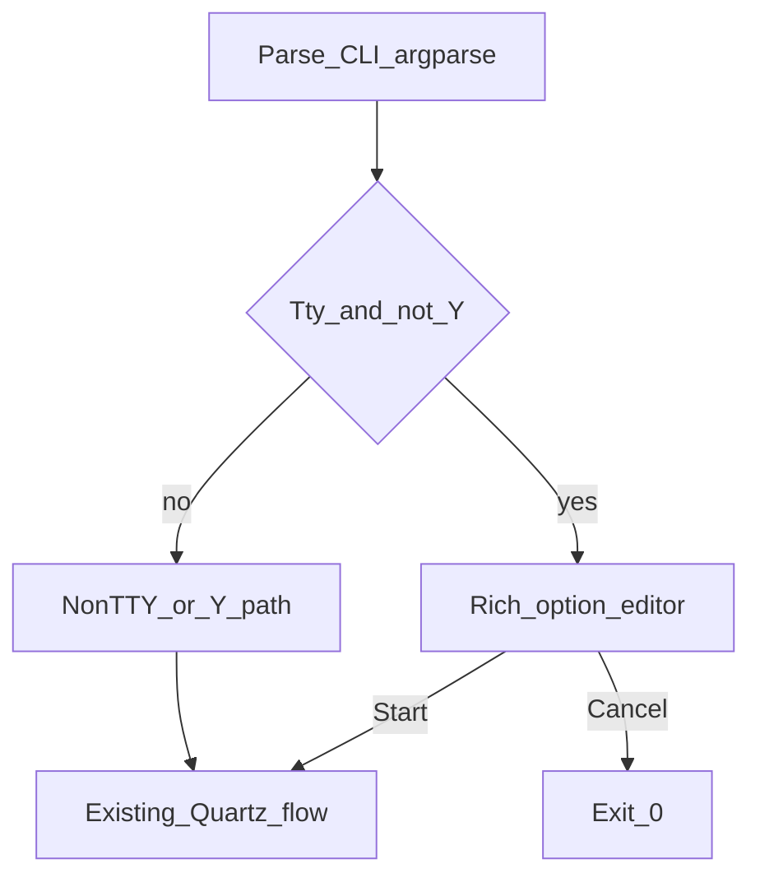

---
todos:
  - id: add-plan-02
    content: "Write docs/plans/02-macos-mouse-click-terminal-ux.md (goals, matrix, keys, phases, tests)"
    status: completed
  - id: refactor-ui-entry
    content: "Refactor macos_mouse_click.py post-parse into pluggable TTY Rich path vs legacy"
    status: pending
  - id: rich-editor
    content: "Implement Rich table/panels + row nav + edit + Start/Cancel without breaking -Y or non-TTY"
    status: pending
  - id: deps-doc
    content: "Update script docstring/help + plan 01 cross-link for pip install including rich"
    status: pending
  - id: manual-qa
    content: "Manual QA matrix from plan doc on Terminal.app and piped stdin"
    status: pending
isProject: false
---

# Plan 02: macOS clicker terminal UX (Rich + TTY)

This document is the **UX / terminal overlay** spec for [`osx/macos_mouse_click.py`](../../osx/macos_mouse_click.py). Functional behavior (modes, Quartz, signals, CLI semantics) remains defined in **[`01-macos-clicker.md`](01-macos-clicker.md)** unless this plan explicitly overrides presentation only.

## Table of contents

- [Goals](#goals)
- [Comparison: plan 02 vs what-is-left.py](#comparison-vs-what-is-left)
  - [What `what-is-left.py` uses today](#what-is-left-uses-today)
  - [How plan 02 aligns and how it differs](#plan-02-alignment-differs)
- [Behavior matrix (locked)](#behavior-matrix-locked)
- [UX design](#ux-design)
  - [Keybinding summary (v1)](#keybinding-summary-v1)
- [Implementation touchpoints](#implementation-touchpoints)
- [Manual QA checklist (after implementation)](#manual-qa-checklist-after-implementation)
- [Out of scope (v1)](#out-of-scope-v1)
- [Implementation order](#implementation-order)

## Goals

1. **Prettier output:** consistent **colors** (errors, warnings, headers, values, keys) using **`rich`** (`Console`, `Panel`, `Table`, styled `Text`).
2. **More interactive pre-run:** on a **real TTY** and **without** **`-Y`/`--yes`**, replace:
   - current **`--interactive`** stdin prompts, and
   - the plain **“Resolved configuration” + `Proceed? [y/N]`** sheet  
   with a **single Rich-driven flow** where the user can **move up/down** through options and change values **before** starting taps/clicks.
3. **Non-TTY and `-Y` paths unchanged:** scripting, pipes, and automation stay aligned with plan 01.

## Comparison: plan 02 vs [`what-is-left.py`](../../what-is-left.py)

Existing repo script **`what-is-left.py`** is the stylistic reference for Rich-based terminal output in pub-bin.

### What `what-is-left.py` uses today

- **`rich.console.Console`** — primary print path.
- **`rich.panel.Panel`** — main UI: titled panels, **`border_style`** (e.g. cyan, red, yellow, green, blue), summary and file blocks.
- **Imports** also include **`rich.table.Table`**, **`rich.text.Text`**, **`rich.progress.Progress`**, **`rich.columns.Columns`**; much of the layout is **string-built content inside `Panel`s** and **hand-rolled column alignment** (split lists, padding, join), not necessarily those widgets everywhere in the code path.
- **Optional Rich:** `try` / `except ImportError` → `RICH_AVAILABLE`, with a **plain-text fallback** when Rich is missing.
- **Interaction:** **batch only** — run, print a color report, exit. **No** arrow-key UI, **no** `rich.live.Live`, **no** full-screen editor.

So the “look” there is **Rich panels + colored borders + structured text**, not a separate TUI framework.

### How plan 02 aligns and how it differs

| Aspect | `what-is-left.py` | Plan 02 (this document) |
|--------|-------------------|---------------------------|
| **UI library** | **Rich** only | **Rich** only (same stack) |
| **Colors / panels** | Panels, border styles, emoji in strings | Same vocabulary: **`Panel`**, **`Table`**, styled **`Text`**, explicit color roles |
| **Optional import** | Try/import + plain fallback | **Lazy-import `rich`** on the TTY path; same *idea* as optional Rich |
| **Interactivity** | None (read-only dashboard) | **New:** row focus, edit, Start/Cancel — needs **extra** patterns (`rich.live.Live` or clear/redraw, plus **stdin / termios** for keys), which `what-is-left.py` does **not** use today |
| **Other stacks** | No Textual / prompt_toolkit | Plan 02 also excludes **Textual** (explicit out-of-scope) |

**Summary:** Plan 02 matches **`what-is-left.py` on dependency choice (`rich`) and general presentation style** (Console + Panel + tables/text). Plan 02 **adds** a **stateful, keyboard-driven pre-run editor**, which is a layer beyond what that script implements; implementation should still **mirror its optional-Rich and Panel-first style** for consistency across pub-bin tools.

## Behavior matrix (locked)

| Condition | Behavior |
|-----------|----------|
| **TTY** and **not** `-Y`/`--yes` | Use **Rich TUI** for missing fields + review/edit + confirm **Start** / **Cancel** |
| **`-Y`/`--yes`** | No Rich TUI; keep current stderr one-liner + immediate run |
| **Not a TTY** (pipe, CI) | No TUI; keep current rules (confirmation still requires TTY today → error suggests `-Y`) |

## UX design

- **Entry:** After `argparse` + validation of **mutually exclusive** mode flags (same rules as plan 01), build **`ResolvedConfig`** from CLI + defaults.
- **Editor screen:** `rich` **Table** (or stacked **Panels**) of rows: **Mode**, **X / Y** (only when mode is fixed), **Count**, **Delay**; highlight **current row**; show **value** and **source** (`cli` / `default` / `prompt` / missing).
- **v1 key model (recommended):** **Up / Down** move between rows; **Enter** on a row opens a short **prompt** to edit that field (still framed with `rich`). **S** = Start, **Q** = Cancel (exit `0`, same as today’s cancel), **R** = reset current row to plan default (optional but useful).
- **v2 (optional later):** in-place digit edit with **Left / Right** without Enter, using `termios`/`tty` arrow sequences—more fragile across terminals; document only after v1 is stable.
- **Colors:** explicit styles, e.g. `error` red, `warning` yellow, `title` bold cyan, `value` green, `muted` dim.

### Keybinding summary (v1)

| Key | Action |
|-----|--------|
| Up / Down | Change selected row |
| Enter | Edit selected field (prompt) |
| S | Start run (after validation) |
| Q | Quit without running (exit 0) |
| R | Reset selected row to default (optional) |

## Implementation touchpoints

- **File:** [`osx/macos_mouse_click.py`](../../osx/macos_mouse_click.py) — refactor **post-parse** path: a **resolve UI** step chooses **TTY Rich path** vs **legacy** (`run_interactive_prompts`, `print_confirmation_sheet`, `confirm_or_abort` today).
- **Dependencies:** document `python3 -m pip install pyobjc-framework-Quartz rich`. **Lazy-import `rich`** only on the TTY non-`-Y` path so `--help` stays fast and Quartz-free until run.
- **Accessibility:** unchanged; Rich only affects **before** Quartz runs.

## Manual QA checklist (after implementation)

- TTY: `--learn` with row edits + Start; verify clicks still work when Accessibility granted.
- TTY: partial CLI + TUI fills gaps (replaces old `--interactive` text flow).
- **`-Y`:** no Rich UI; behavior matches pre-02 script.
- **Piped stdin:** no TUI; sensible message and `-Y` hint where applicable.
- **Resize / narrow terminal:** layout remains readable (minimum width note in implementation).

## Out of scope (v1)

- **Textual** full-screen app (Rich only per decision).
- Mouse-driven widgets.
- Persisting last-used defaults to disk.

## Implementation order

1. Land this document (this file) and link from plan 01 or script docstring if desired.
2. Add **`rich`** dependency + lazy import + TTY branch in `main()`.
3. Implement Rich editor + wire Start/Cancel to existing Quartz flows.
4. Remove redundant plain-text confirmation when TUI runs; keep legacy path for non-TTY.
5. Commit per **`README-AI-CODING-STANDARDS.md`** (show commit summary, confirm in a separate message).
