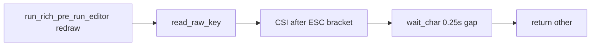

<!-- Cursor agent plan (canonical copy in-repo; do not use ~/.cursor/plans/). -->
---
todos:
  - id: "def-doc"
    content: "Add DEF-006 to plan 02 (table, subsection, frontmatter todo, MT links)"
    status: completed
  - id: "pty-test"
    content: "Add osx/tests/test_read_raw_key_csi.py PTY delayed-CSI-B test (darwin, expect fail pre-fix)"
    status: completed
  - id: "fix-csi"
    content: "Adjust read_raw_key CSI read timeouts/strategy until PTY test passes"
    status: completed
isProject: false
---
# DEF-006: Main TUI table — multiple Up/Down presses per row

## Root cause (code review)

The main settings loop is in [`osx/macos_mouse_click.py`](../../osx/macos_mouse_click.py) `run_rich_pre_run_editor`: each iteration redraws the Rich panel, then calls `read_raw_key()` once. Up/Down only change `selected` when `read_raw_key` returns `"up"` / `"down"`.

CSI arrow handling lives in `read_raw_key` (same file, ~266–330):

- After `ESC` + `[`, a loop reads the CSI body with **`wait_char(0.25)`** per byte and stops when the byte is in `"ABCDEFGHZab~"` **or** when a read times out (`c == ""` → `break`).
- If the **final** byte (`A` / `B` for up/down) arrives **more than 250ms** after the previous CSI byte (Bluetooth, remote desktop, busy host, or bursty scheduling), the loop exits early with a **partial** tail that does **not** end with `A`/`B` → return **`"other"`** (no row change).
- Any bytes read **after** that premature exit can be left for the **next** `read_raw_key` call (e.g. a lone `B`), which is not recognized as an arrow → **`"other"`** again. That matches **several** key events before one successful navigation.

Related context: plan **02** already documents **DEF-002** (short post-`ESC` timeout mis-read as cancel) and **DEF-003** (wheel / unknown `ESC` → drain / not cancel). This is a **distinct** failure mode: **intra-CSI** timeout too tight for real-world inter-byte delay.

## Recommendation (fix direction — implement after plan approval)

1. **Harden CSI reads after `ESC [`** (preferred minimal fix): treat CSI as one unit — e.g. **longer or cumulative timeout** for the remainder of the sequence, **or** read available bytes in a tight loop with a **single overall deadline** (e.g. 1s) instead of a hard **per-byte** 250ms cap that can fire mid-sequence. Optionally use **`tty.setraw` once** for the whole editor session to reduce mode churn (validate Rich still renders correctly).
2. **Optional hygiene** (if logs show noise): bounded **stdin drain** immediately after redraw to drop mouse/focus SGR bursts **only** when safe (document risk of eating a fast first key); pair with **disable mouse reporting** sequences on editor entry/exit only if you confirm something enables them.
3. **Avoid** relying on lone `A`/`B` after a failed parse — fix should make full CSI parse reliable.

## Defect documentation

Add **DEF-006** to [`02-macos-mouse-click-terminal-ux.md`](../02-macos-mouse-click-terminal-ux.md) following the existing DEF pattern:

- Summary table row + subsection: symptom (multiple Up/Down per field change on main table), suspected cause (CSI timeout / partial parse), manual repro notes (optional: `script` / logging), **Open** until fix lands.
- Frontmatter todo id e.g. `defect-def-006-tui-arrow-multi-press` (pending).
- Cross-link **MT-01 / MT-02** (Rich table navigation) as verification touchpoints after fix.

## Test that fails today, passes after fix

**Goal:** Deterministic repro without flaky human PTY driving of the full Rich UI.

**Approach:** Add a test module (e.g. [`osx/tests/test_read_raw_key_csi.py`](../../osx/tests/test_read_raw_key_csi.py)) that:

1. Opens a **pseudo-TTY** (`pty.openpty()`): child attaches stdin to slave, calls **`read_raw_key()`** once, writes result to a pipe or exit code.
2. Parent writes **`ESC` `[`** promptly, then **`B`** (down arrow CSI) after **`sleep > 0.25s`** (e.g. **0.30s**) before the `B` byte — still within one logical keypress from the TTY’s perspective, but violating the current **250ms** inter-byte budget inside `read_raw_key`.
3. **Assert** child’s single read returns **`"down"`**. On **current** code this is expected to return **`"other"`** → **test fails** (documents broken state).
4. Gate with **`@pytest.mark.darwin`** (same as existing osx tests) and a **reasonable overall timeout** so CI does not hang.

After the CSI-read fix, the same test should **pass** without changing the test’s timing threshold (or with a documented margin).

**Optional follow-up** (not required for DEF-006): a second test with **SS3** `ESC O B` and a delayed `B` for the same pattern.

## Files to touch (implementation phase)

| File | Change |
|------|--------|
| [`02-macos-mouse-click-terminal-ux.md`](../02-macos-mouse-click-terminal-ux.md) | DEF-006 section + table + frontmatter todo |
| [`osx/macos_mouse_click.py`](../../osx/macos_mouse_click.py) | Harden `read_raw_key` CSI tail read (after tests prove failure mode) |
| [`osx/tests/test_read_raw_key_csi.py`](../../osx/tests/test_read_raw_key_csi.py) | New PTY-based regression test |

## Out of scope

- Full Rich-table PTY navigation tests (previously deferred as flaky).
- Changing cancel / `ESC` policy (**DEF-003**).
