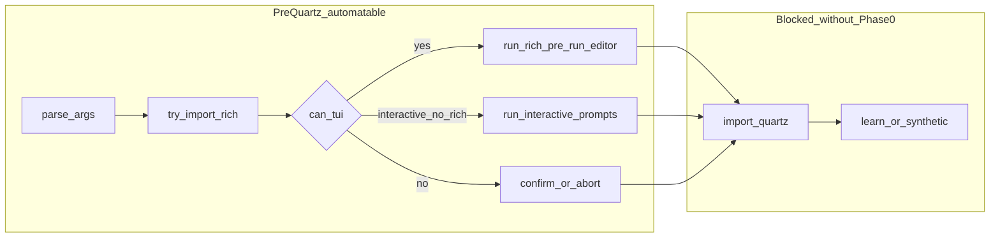

<!-- Cursor agent plan (canonical copy in-repo; do not use ~/.cursor/plans/). -->
---
todos:
  - id: "phase0-contract"
    content: "Define dry-run contract (flag/env, JSON line stream, before/after Running) and implement branch before import_quartz() in macos_mouse_click.py"
    status: completed
  - id: "phase0-refactor"
    content: "Optional: extract resolve_config vs execute_quartz for clearer testing seams"
    status: completed
  - id: "pty-harness"
    content: "Add pytest + subprocess PTY harness (pexpect or pty) with timeouts, unbuffered child, fixed COLUMNS"
    status: completed
  - id: "tests-mt09"
    content: "Implement MT-09-A/C first; MT-09-B after Phase 0 lands"
    status: completed
  - id: "tests-mt02"
    content: "Implement MT-02-A then B/C; document stdout vs stderr sync points"
    status: completed
  - id: "ci-macos"
    content: "Add macos-latest workflow, skip non-Darwin, pin rich; optional job for -Y+Quartz"
    status: completed
  - id: "plan02-docs"
    content: "Annotate plan 02 MT rows with automated vs human-required after tests exist"
    status: completed
isProject: false
---
# Plan 03 deep dive: recommendations and automation risks

## Current code reality (baseline for automation)

In [`osx/macos_mouse_click.py`](../../osx/macos_mouse_click.py), `main()` today does:

1. Parse args / `validate_ns` / build `ResolvedConfig`.
2. `try_import_rich()` (module-level cache: `_rich_import_attempted` / `_rich_module` — **only safe to fake `rich` in a subprocess**, not by reloading the module in-process).
3. `can_tui = tty_can_use_rich_editor(cfg) and rich_mod` where `tty_can_use_rich_editor` requires **`not assume_yes` and `stdin.isatty()` and `stdout.isatty()`** (lines 206–211).
4. Rich path: `run_rich_pre_run_editor` → on success `apply_defaults` in `main` (line 895); legacy path: `run_interactive_prompts` when `used_interactive` and not `can_tui`.
5. Non-TTY confirmation / `print_confirmation_sheet` + `confirm_or_abort` when not `assume_yes` and not `can_tui`.
6. Print **Running:** (Rich uses `Console(stderr=True)` at 921–925; plain uses `stderr` at 928–930).
7. **`import_quartz()`** (line 933) — unconditional today before `run_learn_flow` / `run_fixed_or_cursor_flow`.

**Stream split (automation gotcha):** `run_rich_pre_run_editor` builds `Console()` with **no** `file=` argument (line 495), so the Panel/table go to **stdout** by default; the post-editor “Running:” line for the Rich path is explicitly **stderr**. A PTY master read usually merges both, but any driver that only tails `stderr` will miss `review / edit` and table content.

Plan 03’s **Phase 0** is the architectural gate: insert a branch **after** “Running:” (or immediately after `run_rich_pre_run_editor` returns True, if you want zero Quartz import even when printing Running) that prints a **single machine-readable** line and **`sys.exit(0)`** without calling `import_quartz()`.

---

## Detailed recommendations by phase

### Phase 0 — Testability refactor (highest priority)

**Goals:** (a) no PyObjC import on the dry path; (b) stable, parseable artifact for assertions.

**Recommendations:**

1. **Single official hook** — Prefer **both** a CLI flag (`--dry-run-after-editor` or name per product taste) **and** an env var (e.g. `MACOS_MOUSE_CLICK_DRY_RUN=1`) so CI and local shells are covered; document precedence if both are set.
2. **Placement** — Implement the exit **after** the same “Running:” line that production uses (so logs match reality) but **before** `import_quartz()`. Alternative (stricter test isolation): exit immediately when `run_rich_pre_run_editor` returns True if flag set — skips “Running:” unless you also print a stub line; pick one contract and document it in Plan 03 / plan 01.
3. **Machine-readable line** — Use **one line** to stdout or stderr (pick one and freeze it), e.g. prefix `MACOS_MOUSE_CLICK_DRY_RUN_JSON ` + JSON of `{mode, count, delay, x, y}` (omit or null `x`/`y` when N/A). Avoid multi-line Rich output in the assertion surface.
4. **Refactor shape (optional but valuable)** — Extract a function such as `resolve_config_for_run(argv) -> (ResolvedConfig, can_tui, rich_mod)` vs `execute_quartz_run(cfg, ...)` so unit tests can call the first without importing Quartz. Even without full extraction, the early `sys.exit` branch is enough for subprocess PTY tests.
5. **Guardrails** — Dry-run should refuse combinations that are ambiguous (e.g. do not imply Accessibility was granted). If `-Y` + dry-run is meaningless, **error or ignore** explicitly in help text.

### Phase 1 — PTY integration tests (Rich path)

**Recommendations:**

1. **Subprocess-only** for anything touching `try_import_rich` or global terminal state; **never** run two editors in one Python process without a fresh interpreter.
2. **Synchronization** — Wait on stable substrings present in **stdout** (`review / edit`, `macOS mouse click`) per the stream note above; avoid asserting full table layout (width-dependent).
3. **Terminal geometry** — Set `COLUMNS` / `LINES` in the child env (Plan 03 already hints for MT-08); use a fixed width (e.g. 120) to reduce Rich wrap flake.
4. **`PYTHONUNBUFFERED=1`** — Required on child (Plan 03 already says this).
5. **Wheel / CSI negative** — Reproduce plan 02 DEF-003 style noise: after sync, inject bytes for wheel-like ESC sequences; assert process still in editor and **no** premature `Cancelled.` (align with `read_raw_key` + `_drain_stdin_burst` behavior).
6. **Timeouts** — Every `pexpect` / `select` wait should have a hard timeout; fail with a **log dump** of the PTY buffer for CI debuggability.

**Pure unit slice (Plan 03 scope table):** Extract `read_raw_key`’s ESC/CSI branch and `_drain_stdin_burst` behind injectable `stdin`/`select` for **fast** Linux-safe unit tests where feasible; keep one macOS PTY smoke for integration.

### Phase 2 — Subprocess tests (pipes, `-Y`, legacy)

**Recommendations:**

1. **Pipe / non-TTY** cases do **not** need a PTY for many assertions (stderr substrings + exit code), matching Plan 03.
2. **`-Y` paths** still invoke **`import_quartz()`** today — on GitHub `macos-latest`, Accessibility may be **denied**; short `-n 1` runs might still fail or hang on prompts. Treat **MT-03–MT-05 / `-Y`** as **optional CI** or **macOS manual / self-hosted runner** until stubbed or until you add a “skip Quartz” mode for those (out of Plan 03 v1 scope per doc — **call out explicitly in CI docs**).
3. **MT-09** — Keep the documented **`PYTHONPATH`** stub `rich.py` pattern; **prepend** `tmpdir` to existing `PYTHONPATH` with `os.pathsep` to avoid breaking other injected paths.

### Phase 3 — CI

**Recommendations:**

1. **New workflow** under `.github/workflows/` (none today at repo root for this): `macos-latest`, `pip install rich pyobjc-framework-Quartz` (Quartz import still needed for non–dry-run tests if any slip in; for Phase 0–1 only, you can minimize Quartz usage but the package may still be needed if `import_quartz` is not refactored away for collection).
2. **Pin Rich** in CI (e.g. `rich==13.x`) or use a **small range** matrix (2 Python × 1 Rich) to avoid output-format churn; widen matrix only after tests stabilize.
3. **Markers** — `@pytest.mark.darwin`, `@pytest.mark.mt02`, `@pytest.mark.mt09`; default Linux developers skip with clear reason string.
4. **Concurrency** — Run PTY tests **serial** (`pytest -n0` or single worker) to avoid TTY races if the suite grows.

### Phase 4 — Docs / plan 02 matrix

**Recommendations:** When a case is automated, add a column or tag in plan 02 (e.g. `auto: plan03 §MT-02-A`) and link to the test module path — avoids duplicate manual work.

---

## Automation issues and mitigations (focused list)

| Area | Issue | Mitigation |
|------|--------|------------|
| **Streams** | Editor on **stdout**, “Running:” on **stderr** | Assert on merged PTY output or tee both; document for test authors. |
| **TTY contract** | `can_tui` requires **stdin and stdout** TTY | PTY must attach **both**; plain pipes cannot drive Rich editor tests. |
| **Global Rich import** | `try_import_rich` caches module | Subprocess per test; don’t mix “real rich” and “fake rich” in one interpreter. |
| **Flaky sync** | Rich layout, timing, `time.sleep(1.2)` on validation errors in editor | Substring sync + generous timeouts + fixed `COLUMNS`; optional `TERM=dumb` vs `xterm-256color` decision frozen in CI. |
| **Quartz / Accessibility** | `import_quartz()` and real clicks on `-Y` / learn | Phase 0 dry-run for pre-Quartz; gate `-Y` integration behind optional job or self-hosted macOS with permissions. |
| **CSI / timing** | `read_raw_key` uses `select` with **hundreds of ms** waits | CI under load can skew; avoid asserting wall-clock; inject full sequences in one write where possible. |
| **Buffered output** | Child buffering hides sync strings | `PYTHONUNBUFFERED=1`; consider `python -u` or unbuffered wrapper. |
| **Dependencies** | `pexpect` not in repo today | Add as **optional** dev dependency or `osx/tests` extra; stdlib `pty` + `select` is viable but more code. |
| **Security / hygiene** | Fake `rich.py` in `PYTHONPATH` | Generate in `tmp_path`; unique name; no network; tear down process on failure. |
| **Spec vs `validate_ns`** | Plan 03 MT-02-B/C examples depend on “partial CLI” combos | Re-validate each combo against `namespace_to_cfg` / `editor_row_keys` before freezing the matrix (e.g. `-n 7` alone is OK; mode empty → TUI). |
| **Editor inner sleeps** | Error paths sleep **1.2s** | Slow suite; group scenarios or mock `time.sleep` only in unit tests, not PTY. |
| **Signal / teardown** | Raw mode from `read_raw_key` | Ensure subprocess dies on timeout (`kill -9` fallback) so CI workers are not left with stuck children. |
| **Cross-platform** | Linux CI cannot run macOS Quartz paths | Explicit `pytest.skip` unless `sys.platform == "darwin"`; document in README. |

---

## Gaps to clarify in Plan 03 (doc or implementation notes)

1. **Exact dry-run contract** — stdout vs stderr for JSON line; whether “Running:” appears before JSON.
2. **Whether `-Y` + dry-run is allowed** — define behavior to prevent accidental “silent no-op” automation.
3. **MT-02-C** — “No `run_interactive_prompts` text” requires scanning **stderr** for `Select mode:` while Rich is on **stdout** — document dual-stream expectations.
4. **Relationship to Plan 07 (DEF-004)** — PTY tests that type into `Console.input` may flake until field-edit sanitization lands; consider tagging those as `xfail` or limiting MT-02 automation to navigation + **S** without row edits in v1.

---

## Suggested implementation order (pragmatic)

1. **Phase 0** (dry-run branch + JSON line + minimal manual verification).
2. **MT-09-A / MT-09-C** in CI (no Quartz if `Proceed?` is `n` for A; C is error path) — high value, smaller than full MT-02 driver.
3. **MT-02-A** PTY happy path with dry-run.
4. **Phase 1** negatives (wheel / cancel keys).
5. **Phase 2** pipe / `-Y` stderr tests (mark optional if Quartz blocked).
6. **Phase 3** workflow + pins.
7. **Phase 4** plan 02 matrix annotations.

This order minimizes flake while proving CI value before the heaviest Rich navigation matrix.
