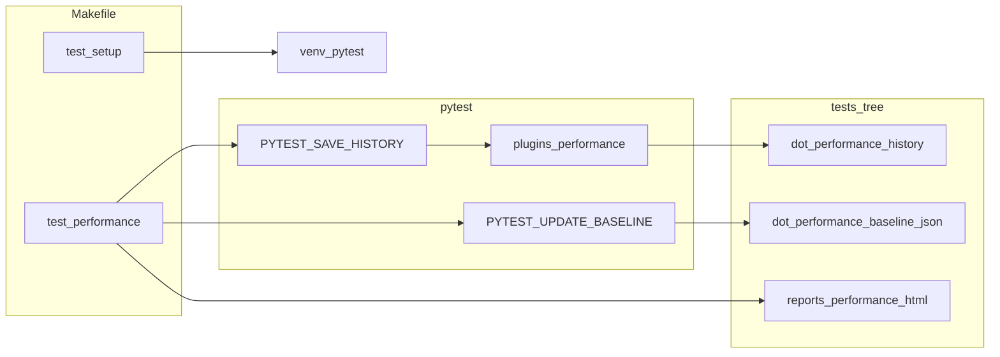

<!-- Cursor agent plan: external repo reference (links point at https://github.com/glblackburn/react2shell-server on branch main). -->
# [react2shell-server](https://github.com/glblackburn/react2shell-server): Make and test framework (reference)

## Makefile as the primary UX

The root [`Makefile`](https://github.com/glblackburn/react2shell-server/blob/main/Makefile) is large (~1300 lines) and does more than tests:

- **Product / env**: React and Next.js version matrices, `nvm`/Node install, framework mode (`.framework-mode`: `vite` vs `nextjs`), `make setup` / `make start` / `make stop` / `make status`, log paths under `.logs/` and `.pids/`.
- **Python test runner**: Variables `VENV`, `VENV_BIN`, `PYTEST := $(VENV_BIN)/pytest`, `TEST_DIR := tests`, `REPORT_DIR := tests/reports`. Canonical flow: **`make test-setup`** (create `venv`, `pip install -r tests/requirements.txt`) then **`make test`** (and variants).
- **Test targets** (all assume `check-venv` unless noted):
  - **`make test`**: Ensures servers are up (framework-aware: Next.js only port 3000; Vite needs 5173 + 3000), then `$(PYTEST) tests/ -v`.
  - **`make test-quick`**: Headless + short tracebacks.
  - **`make test-parallel`**: Timestamped report dir, `pytest -n 10` for tests **not** marked `version_switch`, then `run_version_tests_parallel.py` for version-switch work; sets `PYTEST_REPORT_DIR` and **`PYTEST_SAVE_HISTORY=true`**.
  - **`make test-report`**: HTML report via `pytest-html` to `tests/reports/report.html`.
  - **Scoped targets**: `test-smoke`, `test-hello`, `test-version`, `test-security`, `test-version-switch`, `test-browser BROWSER=...`, `test-clean`, `test-open-report`.
  - **Shell / integration**: `test-nextjs-startup` runs `tests/test_nextjs_startup.sh`; `check-nextjs-16` is a small curl-based spot check; `test-scanner` / `test-scanner-script` for external scanner.
  - **Makefile self-test**: **`make test-makefile`** runs **BATS** on [`tests/makefile.bats`](https://github.com/glblackburn/react2shell-server/blob/main/tests/makefile.bats).

## Test layout and pytest integration

- **Root of Python tests**: [`tests/`](https://github.com/glblackburn/react2shell-server/tree/main/tests) (not nested under `server/`).
- **Suites**: Under `tests/test_suites/` (e.g. `test_hello_world.py`, `test_version_info.py`, `test_security_status.py`) per Makefile targets.
- **Shared config**: [`tests/conftest.py`](https://github.com/glblackburn/react2shell-server/blob/main/tests/conftest.py) ties into performance when `PYTEST_SAVE_HISTORY=true`.
- **Plugins**: [`tests/plugins/performance.py`](https://github.com/glblackburn/react2shell-server/blob/main/tests/plugins/performance.py) — pytest hooks that record timings when the env var is set.
- **Utilities**: [`tests/utils/performance_history.py`](https://github.com/glblackburn/react2shell-server/blob/main/tests/utils/performance_history.py) — paths for **`.performance_history/`** (per-run JSON) and **`.performance_baseline.json`**, plus helpers used by reports.
- **Docs in-tree**: e.g. [`tests/PERFORMANCE_TRACKING.md`](https://github.com/glblackburn/react2shell-server/blob/main/tests/PERFORMANCE_TRACKING.md), `PERFORMANCE_LIMITS_GUIDE.md`, `README.md` under `tests/`.

## Performance: config, env flags, artifacts, and Make entry points

| Piece | Role |
|--------|------|
| [`tests/performance_config.yaml`](https://github.com/glblackburn/react2shell-server/blob/main/tests/performance_config.yaml) | Per-test / suite timeouts, regression thresholds (`regression.threshold` / `warning_threshold`), baseline path, reporting toggles. |
| **Env vars** | `PYTEST_SAVE_HISTORY=true` enables recording; `PYTEST_UPDATE_BASELINE=true` updates baseline during pytest; `UPDATE_BASELINE=true` used by **`make test-performance`** when baseline missing or forced. |
| **Committed / local artifacts** | `tests/.performance_baseline.json`, directory `tests/.performance_history/` (timestamped JSON per run), HTML `tests/reports/performance_history_report.html`. **Note:** `.performance_history` is typically gitignored or selectively committed — the design doc describes treating history as run output; baseline updates are explicit (`test-update-baseline` / `UPDATE_BASELINE`). |
| **`make test-performance`** | Loads `nvm`, runs full pytest with history (and optional baseline update), runs [`tests/generate_performance_report.sh`](https://github.com/glblackburn/react2shell-server/blob/main/tests/generate_performance_report.sh), then [`tests/performance_report.py summary`](https://github.com/glblackburn/react2shell-server/blob/main/tests/performance_report.py) for CLI summary. |
| **Deprecated Make targets** | `test-performance-check`, `test-performance-trends`, etc. still exist but print **DEPRECATED** and point to `test-performance`. |

## CI vs local

- **[`.github/workflows/ci.yml`](https://github.com/glblackburn/react2shell-server/blob/main/.github/workflows/ci.yml)**: Lint (Makefile `-n help`, YAML/JSON sanity), **`make test-nextjs-startup`**, Vite matrix steps with `curl` + `jq` (not the full Selenium pytest job yet — `test-python` / `test-nextjs` jobs are **placeholders**).
- **[`.github/workflows/performance-check.yml`](https://github.com/glblackburn/react2shell-server/blob/main/.github/workflows/performance-check.yml)**: **Placeholder** (“implementation pending”) — performance is primarily driven **locally** via `make test-performance` today.

## Contrast with pub-bin (osx) — one line

**pub-bin** today: small **`osx/tests`** tree, **`osx/pytest.ini`**, **`osx/requirements-test.txt`**, workflow **`macos-mouse-click.yml`** — no venv wrapper, no performance plugin/history yet. **react2shell-server** is heavier: **venv + Make orchestration + optional performance plugin + baseline/history + report scripts**.

---

If you want a **follow-up implementation plan for pub-bin**, say whether you prefer (a) a thin **`Makefile`** wrapping `pytest osx/tests -c osx/pytest.ini`, (b) **pytest-benchmark**-style timings only in CI artifacts, or (c) porting a **subset** of the performance plugin + `performance_config.yaml` pattern.
